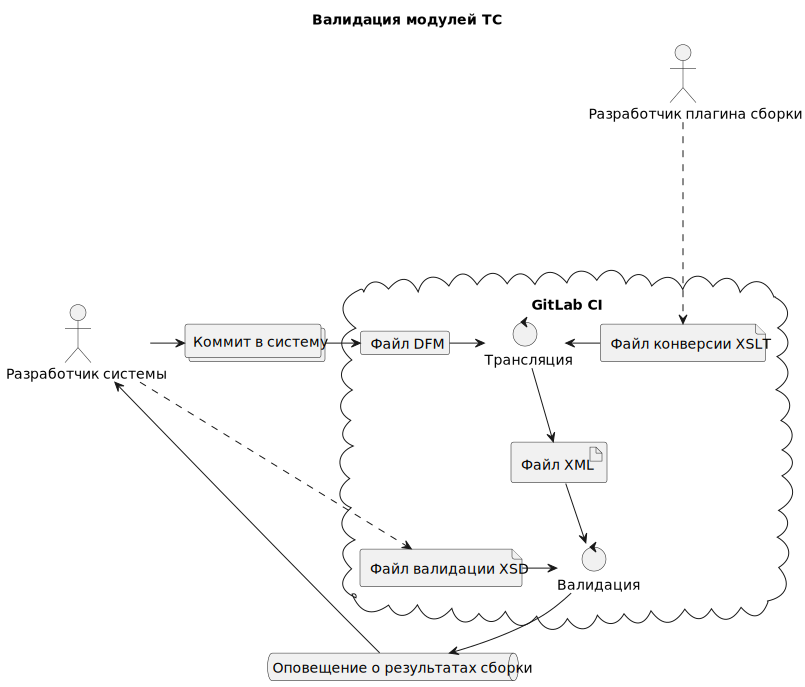

# SysScripts

Здесь собраны общие полезные ссылки, команды и шаблоны в основном для работы в
экосистеме `Linux`-ов. При этом некоторые строки посвящены и иным платформам.

Подпроекты:

- [Clonezilla](clonezilla/README.md) - клонирование систем
- [Нибелунги](nibelungen/README.md) - `Gitlab CI Docker Runner`
- [OpenSuse](opensuse/README.md) - Особенности работы в `OpenSuse`
- [Oracle](oracle/README.md) - полезная информация по `Oracle`
- [Qt](qt/README.md) - Самостоятельная сборка `Qt` и всего сопутствующего
- [QuantML](quantml/README.md) - задел на небольшой `ML` проект
- [Scripts](scripts/README.md) - скрипты автоматизации
- [VimIDE](vimide/README.md) - как кодить в `vim` под `C++`

Переменные среды приводятся без знака `$`, к примеру: `CV_REF`.

# Оглавление

- [SysScripts](#sysscripts)
- [Оглавление](#оглавление)
- [Философия](#философия)
  - [Принцип зёрнышка](#принцип-зёрнышка)
- [Стиль кода](#стиль-кода)
- [Итернационализация](#итернационализация)
  - [CP1251](#cp1251)
- [Система](#система)
  - [Закулисье](#закулисье)
  - [X-ы](#x-ы)
- [Locate](#locate)
- [Сеть](#сеть)
- [C++](#c)
- [Make](#make)
- [Python](#python)
- [Ssl](#ssl)
- [Java](#java)
  - [Keytool](#keytool)
- [Gradle](#gradle)
- [Docker](#docker)
- [PlantUML](#plantuml)
- [Meld](#meld)
- [Visual Code](#visual-code)
- [Cygwin](#cygwin)
- [TortoseGit](#tortosegit)
- [BorlandXSD](#borlandxsd)
- [Некоторые заметки](#некоторые-заметки)
- [Полезные ссылки](#полезные-ссылки)

# Философия

Прочитайте стандарт [POSIX][14].

## Принцип зёрнышка

Принцип следуя которому развёрстка данной экосистемы:

1. Максимально формализована (приведена к модели, описана)
2. Максимально автоматизирована
3. Возможна, обладая лишь иформацией о структурах (1)
4. Происходит из одной точки входа (2)

(1) без необходимости копировать бизнесс данные\
(2) без необходимости совершать множество ручных действий

*"Принцип зёрнышка"* в ПО аналогичен тому, как из посажанного семени вырастает
дерево.

# Стиль кода

Несмотря на вклад символа `\t` в дело вычислительной техники, его статность и
давность, всё же было решено отказаться от последнего в роли символа отступов
в пользу ряда пробелов. Несмотря на то же самое в отношении символа `\r`, было
решено использовать только `\n`. Его же оставлять последним в файле, о чём
подробнее можно прочитать [тут][10].

Поставьте галочку в опции `files.insertFinalNewline` в `VS Code`.

# Итернационализация

Локаль системы устанавливается в следующих файлах:

* `/etc/sysconfig/i18n` - глобальная локаль
* `/home/<user>/.dmrc` - локаль `X`-ов пользовательской сессии

## CP1251

Конечно, ни кто не удивится узнав, что во многих компаниях до сих пор везде
используется кодировка `CP1251`. Это является большой проблемой, которую
следует решать, в свете того, что проект не может нормально существовать в наше
время с кодировочными страницами `ANSI`. Посему, я всегда перевожу все проекты
на `UTF-8`.

Нет способа сделать перекодировку большого количества файлов достаточно
сложного проекта автоматом за один раз. Требуется использовать ряд
инструментов. В нашем случае это утилита `iconv` со стороны `Linux`-а и
`Notepad++` на `Wind`-е.

> При всех преимуществах `Linux`-ов над ОС семейства `Windows`, необходимо
> признать, что есть несколько инструментов доступных *от туда*, аналогов
> которым нет *тут*; среди них: `Notepad++` и `TortoiseGit`

Мы воспользуемся общей папкой примонтированной через `/mnt/share`, как описано
в [`OpenSuse`](opensuse/README.md#внешние-папки).

При отсутствии `Linux`-а, думаю вы сможете воспользоваться `Cygwin`-ом для
решения данной задачи.

Сначала локализуем все файлы заражённые большевизмом:

```sh
$ cd /path/to/repo
$ file * | grep ISO
```

Скорее всего выйдут почти все `*.cpp` файлы и некоторые `*.h`.

Для того, что бы наглядно проверить кодировку, воспользуемся командой:
`od -cx <file> | less`.

А вот команда для массовой перекодировки:

```sh
$ for f in $(file * | grep ISO-8859 | awk -F":" '{print $1}'); \
  do iconv -f CP1251 -t UTF-8 $f -o $f; \
  done
```

**Некоторые файлы окажутся битыми**, для решения этой проблемы открываем в
`TortoiseGit` утилиту `Diff` и проходимся по каждому файлу. На тех файлах, на
которых `TortoiseGit` выдаст ошибку при их открытии делаем следующее. Открываем
каждый в `Notepad++` и используем опцию `Encoding -> Convert to UTF-8`.
Преимущество этого метода в том, что вы сразу видите результаты преобразования.
Если даже после преобразования в `Notepadd++` файл оказывается битым, просто
скопируйте туда код с исходника. Учитывая что файл уже распознаётся как
`UTF-8`, текст автоматом преобразуется в нужную кодировку при копировании.

> Важно! Возможно станут перекодированы так же некоторые строки, подлежащие
> записи в БД, а база данных возможно в `ANSI` кодировке; если так, нужно будет
> точечно использовать функции перекодировки из кода `C++`, или вызвать
> `setenv("NLS_LANG",".UTF8", 1)` в начале программы

`CP1251` не единственная кирилическая `ANSI` кодировка, с которой вам придётся
столкнуться. Иной пример, это печатные устройства, которые традиционно работают
с кодировкой `CP866`. В процессе работы вам часто придётся анализировать
шестнадцатиричное представление текста в той или иной кодировке. Помогут вам в
этом, замечательные и наглядные [таблицы][15] на сайте посвящённом `Arduino`.

В общем написан так же [скрипт](scripts/reencode.py) на `Python`-е для решения
данной задачи.

# Система

Общие заметки по `OS`.

## Закулисье

Как известно старые системы `Linux`-а придерживались принципа `runlevel`.
У новых дела обстоян немного иначе, но принцип знать необходимо.
Что бы загрузить систему в нужном `runlevel`-е, отредактируйте файл: `/etc/inittab`.

Некоторые процессы в `Linux`-е оформлены в древнее понятие `job`.
Посмотреть список `job`-ов и остановить необходимый можно следующим образом:

```sh
$ jobs
$ kill %1
```

## X-ы

Важные термины:

> X11 Коммуникационный протокол X Window System

> Xlib Библиотечная реализация клиентской части X Window System

> Xorg Библиотечная реализация серверной части X Window System

Полезные ссылки:

* [О графике в Linux][20]
* [Обсуждение особенностей DM][21]
* [Автологин][25]

Выполните следующие команды для выполнения следующих операций:

* Вывести информацию о процессе сервера `X`: `ps -fwwC Xorg`
* Вывести используемый экран: `echo $DISPLAY`
* Выключить `X` сервер: `killall -9 Xorg`

Важные конфигурационные уголочки:

* `/etc/X11/prefdm` - настройка загрузчика `DM`
* `/etc/gdm/custom.conf` - настройка `GDM`
* `/etc/kde/kdm/kdmrc` - настройка `KDM`

Немного теории.

После загрузки сервера `Xorg`, грузится первый попавшийся `Display Manager`.
Если установлен устаревший на сегодня `prefdm`, то последний уже грузит первый
попавшийся `Display Manager`. `Display Manager`-ы устанавливаются в виде сервисов,
и при установке могут отключить конкурентов. И отключают конкурентов
при переустановке - *Кто последний встал, того и тапки*.
`Display Manager` часто называют `Login Manager`.
`Display Manager` грузит `Desktop Environment` создавая `XSession` с конкретным
пользователем. Обычно есть прямая взамосвязь между `Display Manager`-ом и
`Desktop Environment`-ом, в том плане, что они идут связкой в рамках одного проекта.

Заметки из жизни:

* Сеанс пользователя по умолчанию и выбор языка находятся в файле ~/.dmrc

> TODO: сделать ссылку на раздел о графике в `OpenSUSE`, или объеденить
> разделы

# Locate

Важная утилита для поиска динамических библиотек.

Команда называется: `updatedb`. Для работы утилиты, её нужно запустить с
правами `root`-а, но перед этим очень важно исключить некоторые пути поиска. В
нашем случае следует исклюсить: `/var/lib/docker`.

В файле `/etc/updatedb.conf` добавьте `/var/lib/docker` в `PRUNEPATHS`.

Теперь запустите `sudo updatedb`.

> TODO: сделать ссылку на раздел о `Locate` в `OpenSUSE`, или объеденить
> разделы

# Сеть

В `OpenSuse` используется утилита ~~Schutzstaffel~~ `ss` заместо `netstat`.

Иногда в скриптах будет необходимо получить `PID` процесса, который слушает
определённый порт:

```sh
PORT=8081
IP=0.0.0.0
ss -pln | \
  grep $PORT | \
  grep $IP  | \
  awk '{print $7}' | \
  awk -F"," '{print $2}' | \
  awk -F"=" '{print $2}'
# Всё это можно записать строкой в переменную, и тогда
PID=$($COMMAND)
# Теперь процесс можно автоматом завершить
kill -9 $PID
```

# C++

Для того, что бы автоматом подставить платформонезависимый идентификатор целого
числа в формате `sprintf`, исзользуйте следующий шаблон:

```c++
sprintf(buff, "%" PRId64, num);
```

Вызов `cmake` с конкретным `gcc\g++`:

```sh
#!/bin/bash

export CC=/usr/bin/gcc-9
export CXX=/usr/bin/g++-9

rm -rf CMakeFiles/ CMakeCache.txt cmake_install.cmake *_autogen
cmake .
```

Вот полезная таблица версий `C++`:

| Year | C++ Standard       | Informal name |
| ---- | ------------------ | ------------- |
| 1998 | ISO/IEC 14882:1998 | C++98         |
| 2003 | ISO/IEC 14882:2003 | C++03         |
| 2011 | ISO/IEC 14882:2011 | C++11, C++0x  |
| 2014 | ISO/IEC 14882:2014 | C++14, C++1y  |
| 2017 | ISO/IEC 14882:2017 | C++17, C++1z  |
| 2020 | ISO/IEC 14882:2020 | C++20, C++2a  |

# Make

[Немного теории][22]

Очень важно уметь писать скрипты `Make` самостоятельно.
Важно помнить, что отступы, предположительно, должны быть `\t`.

В `Make` есть одна особенность: `.PHONY`, выглядет примерно так:

```make
.PHONY: clean
clean:
  rm -rf *.o
```

`.PHONE: <цель>` значит, что цель исключительно виртуальная и не привязанна к
файлу, даже еслии онный существует.

`Make` работает по принципу: *запускаем, если зависимость обновилась*.
Параметры времени обновления зависимосте `Make` получает от туда же, от куда
команда `stat`.

# Python

`Python` имеет большое значение для превращения `Vim` в `IDE`, так как многие
плагины основаны на нём.

На `OpenSuse 15.3` команда `python` запустит `python2.x`, но для дел `vim`-ных
нам нужен `python3`. В `OpenSuse` нет стандартного `update-alternatives`, как
на `Ubuntu`, поэтому просто измените ссылки:

```sh
$ cd /usr/bin
$ ls -la | grep python
# Только если мы имеем симлинк, тогда:
$ sudo rm python
$ sudo ln -s python3 python
```

Конечно у вас уже должен быть установлен `Python3`

---
*Небольшое отступление*.

Иногда нужно установить пакеты `Python`-а именно с `Python2`. По умолчанию
`pip` в наши дни будет использовать `Python3`.

Можно было бы сделать следующее:

```sh
# Скачать нужный `get_pip.py`
$ curl -O https://bootstrap.pypa.io/pip/2.7/get-pip.py
# Установить `pip` с `Python2`
$ sudo python2 get-pip.py
```

Но, далее вы получите ошибку:

> ImportError: No module named xml.etree.ElementTree

В связи с этим проще просто портировать проект на `Python3`, [вот][12] различия
синтаксиса.

---
Часто вам нужно будет узнать список установленных модулей и их версии.
Для этого используйте: `pip freeze | grep <module>`.

Центральные пакеты `Python3`-а устанавливаются по расположжению:
`/usr/lib64/python3.<x>/site-packages/`, но при вызове `pip` устновка будет в
`/home/<user>/.local/lib/python3.6/site-packages` по этому `pip` нужно
запускать без `sudo`.

Вы всегда можете посмотреть данные по модулю с помощью: `pip show <MODULE>`.

# Ssl

Важно заметить, что сертефикаты представленные самым распространёным
стандартом `X.509` могут быть представлены в двух физических форматах:
`PEM` и `DER`.

* `PEM` - `Base64 ASCII`
* `DER` - двоичный

В формате `PEM` файлы обычно имеют расширение `.pem`, `.crt`. В `DER` -
`.cer`, `.der`.

Об этом можно больше прочитать [тут][26].

Вкратце об `openssl`. `openssl` вызывается с первым параметром подпрограммы,
и остальными параметрами, которые передаются в подпрограмму.

Основные подпрограммы `openssl`:

* `s_client` - совершает запросы по протоколу `TLS`
* `x509` - работает с сертификатами стандарта `X.509`
* `req` - создание сертификата
* `crl` - работа со списками отозванных сертификатов

Для того, чтобы сохранить сертификат с необходимого сервера:

```sh
$ echo -n | \
  openssl \
    s_client \
      -connect kalevala.ru:443 2> /dev/null | \
  sed -ne '/-BEGIN CERTIFICATE-/,/-END CERTIFICATE-/p' \
  > kalevala.ru.crt
$ ls kalevala.ru.crt
```

> При необходимости, можно скачать всю цепочку, добавив параметр
> `-showcerts` к подпрогремме `s_client` программы `openssl`

Для того, чтобы посмотреть информацию по скаченному сертификату:

```sh
$ openssl x509 -in kalevala.ru.crt -noout -text | less
```

> В случае, если мы просматриваем сертификат в двичном формате `DER`,
> следует добавить параметр `-inform der` к подпрограмме `x509`
> программы `openssl`

```sh
$ openssl x509 -inform der -in kalevala.ru.cer -noout -text
```

Если в одном `pem` файле у нас много сертификатов, то мы можем просмотреть
все с помощью следующей конструкции. Вывод передаётся в `less`,
в рамках `less` можно использовать поиск тем же образом, как в `vim`:

```sh
$ while openssl x509 -noout -text; do :; done < cert-bundle.pem | less
```

Дабы выбрать некоторый сертификат из всего буклета, найдите первую и последнюю
строки текстового представления последнего с помощью программы `vim` и режима
`set nu`. Пусть это будут `28`-ая и `49`-ая строки. Воспользуйтесь командой:

```sh
sed -n '28,49 p' cert-bundle.pem
```

Для того, чтобы создать самиздатный сертификат:

```sh
$ openssl req \
  -newkey rsa:4096 -nodes -sha256 -keyout ilmarinen.key \
  -x509 -days 365 -out ilmarinen.crt \
  -subj "/C=RU/ST=Vologda/L=Vologda/O=Kalevala/OU=NIT/CN=Ilmarinen"
```

# Java

`Java` активно используется в проектах, и нет ни какой причины
не использовать этот второй по красоте язык после `C#`-а, учитывая
что в отличии от последнего он полностью `OpenSource`-ный.

`Java` используется как среда выполнения замечательной системы сборки
`Gradle`. `Gradle` в свою очередь запрашивает зависимости из `Maven`
репозиториев. Последние в свою очередь могут находиться на локальных
корпоративных хостах. Для обестпечения доступа к онным требуется
произвести некоторые манипуляции с хранилищем ключей `Java`-ы -
`keystore`-ом с помощью утилиты `keytool`.

## Keytool

Подобно тому, как в `OS` есть `pem` файл содержащий сертифкаты:
`/var/lib/ca-certificates/ca-bundle.pem` так же и в `java`-е есть
подобный файл: `$JAVA_HOME/lib/security/cacerts`.

Если переменная среды `JAVA_HOME` не установлена, но команды `java`
прописана в `PATH`, то `cacerts` можно найти с помощью:

```sh
$ JAVA_HOME=$(dirname $(dirname $(readlink $(readlink $(which java)))))
$ CACERTS_PATH=$JAVA_HOME/lib/security/cacerts
$ ls $CACERTS_PATH
```

Предположим мы уже сохранили необходимые сертификаты, как указанно
[тут](#ssl).

> Далее предполагаем, что мы используем `Java 11`. В этой версии `java`-ы
> нам можно не прописывать путь к `cacerts`; достаточно лишь указать
> параметр `-cacerts`. Если же всё таки необходимо прописать путь к
> хранилищу, передайте слудующий параметр: `-keystore $CACERTS_PATH`

Хранилище ключей по умолчанию защищено паролем. Этот пароль редко меняют,
оставляя изначальным: `changeit`.

Далее, импортируем сертификат:

```sh
$ sudo keytool \
  -importcert \
  -trustcacerts \
  -cacerts \
  -noprompt \
  -storepass changeit
  -alias kalevala
  -file kalevala.ru.crt
```

С помощью этой команды вы можете импортировать как файлы `pem`, так и `der`.
Обязательно выберите соответствующий `alias`.

Если у вас букет сертификатов одной цепочки, импортируйте их по очереди,
давая разные `alias`-ы и подставляя нужный файл в параметр `-file`.

Параметр `-trustcacerts` не обязателен, но желаем.

---
Для `java 8` воспользуйтесь:

```sh
$ sudo keytool \
  -import \
  -keystore $CACERTS_PATH \
  -storepass changeit \
  -noprompt \
  -alias kalevala \
  -file kalevala.ru.crt
```
---

Для того, чтобы просмотреть список всех сертификатов, и найти там
свежедобавленные, выполните:

```sh
$ keytool \
  -cacerts \
  -storepass changeit \
  -list \
  -v | grep kalevala
```

Если мы добавили что-то не то, и хотим удалить:

```sh
$ sudo keytool \
  -delete \
  -cacerts \
  -storepass changeit \
  -noprompt \
  -alias kalevala
```

Все эти процедуры будут необходимы для того, что бы обеспечить `Gradle`
доступом к локальным `Maven` репозиториям. О [`Gradle`](#gradle) смотрите
ниже. После импорта новых сертификатов, вам будет необходимо остановить
запущенный `Gradle` сервис:

```sh
$ gradle --stop
```

# Gradle

`Gradle` это замечательная экосистема сборки проектов. Стоит
[ознакомиться][17] с базовыми сведениями о написании скриптов.

У `Gradle`-а есть один важный момент. Если вы используете локальный сервер,
то есть не используете опцию `--no-daemon`, то для того, что бы передать
параметры в скрипт из новых установленных переменных среды, вам надо
перезапустить сервис.

```sh
$ export PARAM=value
$ ./gradlew --stop
$ ./gradlew <цель>
```

# Docker

Поиск образов наследников по идентификатору:

```sh
for i in $(docker images -q)
do
  docker history $i | grep -q e969c38d7c77 && echo $i
done | sort -u
```

# PlantUML

В нашей работе очень важна визуализация всевозможных схем. Создавайте
диаграммы как можно больше и чаще. Как минимум они помогут лично вам, уложив у
вас в голове процессы, структуры, архитектуру наилучшим образом.

Мы используем плагин `PlantUML` в [`Visual Studio Code`](#visual-code).

На `Linux`-е настройка относительно проста. Всё можно установить с помощью
манагера проектов. Если вам необходимо установить на `Windows`-е, необходимо
выполнить следующее.

1. Установите плагин в `VS Code`
2. Скачайте `plantuml-<VERSION>.jar` с официального сайта, и положите файл
   на диск в удобном расположении
3. Скачайте `zip` архив `Graphviz` с официального сайта, и так же положите
   содержимое архива в удобном вам месте
4. Скачайте любой `Java 11` или выше `SDK` или `Runtime`
5. Создайте переменную среды `GRAPHVIZ_DOT` указывающую на `dot.exe` из
   третьего пункта
6. Добавтье в переменную `PATH` путь до папки `bin` *содержащую* `java.exe`
7. Создайте переменную `JAVA_HOME` с путём до папки *содержащей* папку `bin` из
   шестого пункта
8. Пропишите в `.vscode/settings.json` следующую конфигурацию заменяя `...` на
   актуальные пути

```json
{
    "java.home": "C:\\...\\jre",
    "plantuml.jar": "C:\\...\\plantuml-1.2022.4.jar",
    "plantuml.java": "C:\\...\\bin\\java.exe",
    "plantuml.render": "Local"
}
```

> После установки переменных, выключитt все инстансы `VS Code` и запустите
> среду снова.

# Meld

К сожалению в `Linux`-ах нет настолько удобного инструмента как `TortoiseGit`,
который позволяет делать интерактивное слияние любой ветки в рабочее
пространство. Поэтому необходимо использовать `meld`, который устанавливается
с помощью `sudo zypper in meld`.

1. В репозитории переключитесь на ветку **В КОТОРУЮ** планируем слияние:
   `git checkout <target_branch>`
2. Создайте новую ветку командой `git checkout -b <target_branch>-meld`
3. Переключите индекс на исходную ветку c которой планируем слиять:
   `git reset --soft <source_branch>`
4. Запустите `Meld` и в интерфейса выберите опцию `Version Control View`
5. Задайте путь к репозиторию
6. При необходимости, перегружайте рабочее пространство в `Meld` клавишей `F5`
7. Совершите интерактивное слияние
8. Закоммитьте изменения командами `git add .` и `git commit ...`
9.  Переключитесь на целевую ветку: `git checkout <target_branch>`
10. Совершите слияние из промежуточной ветки командой
    `git merge <target_branch>-meld`
11. Залейте изменения на `GitLab`, убедитесь, что всё собирается на `CI`

# Visual Code

Создайте в корне проекта заигнорированную папку `.vscode`.

Прочитайте [документацию][16] по конфигурированию `settings.json`.

Создайте файл `.vscode/c_cpp_properties.json`
(путь относительно корня проекта) с содержимым:

```sh
{
  "configurations": [
    {
      "name": "Linux",
      "includePath": [
        "${workspaceFolder}/**",
        "${workspaceFolder}/build/pos_autogen/include/*",
        "${ORACLE_HOME}/rdbms/public",
        "/opt/qt5/include/**"
      ],
      "defines": [],
      "compilerPath": "/usr/bin/gcc",
      "cStandard": "gnu11",
      "cppStandard": "gnu++14",
      "intelliSenseMode": "linux-gcc-x64",
      "configurationProvider": "ms-vscode.cmake-tools"
    }
  ],
  "version": 4
}
```

Установите `plugin`-ы `CMake` и `Cmake Tools` от `twxs` и `Microsoft`.
Далее в левой панели появится перспектива `CMake`. В этой перспективе у вас
будут опции конфигурации, сборки, запуска и отладки проекта.

Требуемые плагины для работы в `Visual Studio Code`:

| Плагин                 | Идентификатор                       |
| :--------------------- | :---------------------------------- |
| `Better C++ Syntax`    | `jeff-hykin.better-cpp-syntax`      |
| `C/C++ Extension Pack` | `ms-vscode.cpptools-extension-pack` |
| `CMake`                | `twxs.cmake`                        |
| `CMake Tools`          | `ms-vscode.cmake-tools`             |
| `Markdown All in One`  | `yzhang.markdown-all-in-one`        |
| `PlantUML`             | `jebbs.plantuml`                    |
| `Qt tools`             | `tonka3000.qtvsctools`              |
| `Trailing Spaces`      | `shardulm94.trailing-spaces`        |
| `Bookmarks`            | `alefragnani.bookmarks`             |


Навигация по посещённым участкам:

Linux:

* Назад: `ctrl + alt + -`
* Вперёд: `ctr + shidt + -`

Windows:

* Назад: `alt + <-`
* Вперёд: `alt + ->`

Команды плагина `Cmake-Tools`:

* `Build` - `F7`
* `Debug` - `Ctrl + F5`

# Cygwin

Вам возможно понадобится использовать `Cygwin` с `Wind`-ы для некоторых задач,
типа перекодировки страниц.

Для установка `cygwin`-а без прав админа запустите из `cmd` `Windows`-а:

```cmd
> setup-x86_64.exe --no-admin
```

Важно в рамках `Cygwin`-а установить следующие настройки, обратите внимание,
что используется `--global` для задания глобальных настроек, вы можете опустить
эту опцию для конфигурации только репозитория:

```sh
# Имя пользователя в рамках глобальных настроек
$ git config --global --edit
# Сохранять LF (line feed) в репозитори
$ git config core.autocrlf input
# Игнорировать права запуска файла, тк в cygwin-е это право недоступно
$ git config core.filemode false
```

# TortoseGit

В мире есть прекрасный инструмент, который к сожалению существует только
для `Wind`-ы. Это -  `TortoiseGit`. Надеюсь в какой то момент его всё же
соберут для `Linux`-а.

Есть один важный момент. После перегрузки компьютера `pageant` слетает.

Для решения этого вопроса:
1. Откройте папку автозапуска: `Win + R`, `shell:startup`
2. Создайте ярлык для `C:\Program Files\TortoiseGit\bin\pageant.exe`
3. Скопируйте ярлык в папку автозапуска
4. В свойствах ярлыка, вконце пути добавьте путь до ключа `Putty`

# BorlandXSD

Для валидации копонентов на проектах `Delfi` необходимо обзавестись конвенцией
имён в некоем `framework`-е `UI` классов конкретного ПО. Используя эту
конвенцию и декларативный подход `DML` файлов, мы можем создать процесс
валидации, обрабатывая дерево композиций:

* Кто в составе какой формы или окна, или по другому - композиция
* Тип объекта
* Имеем ли мы базовый объект или наследование - `object` и `inherited`

Полагаясь на конвенцию имён мы можем обогатить метаданные структуры привязанной
к некоторой сущности на `UI`. К примеру если тип объекта `TFrKalevala`, можно
предположить, что `Fr` - это фрейм. Так же можно создать промежуточные классы,
к примеру `ABWList`. В данном случае `A`, это `abstract`. Данная конвенция
может заставит валидатор убедиться, что необходимые свойства списка
переопределены. Следующий этап, внедрение `XSLT` и `XSD`. Написать `XSLT`,
который переведёт `DFM` в `XML` и создать `XSD` который будет накладывать
валидацию. Это позволит создать громадную массу правил очень простыми
способами. Более того, файл валидации может быть в руках самих разработчиков.



# Некоторые заметки

Пример экранирования слешей в путях сохранённых в переменных при передачи
переменных команде `sed`:

```sh
$ OLD_LIB=/path/to/old/lib
$ NEW_LIB=/path/to/new/lib
$ sed -i "s/${OLD_LIB//\//\\/}/${NEW_LIB//\//\\/}/" file
```
---

Размеры папок для всех случаев жизни, включая `Docker`:

```sh
#!/bin/bash
for name in `sudo ls -a $1`; do
  sudo du -sh $1/$name
done
```
---
Данный проект использует `GitHub` *действие*: [`Markdown link check`][6].

# Полезные ссылки

* [SSL CRL/OSCP Habr][1]
* [SSL CRL/OSCP Англ.][2]
* [GitLab CI RegExp][3]
* [CMAKE_BUILD_TYPE (Stackoverflow)][4]
* [Архитектуры процессора][5]
* [Linux Локаль][7]
* [Переменные в CMake][8]
* [О Microsoft-е][9]
* [Комбинации клавишь Vim][11]
* [Использование помощи в Vim][13]
* [Upstart][18]
* [TTY][19]
* [TTY резолюция][23]

[1]: https://habr.com/ru/post/417521
[2]: https://jamielinux.com/docs/openssl-certificate-authority/certificate-revocation-lists.html
[3]: https://docs.gitlab.com/ee/ci/jobs/job_control.html#regular-expressions
[4]: https://stackoverflow.com/questions/48754619/what-are-cmake-build-type-debug-release-relwithdebinfo-and-minsizerel
[5]: https://habr.com/ru/post/316520
[6]: https://github.com/gaurav-nelson/github-action-markdown-link-check
[7]: https://www.baeldung.com/linux/locale-environment-variables
[8]: https://cliutils.gitlab.io/modern-cmake/chapters/basics/variables.html
[9]: https://www.kommersant.ru/doc/2260861
[10]: https://semakin.dev/2020/05/no_newline_at_end_of_file
[11]: https://codedepth.wordpress.com/2017/08/23/vi-vim-hotkeys/
[12]: https://pythonworld.ru/osnovy/python2-vs-python3-razlichiya-sintaksisa.html
[13]: https://vimhelp.org/helphelp.txt.html#helphelp.txt
[14]: https://pubs.opengroup.org/onlinepubs/9699919799/basedefs/contents.html
[15]: https://wiki.iarduino.ru/page/encoding-arduino
[16]: https://code.visualstudio.com/docs/getstarted/settings
[17]: https://docs.gradle.org/current/userguide/tutorial_using_tasks.html#tutorial_using_tasks
[18]: https://github.com/kirill85/upstart-cookbook-ru
[19]: https://zalinux.ru/?p=4490
[20]: https://habr.com/ru/company/lanit/blog/516330/
[21]: https://forum.altlinux.org/index.php?topic=37531.0
[22]: https://makefiletutorial.com/
[23]: https://linuxconfig.org/how-to-increase-tty-console-resolution-on-ubuntu-18-04-server
[24]: https://zalinux.ru/?p=1774
[25]: https://zalinux.ru/?p=1774
[26]: https://www.ssl.com/ru/руководство/кодировки-и-преобразования-pem-der-crt-и-cer-x-509/
