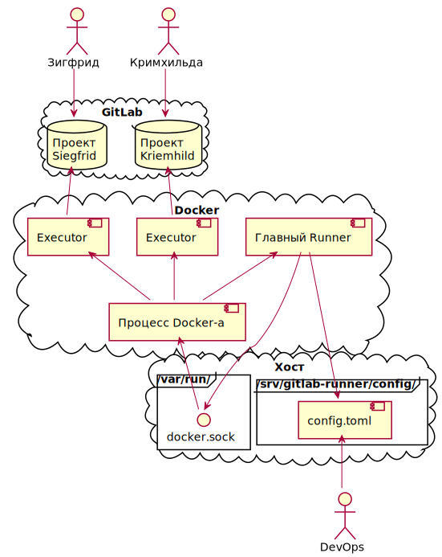

> Carthago delenda est!

# Нибелунги

Настройка GitLab Runner-а

# О данном проекте

Проект `Нибелунги` содержит в себе всё необходимое для интеграции остальных
проектов в процесс `CI` используя технологию `GitLab Runner Docker Executor`.

Большое значение имеет данная инструкция описывающая весь процесс, пожалуйста
ознакомьтесь с ней.

Данный проект так же содержит демонстративный подпроект `Nibelungen`
описывающий весь процесс взаимодействия с `GitLab CI`. Взяв внутренний проект
`Nibelungen` в качестве шаблона, вы сможете легко адаптировтаь свой проект под
интеграцию.

Итак, содержимое данного проекта:

* `ci`: Папка с общими скриптами, которые должны входить во все образы
  `Docker`-а
* `docs`: Диаграммы для данного `README`
* `images`: Образы `Docker`-а для разных типов сборок
* `nibelungen`: Внутренний проект демонстрирующий принципы `GitLab CI`
* `.gitlab-ci.yml`: Файл конфигурации `CI` для внутреннего проекта `nibelungen`
* `docker-compose.yml`: Файл содержащий описание главное контейнера
  `GitLab Runner`-а
* `README.md`: Инструкция описывающая разворачивание серверной и клиентской
  частей
* `reg.ini`: Файл содержащий информацию для регистрации `executer`-а для
  проекта `Nibelungen`
* `register.py`: Скрипт регистрирующий `executer`-ы клиентских проектов
* `runner.code-workspace`: `workspace` файл `IDE` `Visual Code`

# Оглавление

- [Нибелунги](#нибелунги)
- [О данном проекте](#о-данном-проекте)
- [Оглавление](#оглавление)
- [Концепция](#концепция)
- [Настройка на сервере](#настройка-на-сервере)
- [Docker](#docker)
  - [Установка](#установка)
  - [Swarm](#swarm)
  - [Настройка реестра Docker-а](#настройка-реестра-docker-а)
  - [Зависания и производительность](#зависания-и-производительность)
  - [Создание папки на хосте](#создание-папки-на-хосте)
  - [Загрузка корневого сертификата](#загрузка-корневого-сертификата)
  - [Запуск Runner-а](#запуск-runner-а)
  - [Настройка параллельности](#настройка-параллельности)
- [Иструкция настроки для каждого проекта](#иструкция-настроки-для-каждого-проекта)
  - [Настройка CI/CD на сервере для каждого проекта](#настройка-cicd-на-сервере-для-каждого-проекта)
  - [Создайте Docker образ](#создайте-docker-образ)
  - [Регистрация образа Docker](#регистрация-образа-docker)
  - [Регистрация Runner-а](#регистрация-runner-а)
  - [Наcтрока кеша](#наcтрока-кеша)
  - [Реализация загрузки артифактов](#реализация-загрузки-артифактов)
  - [Папка со скриптами для CI](#папка-со-скриптами-для-ci)
  - [Фаза очистки старых pipeline-ов](#фаза-очистки-старых-pipeline-ов)
  - [Заполнение фала .gitlab-ci.yml](#заполнение-фала-gitlab-ciyml)
  - [Запуск pipeline-ов](#запуск-pipeline-ов)
- [Создание образов Docker-а](#создание-образов-docker-а)
  - [Kalevala Maven](#kalevala-maven)
  - [Kalevala Gradle](#kalevala-gradle)
- [Локальная сборка мобильных приложений](#локальная-сборка-мобильных-приложений)
  - [Установка Android SDK](#установка-android-sdk)
  - [Сборка проекта](#сборка-проекта)
  - [Подписание APK](#подписание-apk)
  - [Проверка скрипта подписи APK на локальной сборки](#проверка-скрипта-подписи-apk-на-локальной-сборки)
  - [Отладка образа Kalevala Gradle](#отладка-образа-kalevala-gradle)
- [Некоторые заметки](#некоторые-заметки)

# Концепция

*Небольшая ремарка: в дальнейшем термин `runner` может быть использован как
касательно главного контейнера `GitLab Runner`-а, так и в отношении
конкретного `executer`-а, запускаемого для сборки целевого проекта. Точное
значение истекает из контекста.*

На следующей диаграме изображена общая концепция `GitLab Runner`-а с
`executer`-ами `Docker`-а:



# Настройка на сервере

Все шаги нижеследующей инструкции расписанны ниже.

1. Установите `Docker`
2. Настройте `Docker Registry`
3. Создайте папку `/srv/nibelungen/config/certs/` на хосте
4. Загрузите корневой сертификат
5. Из корня проекта запустите `runner` командой `./deploy.sh`
6. Настройте параллельность для главного `runner`-а

# Docker

Инфраструктура докера нужна для разработки контейнера в рамках которого
`GitLab CI` будет собирать проект на сервере сборки.

## Установка

> Тут описывается установка `Docker`-а на хосте `OpenSuse`

Установка `Docker`-а:

```sh
# To install the docker and docker-compose packages
$ sudo zypper install docker python3-docker-compose
# To start the docker daemon during boot
$ sudo systemctl enable docker
# To join the docker group that is allowed to use the docker daemon
$ sudo usermod -G docker -a $USER
# Restart the docker daemon
$ sudo systemctl restart docker
```

Тут очень важно сделать `logout` и `login`, что бы права группы применились к
вашему пользователю.

```sh
# Verify docker is running
docker version
# This will pull down and run the, "Hello World" docker container from
# dockerhub
docker run --rm hello-world
```

## Swarm

Инициализируйте `Swarm`:

```sh
docker swarm init
```

## Настройка реестра Docker-а

> В связи с избыточной сложностью рекомендуется НЕ устанавливать
> `Docker Registry` на станциях разработки

Установка реестра необходима для воспроизведения штатного режима работы
сервера на котором будет крутиться образ. В штатном режиме образ будет
скачиваться стеком `swarm`-а с реестра.

Данные `registry` находятся в `/opt/docker/data`.

Добавьте метку на наш едиственный узел:

```sh
docker node update --label-add registry=true $HOSTNAME
```

Создайте самиздатный сертефикат, если не распологаете иным, изменив пути и
данные на необходимые:

```sh
mkdir $HOME/certs/
cd $HOME/certs/
openssl req \
  -newkey rsa:4096 -nodes -sha256 -keyout ilmarinen.key \
  -x509 -days 365 -out ilmarinen.crt \
  -subj "/C=RU/ST=Vologda/L=Vologda/O=Kalevala/OU=NIT/CN=Ilmarinen"
```

Установите сертификат в системе:

```sh
sudo cp ilmarinen.crt /usr/share/ca-certificates
sudo update-ca-certificates ca-certificates
```

А так же конкретно для `Docker`-а:

```sh
# Убедитесь, что требуемая папка существует
sudo cp ilmarinen.crt /etc/docker/certs.d/ilmarinen\:8443/
```

Удалите сервис и секреты, если они уже настроены и настроены
неудовлетворительно:

```sh
docker service rm registry
docker secret rm ilmarinen.key
docker secret rm ilmarinen.crt
```

Добавим секреты `Docker`-а:

```sh
docker secret create ilmarinen.key ilmarinen.key
docker secret create ilmarinen.crt ilmarinen.crt
```

Создайте сервис командой:

```sh
sudo docker service create \
  --name registry \
  --secret ilmarinen.crt \
  --secret ilmarinen.key \
  --constraint 'node.labels.registry==true' \
  -e REGISTRY_HTTP_ADDR=0.0.0.0:443 \
  -e REGISTRY_HTTP_TLS_CERTIFICATE=/run/secrets/ilmarinen.crt \
  -e REGISTRY_HTTP_TLS_KEY=/run/secrets/ilmarinen.key \
  --publish published=8443,target=443 \
  --replicas 1 \
  registry:2
```

Если необходимо примонтировать хранилище реестра на видимую папку, добавьте
`--mount type=bind,src=/opt/docker/data,dst=/var/lib/registry` в опции вызова.

Для того, что бы посмотреть состояние репозитория, вы можете воспользоваться
следующими командами:

```sh
# Проверка статуса сервиса
docker service inspect registry --pretty
# Просмотр содержимого репозитория
curl -k -X GET https://$HOSTNAME:8443/v2/_catalog | python -m json.tool
# Просмотр тегов конкретного образа
curl -k -X GET https://$HOSTNAME:8443/v2/<image>/tags/list | \
  python -m json.tool
```

> В связи со сложностью активации реестра `Docker`-а с самописным артефактом,
> взаимодействие с реестром пока не налажено

## Зависания и производительность

`Docker` при сборках может начать *не-по-детски* зависать. Это значит, что
скопилось много мусора. Очистить его мы сможем, с помощью команды:

```sh
docker system prune -a
```

Очень рекомендуется компановать команды оболочки в одну дериктиву `RUN`
используя два амперсанда и слеш, к примеру:

```Docker
RUN mkdir /opt/qt4 && \
    cd /opt/qt4 && \
    /root/qt4config.sh $QT_VER && \
    make -j$(nproc)
```

## Создание папки на хосте

> Требуется переписать данный мануал в ключе переноса сертификатов в сам образ;
> необходимо минимизировать количество томов связанных непосредственно с
> хостом, в идеале обеспечить возможность контейнреа пуститься в полёт по улью

Подключитесь к хосту на котором будут бежать `GitLab Runner` и дочерние
`Executor`-ы. `OS` хоста должна относиться к семейству `Linux`.

Создайте папку:

```sh
sudo mkdir -p /srv/nibelungen/config/certs/
```

## Загрузка корневого сертификата

```sh
SERVER=gitlab.kalevala.ru
PORT=443
CERTIFICATE=${SERVER}.crt
openssl s_client \
    -connect ${SERVER}:${PORT} \
    -showcerts </dev/null 2>/dev/null | \
    sed -e '/-----BEGIN/,/-----END/!d' | \
    sudo tee "$CERTIFICATE" >/dev/null
sudo mv $CERTIFICATE /srv/nibelungen/config/certs/
sudo cat /srv/nibelungen/config/certs/gitlab.kalevala.ru
```

Убедитесь, что сертификат скачался.

## Запуск Runner-а

Runner запускается в виде *сервиса* `Docker`-а методом `deploy`-я описанного в
`docker-compose` файле в *улей* `swarm`.

В свете необходимости привязки *сервиса* к определённому узлу, в рамках
`docker service` используется механизм *меток* (`labels`) и *реплик*
(`replicas`). Сервисы позволяют системе автоматически реанимировать контейнеры
в случае их падения. *Метки* и *реплики* необходимы, что бы держать сервис на
определённом узле, так как сервис монтирует папку которой не будет на иных
узлах.

Для главного узла, мы используем метку `main`.

В ещё более далёком будущем, можно будет выпустить сервис в свободный полёт по
улею (`swarm`) монтируя папку с конфигурацией через `nfs`. Так же будет
необходимо решить проблему с монтированием сокета: `/var/run/docker.sock`.

Задайте метку необходимому *узлу* (`node`), если она не задана. Сначала
проверьте, задана ли метка:

```sh
docker node ls
docker node inspect self --pretty
```

Обратите внимание на секцию `labels`

Если метки `main` нет, задайте:

```sh
docker node update --label-add main=true <host_name>
```

Убедитесь, что *метка* (`label`) выставлена.

```sh
docker node inspect self --pretty
```

Перейдём к разворачиванию нашего сервиса в улей. Выполните команду из корня
данного репозитория:

```sh
sh deploy.sh
```

Что бы получить информацию о сервисах в общем и нашем в частности, выполните
следующие команды. В частности в выводе первой команды, проверьте, что в
строчке нашего сервиса, значение колонки `REPLICAS` - `1/1`:

```sh
docker service ls
docker service inspect gitlab_runner --pretty
```

Что бы получить информацию об ограничениях на расположение сервиса по меткам,
выполните:

```sh
docker service inspect  \
  --format='{{json .Spec.TaskTemplate.Placement.Constraints}}' \
  gitlab_runner
```

**НЕ Запустите** контейнер командой `docker-compose up -d`, так как мы
запускаем сервис через улей:

Что бы мониторить лолги контейнера, выполните:

```sh
docker service logs gitlab_runner
```

## Настройка параллельности

Откройте `config.toml` с правами `root`-а:

```sh
sudo vim /srv/nibelungen/config/config.toml
```

Настройте на корневом уровне следующие опции:

```
oncurrent = 10
check_interval = 1
```

# Иструкция настроки для каждого проекта

Все шаги нижеследующей инструкции расписанны ниже.

1. Настройте CI/CD для каждого проекта на сервере GitLab
2. Создайте необходимый образ `Docker` для каждого проекта
3. Зарегестрируйте `Docker` образ
4. Зарегестрируйте `runner` для каждого проекта
5. Настройте `volumes` для переиспользования скаченных библиотек
6. Реализуйте этап загрузки артифактов на сервер
7. Создайте папку `ci` со скриптами интеграции
8. Проверьте скрипт очистки старых `pipeline`-ов
9. Заполните файл `.gitlab-ci.yml`
10. Запустите `pipline`-ы в настроенных проектах

## Настройка CI/CD на сервере для каждого проекта

Создайте файл `.gitlab-ci.yml` в репозитории и загрузите изменения на сервер.

В рамках проекта активируйте опцию или убедитесь, что она активна по
следующему пути:

*Settings -> General -> Visibility, project features, permissions -> Expand ->
Repository -> Pipeline*

Сохраните изменения.

В случае если у вас ещё нет *личного токена*, или вы хотите создать отдельный
личный токен для каждого проекта, перейдите по пути:

*Ваша иконка сверху справа -> Access Tokens*

Дайте имя токену, поставьте галочку на `api`.

Нажмите `Create personal access token`.

Сохраните *Личный токен*.

Перейдите по пути:

*Settings -> CI/CD -> Auto DevOps -> Expand*

Снимите галочку с `Default to Auto DevOps pipeline`

Сохраните изменения.

Далее, на той же странице:

*Runners -> Expand -> Specific runners -> Set up a specific runner manually*

Скопируйте токен `runner`-а после фразы `And this registration token`.

Далее, на той же странице:

*Variables -> Expand -> Add variable*

Добавьте необходимую переменную `PRIVATE_TOKEN` указав значение *личного
токена* из прошлого этапа.

Поставьте галочку на опции `Mask variable`.

Сохраните изменения.

Далее: *Settings -> General -> Project ID*

Запомните идентификатор проекта.

## Создайте Docker образ

Все образы `Docker`-а создаются в рамках данного (`nibelungen`) репозитория и
используются в целевых проектах.

Скрипты для всех образов находятся в папке `images`. Для того, что бы
пересобрать конкретный образ, вы можете перейти в нужную подпапку и запустить
скрипт `./docker.sh`. Так же вы можете за раз собрать все образы, запустив
команду `./build.sh` в папке `images`.

Сборка образов должна происходить на хосте, где располагается основной
`gitlab-runner`.

Рабочие варианты создания и отладки `Docker` образов описанны в секциях
посвящённых `Docker`-у ниже, воспользуйтесь ими, если нужно будет создавать
новые образы.

## Регистрация образа Docker

Создайте тег и залейте образ:

```sh
docker tag nibelungen Ilmarinen:8443/kalevala/nibelungen:latest
docker push Ilmarinen:8443/kalevala/nibelungen:latest
```

Проверьте, что образ доступен:

```sh
docker pull Ilmarinen:8443/kalevala/nibelungen
```

Запустите несколько запросов к API:

```sh
curl -k -X GET https://Ilmarinen:8443/v2/_catalog | python -m json.tool
curl -k -X GET https://Ilmarinen:8443/v2/nibelungen/tags/list | \
  python -m json.tool
```

Удалите репозиторий, если необходимо:

```
$ ls /srv/registry/docker/registry/v2/repositories/kalevala/
$ sudo rm -rf /srv/registry/docker/registry/v2/repositories/kalevala/nibelungen
```

**Не забывайте добавлять ilmarinen:8443/kalevala в имя образа, чтобы он брался
из корпоративного реестра Docker-а**

Этот момент нужно учитывать при составлении `reg.ini`, в случае изменения
имени образа, меняйте нужные записи в `config.toml`.

На `ilmarinen` префикс будет: `ilmarinen:5000/kalevala`.

Чтобы массово зарегистрировать все образы, можно воспользоваться чем то вроде:

```sh
sh build.sh | grep tagged
docker tag ...
docker push ...
docker pull ...
```

После того, как мы получили и зарегистрировали все необходимые образы,
очистите систему:

```sh
docker rmi $(docker images -f "dangling=true" -q)
```

## Регистрация Runner-а

В корне каждого проекта который интегрируется в `GitLab CI/CD` должен быть
файл `reg.ini` по образцу подобного файла содержащегося в корне данного
проекта. Этот файл парсится скриптом `register.py`, так же находящемся в корне
данного проекта. Файл включает в себя слудующую информацию:

1. `desc` - Описание `runner`-а
2. `tags` - Теги, которые вы будете использовать в `.gitlab-ci.yml` целевого
   проекта
3. `image` - Образ докера, который будет вызываться `executer`-ом `runner`-а
   для сборки целевого проекта

Как уже сказанно выше, для регистрации `runner`-а нужно использовать скрипт
`register.py` из корня данного репозитория, передав ему соответствующие
параметры:

1. Путь к целевому проекту сожедржащему файл `reg.ini`
2. Скопированный токен `runner`-а
3. Внутренняя команда

Внутренняя команда может быть:

1. `register` - собственно говоря, зарегистрировать
2. `dryrun` - вывести на экран созданную команду регистрации, но не запустить
   её

Если команда вызвана без параметров, будет выведена подсказка.
Пример запуска скрипта:

```sh
sh /register.py /home/crm/repos/androidts2/ <RUNNER_TOKEN> register
```

Далее откройте `config.toml` с правами `root`-а:

```sh
sudo vim /srv/gitlab-runner/config/config.toml
```

В случае (а скорее всего это так), если у вас есть свой образ `Docker`-а для
сборки проекта, установите политику `if-not-present` для опции `pull_policy` в
секции `[runners.docker]` `runner`-а целевого проекта.

Вот пример секции:

```toml
[[runners]]
  name = "Nibelungen"
  ..
  [runners.docker]
    ..
    pull_policy = ["if-not-present"]
```

`GitLab Runner` обнаруживает изменения в файле `config.toml` и сам перегружает
конфигурацию о чём с радостью рассказывает нам в своём логе, который можно
получить, как мы помним, командой `docker service logs gitlab_runner`:

```
gitlab_runner  | Checking for jobs... received      job=927
gitlab_runner  | Job succeeded                      duration=6.157507035s
gitlab_runner  | Configuration loaded               builds=0
```

Если `GitLab Runner` не перегрузил конфигурацию, это можно сделать вручную:

```sh
docker stack ls
NAME         SERVICES   ORCHESTRATOR
Nibelungen   1          Swarm
$ docker stack services Nibelungen
ID             NAME            MODE         REPLICAS   IMAGE
jigjofz8jlxe   gitlab_runner   replicated   1/1        gitlab/...
docker service update --force gitlab_runner
gitlab_runner
overall progress: 1 out of 1 tasks
1/1: running   [==================================================>]
verify: Service converged
docker service logs gitlab_runner
gitlab_runner  | Configuration loaded                          builds=0
gitlab_runner  | WARNING: [runWait] received stop signal       builds=0
                          stop-signal=quit
gitlab_runner  | WARNING: Starting graceful shutdown, waiting for builds to
                          finish  StopSignal=quit builds=0
gitlab_runner  | All workers stopped. Can exit now             builds=0
```

## Наcтрока кеша

В рамках контейнера `executor`-а необходимо кешировать все скаченные
библиотеки, для этого, для каждой системы сборки нужно найти свой локальный
репозиторий.

В рамках отладки, вы можете запустить необходимые команды через файл
`gitlab-ci.yml` и увидеть результат в интерфейсе `GitLab`-а на страницах
проекта.

К примеру, что бы получить путь к локальному репозиторию `maven`-а, установите
следующую команду на выполнение:

```yml
test_job:
  script:
    - mvn help:evaluate -Dexpression=settings.localRepository
```

Для `gradle` как мы знаем, в качестве кеша используется `$USER_HOME/.gradle`.
Из прошлого примера, мы уже поняли что `$USER_HOME` в рамках контейнера, это
`/root`.

Так же стоит кешировать `ANDROID_SDK_ROOT` и путь к локальному кешу
`gradle`-а. `volumes` для этих папок лучше всего указывать в `config.toml`, не
стоит указывать их в самом `Dockerfile`-е.

Для кэширования локального кеша `gradle`-а необходимо синхронизировать его
папки с отдельной папкой после завешения сборки и в обратно перед самой
сборкой. Используйте для этого команду `rsync`.

Обязательно ознакомьтесь с [документацией](https://docs.gitlab.com/runner/)
`GitLab Runner`-а.

Для сложных схем кеширования с перекидыванием артифактов из папки репозитория,
используйте монтирование на папку хоста, для отладки и выявления проблем в
соответствующих фазах.

Вот пример такого монтирования:

```toml
volumes = [ ... "/srv/kalevala_cache:/kalevala_cache"]
```

Как это уже понятно, используемый нами способ кеширования это монтирование
папок хоста или просто кеширование папок контейнера через установку путей в
массиве опции `volumes` в `config.toml`.

**Описание стратегии**

Добавьте полученные пути в массив путей в опции `volumes` в нужном `runner`-е
в `config.toml`. К примеру, для `executor`-ов использующих `maven` и `gradle`,
конфигурация будет как указанно ниже.

Обратите внимание, что в рамках `Dockerfile`-а мы указали домашнюю папку
`gradle`-а, как `/root/gradle`, за место `/root/.gradle`.

Не стоит монтировать в виде `volume`-а `/usr/local/android-sdk` так как файлы
в этой папке статичны, и сам `Android SDK` уже скачан в образе.

```toml
[[runners]]
  name = "AndroidTS2"
  ..
  [runners.docker]
    ..
    volumes = ["/cache",
               "/srv/android_keys:/data",
               "/srv/gradle:/root/gradle",
               "/srv/kalevala_cache:/kalevala_cache"]
[[runners]]
  name = "Changelogs"
  ..
  [runners.docker]
    ..
    volumes = ["/cache", "/root/.m2/repository"]
```

## Реализация загрузки артифактов

Файл `.gitlab-ci.yml` каждого проекта должен использовать скрипт `upload.sh`
для загрузки артифактов. Скопируйте `upload.sh` из папки `nibelungen` данного
проекта в свой, и настройте пути к нужным файлам. Все необходимые параметры
будут передаваться из фазы загрузки в файле `.gitlab-ci.yml`.

Убедитесь, что у проекта есть возможность принимать артифакты.

Платформа интеграции обладает общим скриптом `upload.sh` предназначенным для
загрузки артефактов зборки в репозиторий артефактов на `GitLab`-е.

Скрипт находится в папке `ci` в корне проекта и может работать в трёх режимах:

1. Отладка
2. Режим *личного токена*
3. Режим *токена задачи*

*Личный токен* и *идентификатор проекта* вы получили в предыдущих этапах.

Если по какой то причине у вас нет доступа к настройкам проекта, но при этом
есть токен `API`, вы можете получить идентификатор проекта вызовом `REST`
запроса:

```sh
curl -k -XGET --header "PRIVATE-TOKEN: <PRIVATE-TOKEN>" \
  "https://gitlab.kalevala.ru/api/v4/projects"
```

В выводе команды, вы получите *идентификатор проекта*, который сможете
использовать в дальнейшем.

Режим *токена задачи* это непосредсвенно режим в котором находится скрипт по
время выполнения `workflow` на `GitLab`-е.

Без параметров скрипт выдаст подсказку:

```sh
upload.sh
Загрузка артефактов на GitLab:
  ./upload token_type token pid package version arch_path arch_name
    token_type: тип токена: JOB или PRIVATE
    token     : debug для отладочного запуска или token
    pid       : идентификатор проекта
    package   : имя пакета
    version   : версия
    arch_path : путь к архиву
    arch_name : имя архива
```

Для отладки, запустите скрипт с параметром `debug` в позиции `token`. В этом
режиме скрипт напечатает вызываемый `url`:

```sh
upload.sh PRIVATE debug 265 brunhilde 2.0.0 \
  nibelungen/output/nibelungen.txt nibelungen.txt
TN TYPE: PRIVATE
PROJ ID: 265
PACKAGE: brunhilde
VERSION: 2.0.0
AR_PATH: nibelungen/output/nibelungen.txt
AR_NAME: nibelungen.txt
# api/v4/projects/265/packages/generic
# 2.0.0-brunhilde-2021-05-21_18-59-29
URL: https://gitlab.kalevala.ru/.../.../2.0.0/nibelungen.txt
JSON: {"message":"201 Created"}
CODE: 201
Uploaded
```

Что бы запустить скрипт в режиме *личного токена*, создайте необходимые файлы
у себя и используя *личный токен* и *идентификатор проекта* выполните команду
ниже. Вы так же можете сконструировать имя пакета используюя `timestamp`:

```sh
KALEVALA_VERSION=$(sh ci/version.sh)
TIMESTAMP=$(date +"%Y-%m-%d_%H-%M-%S")
PACKAGE=$KALEVALA_VERSION-brunhilde-$TIMESTAMP
upload.sh PRIVATE <PRIVATE-TOKEN> 265 $PACKAGE 2.0.0 \
  nibelungen/output/nibelungen.txt nibelungen.txt
TN TYPE: PRIVATE
PROJ ID: 265
PACKAGE: 2.0.0-brunhilde-2021-05-21_19-02-42
VERSION: 2.0.0
AR_PATH: nibelungen/output/nibelungen.txt
AR_NAME: nibelungen.txt
  % Total    % Received % Xferd  Average Speed   Time    Time     Time  Current
                                 Dload  Upload   Total   Spent    Left  Speed
100 14793  100    25  100 14768     34  20454 --:--:-- --:--:-- --:--:-- 20460
JSON: {"message":"201 Created"}
CODE: 201
Uploaded
```

Перейдите в `GitLab` и убедитесь, что файл загрузился.

Далее, добавьте фазу в `.gitlab-ci.yml` по примеру указанному в данном файле в
данном проекте. Для того, что бы фаза загрузки приняла артефакты с предыдущей
фазы, используйте секциb `artifacts` и `dependencies`. Данная секция должна
использоваться в каждой фазе, которая хочет что то передать следующей фазе.

Так же очень рекомендуется задавать время просрочки артифактов с помощью опции
`expire_in` как в примере:

```yml
pack_job:
  artifacts:
    expire_in: 10 min
    paths:
      - nibelungen/output/nibelungen.txt
```

## Папка со скриптами для CI

Создайте в проекте папку `ci` и добавьте туда все скрипты необходимые для
`workflow` процесса интеграции данного проекта.

## Фаза очистки старых pipeline-ов

Платформа предоставляет вам скрипт `clean.py` для очистки старых
`pipeline`-ов, который находится по исполняемому пути `PATH` во всех образах.

Скрипт принимает идентификатор проекта, *личный токен* и количество дней и
часов для вычисления времянной метки за которой все `pipeline`-ы проекта будут
удалены.

Не смотря на временную метку, скрипт не оставит более 30-и `pipeline`-ов, даже
если они будут в рамках указанной времянной метки.

Целеесообразно иметь возможность отладить данный скрипт вручную.

Запустите из корня проекта:

```sh
ci/clean.py -h
usage: clean.py [-h] [-d] pid token days hours

Очистка старых pipeline-ов

positional arguments:
  pid           Идентификатор проекта
  token         Персональный токен владельца проекта
  days          Количество дней
  hours         Количество часов

optional arguments:
  -h, --help    show this help message and exit
  -d, --dryrun  Сухая прогонка
```

Попробуйте очистить несколько старый `pipeline`-ов вручную:

```sh
python ci/clean.py 265 xxxxxxxxxxxxxxxxxxxx 0 1 -d
PID:    265
Days:   0
Hours:  1
To keep  : 2021-06-01T15:41:42:514
To delete: 2021-06-01T15:19:14:504
To delete: 2021-06-01T14:55:17:499
```

Если опустить опцию `-d`, то будут удалены два `pipeline`-а старге одного часа
у проекта под номером 265.

Добавьте и адаптируйте следующий отрывок в каждый `.gitlab-ci.yml` каждого
проекта:

```yml
clean_job:
  stage: clean
  needs: []
  when: always
  variables:
    PRIVATE_TOKEN: "~token~"
    DAYS: 30
    HOURS: 0
  tags:
    - nibelungen
  script:
    - clean.py $CI_PROJECT_ID $PRIVATE_TOKEN $DAYS $HOURS
```

Замените тэг `nibelungen` на тэг проекта.

Как уже писалось выше, вам необходимо создать переменную `PRIVATE_TOKEN` в
настройках `CD/CI` проекта. Таким же образом вы можете переписать значения
`DAYS` и `HOURS`.

Как уже сказанно, при любых значениях дней и часов, после выполнения скрипта
останется не более 30-и `pipeline`-ов.

## Заполнение фала .gitlab-ci.yml

Заполните файл `.gitlab-ci.yml` в своём проекте по образцу данного файла в
данном проекте создавая необходимые фазы сборки/тестирования/загрузки и тд.

## Запуск pipeline-ов

`Pipeline`-ы с заданиями (`jobs`) будут выполняться на каждый `push` в
репозиторий, а так же при ручном merge request-е. Кроме того, вы можете
запустить процесс вручную, перейдя в опцию *CI/CD -> Pipelines*

# Создание образов Docker-а

В общем, если всё настроено правильно, простой запуск `./build.sh` из папки
`images/` создаст все необходимые образы.

## Kalevala Maven

Для сборок на `maven` необходимо собрать специальный образ `Docker`-а
`kalevala_maven`.

**Установите JDK 1.8**, так как более поздие JDK не содержат пакет
`javax.xml.bind.DatatypeConverter` необходимый для наших проектов.

Склонируйте следующие репозитории в соседнии папки с данным репозиторием.
Соберите их командой `mvn package`:

* `git@gitlab.kalevala.ru:devs/app_server/core.git`
* `git@gitlab.kalevala.ru:devs/app_server/dependencies.git`

Перейдите в папку `images/maven`.

Если все репозитории у вас лежат в одной папке, то простой запуск скрипта
`sh docker.sh` скопирует все зависимости. Если репозитории не в одной папке,
следуйте следующей инструкции.

Создайте папку `deps` в нынешнем местоположении (`images/maven`), и скопируйте
в неё следующие файлы:

1. `core/target/core.jar`
2. `dependencies/lib/ojdbc8.jar`

Далее продолжим в штатном режиме.

Запустите файл `./docker.sh`.

Образ готов, и называется `kalevala_maven`, именно его используйте в файле
`reg.ini` для команды регистрации `executer`-а который использует `maven` как
средство сборки.

## Kalevala Gradle

Для сборок на `gradle` необходимо собрать специальный образ `Docker`-а
`kalevala_gradle`.

В образ импортируются имена файлов необходимых для подписывания `apk`:

1. Имя файла *хранилища ключей*
2. Имя файла содержащего пароль от хранилища

Оба файла должны быть в определённой папке на хосте и монтироваться через
`config.toml` к папке `/data/` в контейнере.

Как уже сказанно `keystore` - *хранилище ключей* и файл с паролем создаются на
хосте или копируются на хост.

По умолчанию, скрипт создания образа будет искать следующие пути:

1. `/srv/android_keys/KalevalaAPPKey.jks`
2. `/srv/android_keys/password.txt`

Если этих файлов нет по данным путям, система ожидает их в виде параметров
вызова. В таком случае, перейдите в папку `images/gradle` и запустите файл
`sh docker.sh` передав путь к хранилищу ключей и путь к файлу с паролем от
хранилища:

```sh
ls /srv/android_keys/
keystore.jks  password.txt
sh docker.sh /srv/android_keys/keystore.jks /srv/android_keys/password.txt
```

Если же вы положили данные файлы по нужным путям, просто запустите файл
`sh docker.sh`

Система будет просить вас подтвердить установку сертификатов, отвечайте `y`.

Образ готов, и называется `kalevala_gradle`, именно его используйте в файле
`reg.ini` для команды регистрации `executer`-а который использует `gradle` как
средство сборки.

# Локальная сборка мобильных приложений

Для создания образа `gradle` вам нужно суметь собрать проект локально.

## Установка Android SDK

Установите `Android SDK`. Краткое описание действий скрипта:

1. Скачивает Android SDK
2. Подтверждает лицензии

```sh
SDK_URL=https://dl.google.com/android/repository/sdk-tools-linux-3859397.zip
ANDROID_HOME=/path/to/android-sdk
ANDROID_VERSION=28
ANDROID_BUILD_TOOLS_VERSION=28.0.3

sudo mkdir -p "$ANDROID_HOME"
cd "$ANDROID_HOME"
curl -o sdk.zip $SDK_URL
unzip sdk.zip
rm sdk.zip
mkdir -p "$ANDROID_HOME/licenses"

echo "24333f8a63b6825ea9c5514f83c2829b004d1" | tee \
  "$ANDROID_HOME/licenses/android-sdk-license"
echo "84831b9409646a918e30573bab4c9c91346d8" | tee \
  "$ANDROID_HOME/licenses/android-sdk-preview-license"

$ANDROID_HOME/tools/bin/sdkmanager --update
$ANDROID_HOME/tools/bin/sdkmanager \
  "build-tools;${ANDROID_BUILD_TOOLS_VERSION}" \
  "platforms;android-${ANDROID_VERSION}" \
  "platform-tools"
```

## Сборка проекта

Собирите к примеру проект `AndroidTS2`. Перейдите в корень проекта, не
забудьте дать права запуска скрипту: `chmod u+x gradlew`

Краткое описание действий скрипта:

1. Установливает переменную среды `ANDROID_SDK_ROOT` в значение `ANDROID_HOME`
   из `Dockerfile`-а
2. Запускает: `./gradlew build`

```sh
export ANDROID_SDK_ROOT="/usr/local/android-sdk"
sh gradlew --console=plain build
```

## Подписание APK

Сначала единоразово создайте `keystore`, затем каждый раз подписывайте с его
помощью `apk`.

Обратите внимание, что нам нужна установленная переменная
`ANDROID_BUILD_TOOLS_VERSION` с прошлого этапа.

Краткое описание действий скрипта:

1. Создаём хранитель ключей
2. Подписываем

```sh
USER_NAME=[name]
PASSWORD=[password]
mkdir /path/to/keystore
cd /path/to/keystore
keytool \
  -genkey \
  -v \
  -keystore $USER_NAME.jks \
  -alias $USER_NAME \
  -keyalg RSA \
  -keysize 2048 \
  -validity 10000
cd /path/to/repo/app/build/output/apr/release
echo $PASSWORD | \
  $ANDROID_SDK_ROOT/build-tools/$ANDROID_BUILD_TOOLS_VERSION/apksigner \
  sign \
  --ks /path/to/keystore/$USER_NAME.jks \
  app-release-unsigned.apk
mv app-release-unsigned.apk app-release.apk
$ANDROID_SDK_ROOT/build-tools/$ANDROID_BUILD_TOOLS_VERSION/apksigner \
  verify app-release.apk
```

С помощью последней команды убедитесь, что apk подписан.

## Проверка скрипта подписи APK на локальной сборки

Во время линии сборки используется скрипт `subscribe.sh`, целесообразно иметь
возможность отлаживать его на хосте.

Заметки:

1. `/path/to/nibelungen` путь к корню данного проекта
2. `/path/to/repo` путь к проекту `gradle` `apk` которого предстоит подписать
3. Файл с паролем должен именоваться `/data/password.txt`

```sh
cd /path/to/repo
sudo mkdir /data
sudo cp /path/to/<keystore.jks> /data/keystore.jks
sudo cp /path/to/<password.txt> /data/password.txt
export ANDROID_SDK_ROOT=</path/to/android/sdk>
export ANDROID_BUILD_TOOLS_VERSION=<android_build_tools_version>
export KEYSTORE=keystore.jks
export PASSWORD=password.jks
```

## Отладка образа Kalevala Gradle

Что бы проверить образ локально, до интеграции в линию сборки, вы можете
запустить его в интрактивном режиме. Обратите внимание на следующие вещи:

1. Папка `/data/` с *хранилищем ключей* и файлом с паролем монтируются в образ
   с хоста
2. *Хранилище ключей* при загрузке контейнера оказывается по пути:
   `/data/$KEYSTORE`
3. Файл с паролем при загрузке контейнера оказывается по пути:
   `/data/$PASSWORD`
4. Переменные среда `ANDROID_SDK_ROOT` и `ANDROID_BUILD_TOOLS_VERSION` так же
   задаются во время создания образа
5. `<home>/.gradle` в рамках образа это `/root/gradle`
6. `/path/to/repo` путь к проекту `gradle`

```sh
cd /path/to/repo
ANDROID_KEYS=/path/to/android_keys
docker run \
  --rm \
  -it \
  --mount type=bind,source="$(pwd)",target=/app \
  --mount type=bind,source=$(echo $HOME/.gradle),target=/root/gradle \
  --mount type=bind,source=$ANDROID_KEYS,target=/data \
  kalevala_gradle \
  /bin/bash
# Находясь в терминале контейнера
cd /app
sh gradlew build -x lint
```

Для подписи APK вы можете использовать скрипт `subscribe.sh` являющийся частью
образа или, в целях отладки, пройти весь процесс  вручную.

Используя скрипт, вам надо передать путь к папке содержажей
`app-release-unsigned.apk`:

```sh
subscribe.sh app/build/outputs/apk/release/
echo $?
```

Вручную:

```sh
PASSWORD=$(cat /data/$PASSWORD)
echo $PASSWORD
ls /data/$KEYSTORE
cd app/build/outputs/apk/release/
echo $PASSWORD | \
  $ANDROID_SDK_ROOT/build-tools/$ANDROID_BUILD_TOOLS_VERSION/apksigner \
  sign \
  --ks /data/$KEYSTORE \
  app-release-unsigned.apk
mv app-release-unsigned.apk app-release.apk
$ANDROID_SDK_ROOT/build-tools/$ANDROID_BUILD_TOOLS_VERSION/apksigner \
  verify app-release.apk
```

Не забудьте вернуть права на все файлы в папке репозитория и кеша после
монтирования папок в контейнер:

```sh
sudo chown -R <user>:<group> /path/to/repo
sudo chown -R <user>:<group> /home/<user>/.gradle
```

# Некоторые заметки

Если у вас не получается создать образ на определённом хосте, вы можете
портировать его сохранением/переносом/загрузкой на другой, к примеру:

```sh
docker save -o gradle.img kalevala_gradle
csp gradle.img crm@appsrv-1:/home/crm/images/
ssh crm@appsrv-1
cd ~/images
docker load -i gradle.img
```
---
Полезные команды `openssl`

```sh
# Подключиться к серверу
openssl s_client -connect gitlab.kalevala.ru:443
# Слепок сертификата [-sha256|-sha1]
openssl x509 -noout -fingerprint -sha1 -inform pem -in Ilmarinen.pem
# Информация о сертификате
openssl x509 -text -noout -in Ilmarinen.pem
```
---
Важно помнить при составлении скриптов для `alpine`: Не пишите в `shebang`-е
`/bin/bash`, так как в `alpine` его нет, пишите только `/bin/sh`.
Вот пример:

```sh
#!/bin/sh

sh build.sh
```
---
Установка `git`-а в `Docker`-е:

```Dockerfile
ARG GIT_URL=https://mirrors.edge.kernel.org/pub/software/scm/git
RUN set -o errexit -o nounset \
    && perl -MCPAN -e "ExtUtils::MakeMaker" \
    && wget --no-verbose --no-check-certificate --output-document=git.tar.xz \
       $GIT_URL/git-${GIT_VERSION}.tar.xz > /dev/null 2>&1 \
    && mkdir /opt/git \
    && tar -xvf git.tar.xz > /dev/null \
    && rm git.tar.xz \
    && mv git-${GIT_VERSION} /opt/gitsrc \
    && cd /opt/gitsrc \
    && ./configure \
       --prefix=/opt/git \
       --with-curl \
       --with-openssl \
       --with-expat \
       CFLAGS=-m32 > /dev/null 2>&1 \
    && make install > /dev/null 2>&1 \
    && rm /usr/bin/git \
    && ln -s /opt/git/bin/git /usr/bin/git \
    && git --version
```
---
По поводу контейнеров. Не переживайте, контейнеры `executer`-ов исчезают после
выполения каждой фазы.
