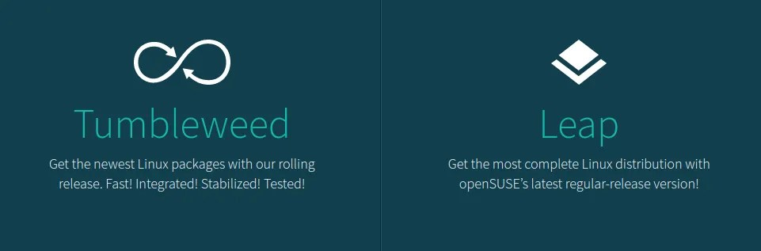
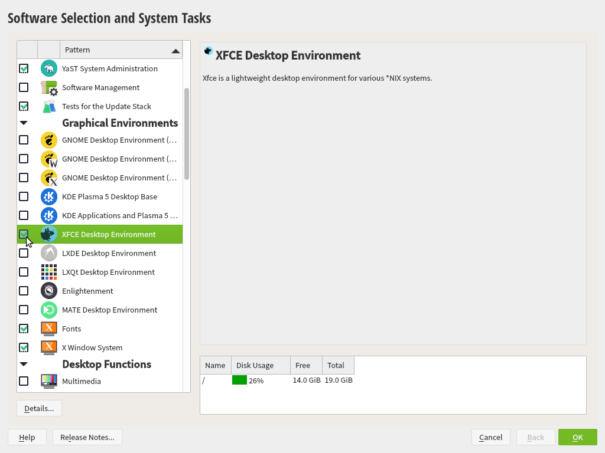
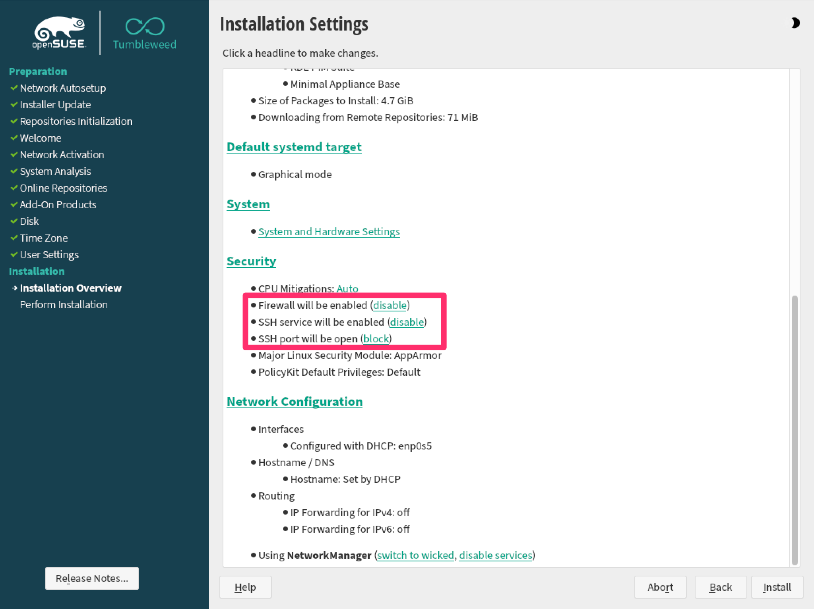
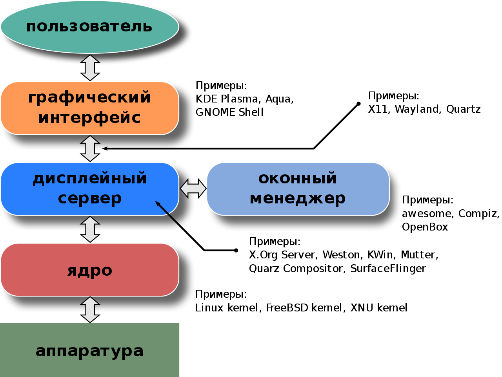
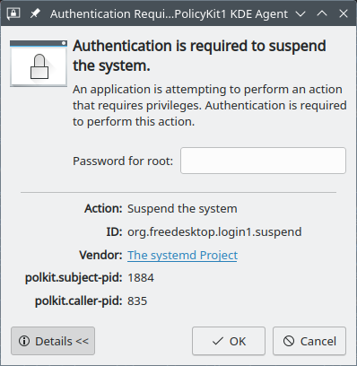
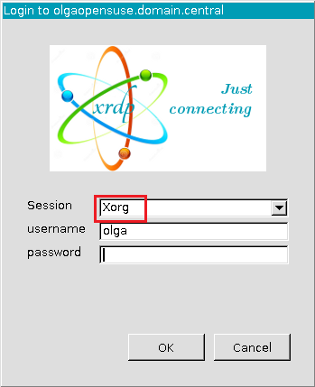
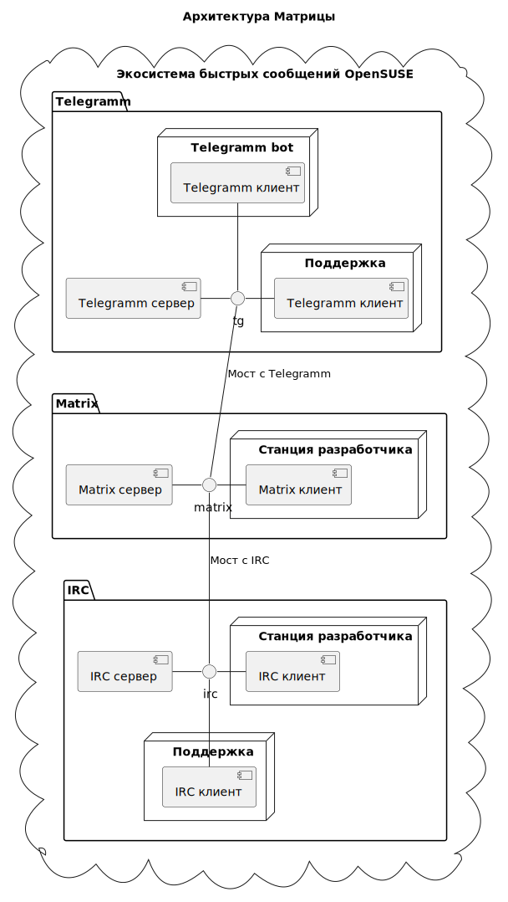
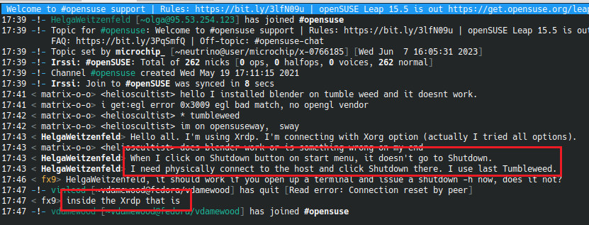

# OpenSuse

> Данный мануал является частью проекта [`Sysscripts`](../README.md); тут я
> рассказываю об особенностях платформы `OpenSuse`, а так же сборки `Qt`

Данный документ сфокусирован на процессе портирования некоторого ПО со старого
`Slackware 7.0`, или иной операционной системы конца 90-х годов, на `OpenSUSE`
последней версии.

# Оглавление

- [OpenSuse](#opensuse)
- [Оглавление](#оглавление)
- [Вступление](#вступление)
  - [Меры объёма памяти](#меры-объёма-памяти)
- [Версионность](#версионность)
  - [Операционная система](#операционная-система)
  - [Версии ПО](#версии-по)
- [Физические ресурсы](#физические-ресурсы)
- [Установка системы](#установка-системы)
  - [Tumbleweed LiveUSB](#tumbleweed-liveusb)
  - [Подготовка дискового пространства](#подготовка-дискового-пространства)
  - [Образ и установка](#образ-и-установка)
  - [Разблокировка firewall-а](#разблокировка-firewall-а)
  - [Первый логин](#первый-логин)
- [Графические среды](#графические-среды)
  - [Немного теории о графике](#немного-теории-о-графике)
  - [Plasma](#plasma)
    - [Plasma и терминал](#plasma-и-терминал)
    - [Plasma и расскладка клавиатуры](#plasma-и-расскладка-клавиатуры)
    - [Отключение автообновления](#отключение-автообновления)
  - [Xfce](#xfce)
  - [IceWM](#icewm)
    - [IceWM и терминал](#icewm-и-терминал)
    - [IceWM и Расскладка клавиатуры](#icewm-и-расскладка-клавиатуры)
- [Вопрос производительности](#вопрос-производительности)
  - [Фазы конфигурации](#фазы-конфигурации)
- [Swap](#swap)
- [Настройка сети](#настройка-сети)
  - [Статическая настройка сети](#статическая-настройка-сети)
- [Переменные среды](#переменные-среды)
- [Настройки](#настройки)
  - [Суперпользователь](#суперпользователь)
  - [Имя хоста](#имя-хоста)
  - [Настройка vim](#настройка-vim)
  - [Удалённый терминал](#удалённый-терминал)
  - [LocateDB](#locatedb)
  - [Приложения](#приложения)
  - [Sysscripts](#sysscripts)
  - [Папки сборок](#папки-сборок)
- [Дополнительные пакеты](#дополнительные-пакеты)
  - [Установка Xrdp](#установка-xrdp)
  - [Установка SSH](#установка-ssh)
  - [Установка Xfce](#установка-xfce)
- [Zypper](#zypper)
- [Сертификаты](#сертификаты)
  - [OS](#os)
  - [Java](#java)
- [Git](#git)
- [Qt](#qt)
  - [Репозиторий и готовые сборки](#репозиторий-и-готовые-сборки)
  - [Небольшое исследование](#небольшое-исследование)
  - [Зависимости Qt](#зависимости-qt)
  - [Подготовка Qt](#подготовка-qt)
  - [Переход на другие ветки и теги](#переход-на-другие-ветки-и-теги)
  - [Заплатка Qt](#заплатка-qt)
  - [Модули Qt](#модули-qt)
  - [Сборка Qt](#сборка-qt)
  - [Замечания Qt](#замечания-qt)
- [OpenCV](#opencv)
  - [Подготовка OpenCV](#подготовка-opencv)
  - [Сборка OpenCV](#сборка-opencv)
- [OpenSSL](#openssl)
  - [Подготовка OpenSSL](#подготовка-openssl)
  - [Сборка OpenSSL](#сборка-openssl)
- [LLVM](#llvm)
  - [Подготовка LLVM](#подготовка-llvm)
  - [Сборка LLVM](#сборка-llvm)
- [GitQlient](#gitqlient)
- [Cmake](#cmake)
- [Железо](#железо)
- [Virtual Box](#virtual-box)
  - [Внешние папки](#внешние-папки)
- [Матрица](#матрица)
- [Snap](#snap)
- [Некоторые заметки](#некоторые-заметки)
- [Термины и сокращения](#термины-и-сокращения)
- [Полезные ссылки](#полезные-ссылки)

# Вступление

В давние времена первые релизы предка `OpenSUSE` разрабатывалась компанией
*Gesellschaft für Software- und System-Entwicklung*, от сюда аббревиатура
*S.u.S.E*.

У `OpenSUSE` есть два основных дистрибутива:

* `Leap` - что означает - *Рывок*
* `Tumbleweed` - что означает *Перекатиполе*



`Tumbleweed` во многом, это `alfa` версия `Leap`, однако вместе с этим именно
`Tumbleweed` считается *той самой*, *для разработчиков*. Основное отличие это
подход к версионности. У `Leap` это стандартная `LTS` (*Long time support*)
модель версий. Шаблон версий `Leap`: `major.minor`. `Tumbleweed` основан на
*непрерывном распространении релизов* (*Rolling release*). Фактически `CI/CD`
от компьютера разработчика дестрибутива до компьютера пользователя. Шаблон
версий `Tumbleweed`: `yyyymmdd`.

Стоит предположить, что в качестве среды для станции разработчика мы будем
использовать `Tumbleweed`, а как среду рабочей *АПК*
(*аппаратно програмного комплекса*) или сервера - `LEAP`.

При установке `Tumbleweed` вы то и дело будете сталкиваться с некоторыми
неполадками. Часто обновление системы командой `sudo zypper update` решает
эти проблемы. Обновляйте систему каждый день.

В данном документе переменные среды приводятся без знака `$`, к примеру:
`CV_REF`.

## Меры объёма памяти

В процессе работы вам придётся столкнуться с переводом между десятичными
и двоичными размерностями объёма памяти. Ниже я привожу таблицу, которая
поможет вам с переводом между единицами:

**Десятичная приставка**

| Название  | Символ | Степень |
| :-------- | :----- | :------ |
| Килобайт  | `kB`   | $10^3$  |
| Мегабайт  | `Mb`   | $10^3$  |
| Гигабайт  | `Gb`   | $10^3$  |
| Терабайт  | `Tb`   | $10^3$  |
| Петабайт  | `Pb`   | $10^3$  |
| Эксабайт  | `Eb`   | $10^3$  |
| Зеттабайт | `Zb`   | $10^3$  |
| Йотабайт  | `Yb`   | $10^3$  |

> Каждая следующая размерность в $1000$ раз больше предыдущей, к примеру
> $6$ `Gb` это $6000$ `Mb`

**Двоичная приставка**

| Название  | Символ | Степень  |
| :-------- | :----- | :------- |
| Килобайт  | `KiB`  | $2^{10}$ |
| Мегабайт  | `Mib`  | $2^{20}$ |
| Гигабайт  | `Gib`  | $2^{30}$ |
| Терабайт  | `Tib`  | $2^{40}$ |
| Петабайт  | `Pib`  | $2^{50}$ |
| Эксабайт  | `Eib`  | $2^{60}$ |
| Зеттабайт | `Zib`  | $2^{70}$ |
| Йотабайт  | `Yib`  | $2^{80}$ |

> Каждая следующая размерность в $1024$ раза больше предыдущей, к примеру
> $6$ `Gib` это $6144$ `Mib`

# Версионность

Далее фиксации последних рабочих состояний операционной системы и ПО:

## Операционная система

| Среда        | `OpenSUSE`   | Версия     |
| :----------- | :----------- | :--------- |
| *Разработка* | `Tumbleweed` | `20240304` |
| *АПК*        | `Leap`       | `15.5`     |

## Версии ПО

Далее фиксация версий ПО для обеих сред. В таблице так же приведены переменные
среды хранящие версию:

> При изменении версии в данной таблице, не забывайте пожалуйста так же
> актуализировать значения переменных в разделе
> [переменные среды](#переменные-среды)

| ПО        | `Git ref`           | Переменная |
| :-------- | :------------------ | :--------- |
| `Qt`      | `v5.15.12-lts-lgpl` | `QT_REF`   |
| `OpenCV`  | `4.6.0`             | `CV_REF`   |
| `OpenSSL` | `openssl-3.2.1`     | `SL_REF`   |
| `LLVM`    | `llvmorg-16.0.1`    | `LL_REF`   |

# Физические ресурсы

На базовом этапе мы располагаем следующими физическими ресурсами:

|               | `Tumbleweed`           | `Leap`                |
| :------------ | :--------------------- | :-------------------- |
| `Motherboard` | `MSI H110M PRO-VD`     | `ChWay Sherman J 5.0` |
| `RAM`         | `3.7 Gi`               | `1.7 Gb`              |
| `Disk`        | `400 Gb`               | `26 Gb`               |
| `CPU`         | `Intell Pentium G4600` | `Intel Celeron J1900` |
| `Frequency`   | `3.60GHz`              | `1.99GHz`             |
| `Cores`       | `4`                    | `4`                   |

# Установка системы

Для разворачивания сервера или среды рабочей станции, вам необходимо
установить и настроить ОС `OpenSuse Tumbleweed` или `OpenSuse Leap`. Вы можете
скачать образ с [официального сайта][23]. `Offline` образ качается резвычайно
долго, следовательно используйте `Online` способ установки.

## Tumbleweed LiveUSB

Вам очень пригодится `Tumbleweed LiveUSB` для решения разных проблем, к примеру
увеличение пространства для `Swap` в случае, если при установке оно не было
достаточно выделено. Разумеется вы сможете использовать `Tumbleweed LiveUSB`
для работы с любой усановкой: и собственно говоря `Tumbleweed` и `Leap` и иной
операционной системой.

На [странице][37] образов `Tumbleweed` на последних страницах найдите и
скачайте файл `openSUSE-Tumbleweed-XFCE-Live-x86_64-Current.iso`. Запишите
его на `Flash USB` устройство знакомой нам командой `dd`. При установке
дополнительного ПО, к примеру `Gparted`, пакеты остануться на флешке. Вам не
придётся качать нужные архивы каждый раз.

## Подготовка дискового пространства

Допустим вы уже имеете достаточно старую систему расположенную на существующем
диске. Вы залили её ранее обычным `dd` с помощью `Clonezilla`, как указано
[тут](../clonezilla/README.md). Пусть это будет предок `OpenSUSE` - `Slackware`
`7.0`. Допустим дисковое пространство представлено следующим образом:

|             |          |
| :---------- | :------- |
| `/dev/sda1` | `500 Mb` |
| `/dev/sda2` | `30 Gb`  |

Вы до сих пор пользуетесь старой системой, и хотели бы расширить её дисковое
пространство. Это лучше сделать сейчас, так как после разметки диска под
`OpenSUSE` это будет опасно и трудоёмко.

Вы загрузились с `Tumbleweed LiveUSB`, запустили `Gparted`, но система не даёт
вам изменить размер тома `/dev/sda`. Вы могли бы создать том `/dev/sda3`
немного дальше, но какие то силы заставляют вас всё же загрузить старый
дистрибутив, и заняться древней магией вручную. Итак, ручное увеличение
пространства диска:

1. Загрузите `Slackware`
2. Изучаем топологию дисков с помощью `lsblk`
   1. `/dev/sda1` занимает всего `500 Mb`
   2. `Slackware` располагается на `/dev/sda2` на двух логических томах
      1. На первом ОС
      2. На втором файл подкачки (`Swap`)
   3. Иных разделов у нас пока нет
3. Изучаем типы разделов с помощью команды `parted /dev/sda`
   1. Печатаем таблицу разделов с помощью команды `print`
   2. Убеждаемся что оба раздела основные (`primary`)
4. Запускаем `fdisk /dev/sda -u=cylinders` в режиме геометрии цилиндров
   1. Печатаем таблицу разделов с помощью команды `print`
   2. Наблюдаем, что на `/dev/sda1` располагается загрузочная область
   3. Создаём новый раздел расчитывая цилиндры
      1. Сейчас для `Slackware` имеется `30` `Gb`
      2. Расширяем пространство для `Slackware` ещё на `30` `Gb`
      3. Вычисляем ближайшее число используя степени двойки
      4. `2^36 = 68719476736`
      5. Расширяем физический диск, логический расширим при необходимости
      6. Ищем сколько в цилиндре байт из заголовка команды
         (предположительно `8225280` байт)
      7. Последний цилиндр предположительно `60801`-ый
      8. Считаем делением сколько необходимо цилиндров, округляем вверх
      9. `68719476736 / 8225280 ~ 8355`
      10. Прибавляем количество цилиндров `/dev/sda1` (предположительно `64`)
      11. `8355 + 64 = 8418`
      12. Выполняем следующую последовательность команд
          1. `n`
          2. `p`
          3. `3`
          4. Вводим расчитанный размер
          5. Оставляем номер последнего цилиндра
          6. Не указанное оставляем по умолчанию нажимая `enter`
5. Расширяем раздел для `Slackware`
   1. Проводим сухой запуск команды `growpart -N /dev/sda 2`
   2. Запускаем команду в реальном режиме `growpart /dev/sda 2`
6. Перегружаем систему, изучаем новое разделение томов вышеупомянутыми
   командами
7. Далее `OpenSUSE` пересоздаст `/dev/sda3` и создаст `/dev/sda4` для своего
   `swap`-а.

> TODO: В будущем подумать как использовать общий `swap`, так же как вариант
> симметрично разместить `OpenSUSE` на `/dev/sda3` на `LVM`

## Образ и установка

Залейте образ на `usb` носитель командой `dd`. Много информации по настройке
системы вы можете найти данном документе. При установке образа, вы сталкнётесь
с графической средой, следовательно вам понадобится мышка.

> Если используя интерфейс `HDMI` при установке сервера вы сталкнётесь с
> серъёзными проблемами в виде прыгающего экрана, то вам стоит использовать
> переключиться на `VGA`

При выборе програмного обеспечения, в перспективе `Patterns` выберите
`XFCE Desktop Environment`.



При настройке файла подкачки (`Swap`) установите его в два раза больше объёма
`ОЗУ`. Настройте файл подкачки в виде раздела диска или логического тома.

При создании пользователя, выберите учётную запись, пусть к примеру это будет
`ilmarinen`. Выберите пароль. Оставьте галочку
*присвоения того же пароля системну пользователю*.

При настройке установки, слева, в секции `Installation Overview` под заголовком
`Installation`, установите следующие опции, как показано ниже на картинке:

* *Firewall will be enabled*
* *SSH service will be enabled*
* *SSH port will be open*



Учтите, что сетевой образ `Tumbleweed` имеет срок годности. Когда последняя
версия сетевого установщика достаточно разрйдётся с образом в сети, вы получите
сообщение вроде:

> You don't have appropriate image for such mode, download it and restart

В данном случае единственное решение это перезалить образ на флешку.

## Разблокировка firewall-а

Во время определения сети, вы можете сталкнуться с проблемой блокировки
`Firewall`-а, если последний имеется в вашей сети, даже если вы разблокировали
`Firewall` для `IP` привязанного к данному хосту, так как во время установки
система берёт новый `IP` по `DHCP`. В данном случае, вы можете использовать
один из двух методов:

1. Установить настройки сети свободного разблокированного адреса
2. Запустить комманду разблокировки

Для настройки сети, вернитесь на главный экран перейдите в меню с названием
типа `Expert Mode`, там `Network config`, откажитесь оставлять настроенные
данные, откажитесь от `DHCP`. Далее действуйте следующим образом:

1. Найдите свободный разблокированный `IP` адресс
2. Откройте настроки вашей сети с доступного компьюера
3. Расчитайте маску подсети (количество бит) (1)
4. Пропингуйте шлюз (`router`)
5. Пропингуйте `DNS Google`-а: `8.8.8.8`

(1) К примеру для `255.255.255.254`, это будет `ipaddress/23`

Перейдите к настройки сети, заполняя необходимую информацию, строку на каждом
окне:

```
xx.yy.zz.ww/nn
xx.yy.zz.1
8.8.8.8
пустое
```

Для разблокировки `firewall`-а запустите команду передавая пользователя и
пароль:

```sh
curl --max-time 1 -k -i -s -u <USER>:<PASSWORD> \
  $(curl --max-time 1 -k -i -s http://yandex.ru | \
    grep Location | \
    awk '{print $2}' | \
    tr -d '[:space:]')
```

Вашему вниманию представлен [скрипт](../scripts/cisco.sh) разблокировки,
который вы можете установить по пути `PATH`.

## Первый логин

Когда система попросит перезагрузится, нажмите `да` и как экран погаснет,
выньте `usb` диск. Первый ваш логин совершите в стандартную графическую
оболочку `Plasma`.

При первом логине, сконфигурируйте `sudo` для пользователя `ilmarinen` с
помощью комманды `sudo visudo` добавив необходимую запись, как указанно ниже.
Для команды `sudo` используйте тот же пароль что для пользовател `ilmarinen`.

# Графические среды

В процессе работы с `OpenSUSE` вам, без сомнения, придётся столкнуться с
различными графическими оболочками. Иначе, *системами рабочей среды*
(`Desktop managers`). [Ниже](#фазы-конфигурации) подробно рассказывается о
том, при каких обстоятельствах нам следует использовать какую среду.

## Немного теории о графике

Давным давно было придумано устройство `Телетайп`:

> (из Википедии) электромеханическая печатная машина, используемая для
> передачи между двумя абонентами текстовых сообщений по простейшему
> электрическому каналу (обычно по паре проводов)

В оригинале устройство называлось `Teletype` и обозначалось аббревиатурой
`TTY`. В какой то момент архитекторы *ЭВМ* решили использовать эту технологию
для взаимодействия с вычислительными машинами. В ранних `Unix`-ах дескрипторы
этих устройств были представлены файлами `/dev/ttyN`. Со временем печатная
машина превратилась в монтор, клавиатура стала отдельным устройством, но общее
имя терминала вывода остолось тем же, гордым `TTY`. Часть мониторов начали
работать в графическом режиме, где главными стали окна и мышка, но ядро ОС всё
так же работало с ними через теже `/dev/ttyN`. Разумеется не всегда был смысл
подключать несколько физических устройств к одному вычислительному блоку. `TTY`
стал виртуальным, и на один и тот же монитор можно было выводить разные
терминалы. В большинстве своём переключение происходило комбинацией
`Alt + Ctrl + FnN`.

Так и по сей день. Первый `TTY` открывается комбинацией `Alt + Ctrl + F1`,
второй `Alt + Ctrl + F2` и так далее. На `OpenSUSE` графический терминал
именно второй.

> Далее я буду использовать приближённую терминологию, с которой часть авторов
> могут не согласиться

На графический терминал информация подаётся из *Дисплейного сервера*, в нашем
случае это один из следующих:

1. `Xorg`
2. `Wayland`

*Дисплейный сервер* взаимодействует с *Оконным менеджером* с одной стороны, и
*Графическим интерфейсом* с другой. *Оконный менеджер* ответственен за
аутентификацию пользователя, а *Графический интерфейс* (так же называемый
*Графической оболочкой*) уже непосредственно создаёт рабочее окружение. В нашем
случае *Графическая оболочка* может быть одна из следующих:

1. `Plasma` на `Xorg`
2. `Plasma` на `Wayland`
3. `Xfce`
4. `Lxde`
5. `IceWM`

При этом *Оконный менеджер* может быть:

1. Консольный
2. `LightDM`
3. `SDDM`
4. `XDM`



В часте своей *Оконные менеджеры* идут из одного набора с
*Графическим интерфейсом*. К примеру `LightDM` соотносится с `Lxde`, а `SDDM` с
`Plasma`.

Во всей этой архитектуре есть так же ещё одна составляющая. Каркас на котором
написаны *Графический интерфейс* и *Пользовательские приложения*. Каркасы у нас
имеются *в основном* следующие:

* `Qt`
* `GTK+`

Смену оболочки мы совершаем через утилиту `yast2 alternatives`. Выберите
необходимое значение опции `default-xsession.desktop`. За *Оконный менеджер*
отвечает опция `default-displaymanager`, но *Оконный менеджер* в общем менять
не имеет смысла. `yast2` имеет так же и графическую среду, но консольная может
оказаться проще:

```sh
sudo yast2 alternatives
```

> Важно заметить, что `Xrdp` подключается так же как и *Оконный менеджер*
> к определённому *Графическому интерфейсу*, фактически выполняя одну из
> функций *Оконного менеджера*

При изменении *Графической оболочки*, если система зависнет, возможно вам
придётся открыть консольный терминал (`Ctrk + Alt + F1`) И перегрузить
соответствующий сервис:

```sh
sudo systemctl restart display-manager
```

Для отладки обратите внимание на лог `Xorg`-а: `/var/log/Xorg.0.log`. В случае
`Wayland` поток логов скорее всего будет проходить по иному маршруту.

> TODO: узнать куда пишет `Wayland`

## Plasma

Графическая среда `OpenSUSE` по умолчанию. На самом деле очень красивая,
относительно лёгкая, правда в `Tumbleweed` иногда непредсказуемая, так как
представляет из себя последнюю, ещё не полностью тестированную версию.

### Plasma и терминал

В основном всё взаимодействие с графической средой происходит через подсистему
`qdbus`. К примеру: завершение данной пользовательской сессии:

```sh
qdbus org.kde.Shutdown /Shutdown logout
```

### Plasma и расскладка клавиатуры

Добавьте русскую раскладку через сситемные настройки, которые вы
найдёте в меню *Пуск* -> *Input Devices* -> *Keyboard* -> *Layouts* -> *Add*.

Обратите внимание на *Alternative shortcut: Meta + `Alt + K`*.

В свете того, что мы работаем через `Xrdp`, достаточно сложно настроить
привычный нам `ALt + Shift`, даже `Alt + Space` не работает - он
перехватывается системой. Проще всего или превыкнуть именно к
`Meta + Alt + K`, где `Meta` это клавиша `Win`, или настроить
`Win + Space`.

### Отключение автообновления

> Данный раздел актуален в случае если вы устанавливаете версию `Leap`

Отключите в `OS` систему автообновлений, иначе придётся столкнуться с
назойливой и трудно решаемой проблемой:

> PackageKit blockiert zypper. Dies passiert, wenn Sie ein Aktualisierungsmodul
> oder eine andere Softwareverwaltungsanwendung benutzen, die PackageKit
> verwendet.\
> PackageKit beenden? [ja/nein] (nein): j\
> PackageKit läuft noch (wahrscheinlich aktiv).

Для отключения, нужно удалить пакет `plasma5-pk-updates`, сначала найдём его
точную версию:

```sh
rpm -qa | grep -i plasma5-pk-updates
plasma5-pk-updates-lang-0.3.2-bp153.2.2.1.noarch
plasma5-pk-updates-0.3.2-bp153.2.2.1.x86_64
```

Затем удалим их поочерёдно учитывая конкретные версии:

```sh
sudo rpm -e plasma5-pk-updates-lang
sudo rpm -e plasma5-pk-updates
```

Если процесс запущен и не даёт воспользоваться командой `zypper`, найдите и
удалите его с помощью `ps -A` и `kill -9`.

Так же полезно отключить сервис индексации файлов:

```sh
balooctl suspend
balooctl disable
balooctl purge
```

Если сервис не отключается, то его можно ликвидировать по старинке:

```sh
ps -ef | greps baloo
sudo kill -9 <pid>
```

Всегда следите за состоянием системы и старайтесь избегать программ, которые её
неоправданно грузят. Вы можете мониторить производительность, с помощью
программы: `htop`.

## Xfce

Мышинная среда `Xfce` полностью настраивается мышкой. Имеет французские корни.
Легче чем `Plasma`, от туда же ловит настройки раскладки клавиатуры.

## IceWM

`IceWM` это самая лёгкая но и самая бедная и труднонастраиваемая среда. Её мы
будем использовать на первой [фазе](#фазы-конфигурации) конфигурации. В
основном все настройки этой среды происходят через файлы.

Буфер обмена при подключении через `Xrdp` может иногда давать сбой. Для
копирования в программе `Konsole`-е, к примеру, в общий буфер, вы можете
использовать комбинацию `Ctrl + Shift + c`.

Все настройки `IceWM` читает в основном из двух папок, но нас интересует лишь
второй вариант - папка в нашем домашнем каталоге:

1. `/etc/icewm`
2. `$HOME/.icewm`

Основные настройки располагаются в файле `preferences`. Ознакомьтесь с
[документацией][38] данного файла. Итак, вот основные файлы настройки `IceWM`:

* `preferences` - общие настройки
* `keys` - горячие клавиши
* `menu` - меню системы *Пуск*
* `startup` - команды автозапуска

Настройте *меню* системы *Пуск* удалив от туда всё лишнее, что тормозит
систему. Добавьте файл `menu` со следующим содержимым:

```sh
prog "Konsole" konsole konsole
prog Firefox firefox firefox
menuprog SUSE folder xdg_menu --format icewm
```

Добавьте горячую комбинацию клавиш `Alt + Ctrl + t` для запуска `Konsole`.
Добавьте файл `keys` со следующим содержанием:

```sh
key  "Alt+Ctrl+t"  konsole
```

### IceWM и терминал

После настройки необходимых файлов, перегрузите среду следующей командой:

```sh
icewm --restart
```

Пулностью удалить `IceWM` из памяти вы можете следующей командой. В данном
случае вы уже вернётесь в *Оконный менеджер*:

```sh
pkill icewm
```

### IceWM и Расскладка клавиатуры

Определите комбинацию `Alt + Shift` для переключения раскладки клавиатуры.
Добавьте файл `startup` со следующим содержимым:

> TODO: разобраться с выводом индикатора раскладки на панель

```sh
setxkbmap \
  -layout "us,ru(winkeys)" \
  -model "pc105" \
  -option "grp:alt_shift_toggle"
```

# Вопрос производительности

Как известно предполагается, что мы будем использовать компьютеры с
ограниченным объёмом памяти. Если для продового режима (`Leap`) выделенных,
ресурсов нам вполне достаточно, то для режима разработки (`Tumbleweed`) мы
ощущаем серьёзный дифицит. На данный момент мы располагаем следующими
горлышками бутылки в сравнении со среднестатистической станцией разработки:

> `3.7 Gi RAM`, `3.6 GHz x 4`

В попытках оптимизировать систему и найти оптимальные настройки, я написала
небольшой пост в поддержку `OpenSUSE` на `Telegramm` [канале][30]:

---
Hi! I sorry that this is kind of longread, but I have much question accumulated
for months of work. We have old point of sale system run with `Qt4/Qr3Support`
over `Slackware 7.0` 32 bit with `qmake` build configuration system. I porting
it to `Qt5` `v5.15.12-lts-lgpl` over last `OpenSUSE` 64 bit with `CMake` build
configuration system. I write kind of [blog][29] for this project, sorry for
Russian. I have computer with 4 `Gb RAM`, and I can not demand more. I can, but
I should not, thus old stations have 4 `Gb RAM` also. I need to make two
distributions for our point of sale station. One - `POS` for market
(`POS` prod) and another - development environment (`POS` dev). I decided to
use `Leap` for `POS` prod and `Tumbleweed` for `POS` dev. I started with
`Tumbleweed` and from beginning get noising auth reqest from Plasma.



I joined to `IRC` chat `#openSUSE` on `liberachat`. People there told me that
if I will create account on `OpenSUSE`, they will join me to `Matrix`. I made
account: `ya.olgapshenichnikova@yandex.ru`. I continued with my project. I
compiled several frameworks: `SSL`, `Qt`, `OpenCV` and other. `SSL` - it was
required by `Qt`. `Qt` doesn't links `ssl` installed by default nor find
headers. `libssl` package doesn't solves the problem. `Qt` successfully built,
but leaves `QtDoc` unbuilt thus issues with `llvm`. It was standart warning:

> WARNING: QDoc will not be compiled, probably because libclang could not be
> located. This means that you cannot build the Qt documentation\
> \
> Either ensure that llvm-config is in your PATH environment variable, or set
> LLVM_INSTALL_DIR to the location of your llvm installation.\
> On Linux systems, you may be able to install libclang by installing the
> libclang-dev or libclang-devel package, depending on your distribution.\
> On macOS, you can use Homebrew's llvm package.\
> On Windows, you must set LLVM_INSTALL_DIR to the installation path.

`OpenCV` we need for our "product recognition" when selling. I need also good
`Git UI` such as `TortoiseGit` for `Windows`. I tried `Guitar` and `GitQlient`,
but it is really lack of functionality... `Guitar` isn't run now at all. I
tried it year ago. `GitQlient` have no ability even to change size of frames in
`UI` window... Despite the fact, that we will use `QtCreator` (I didn't built
it yet) we also need `Visual Studio Code`. I need make our application be build
both with `QtCreator` and `VSCode`. I found that `Tumbleweed` sheeped with
custom `Code - OSS` from `obs://build.opensuse.org/devel:tools:ide`.
But! It just have blue `C/C++ Extension Pack` from `franneck94` and it doesn't
works (`F12` doesn't works). The red `C/C++ Extension Pack` by `Microsoft`
isn't available in `Code - OSS`. I removed `Code - OSS` and installed `Code`
from `https://packages.microsoft.com/yumrepos/vscode`. Now the red
`C/C++ Extension Pack` was available and `F12` now working. But! It was very
very very slow. I tried `Xfce` instead of `Plasma`. It was still slow. We have
320 `cpp` files, by the way. It is importatnt to say that `Plasma` is kind of
very good environment. I watch resources used by in `htop`, and admitted that
it is effective enough. I removed last `Code` and installed `Code - OSS` back.
It was strange, but red `C/C++ Extension Pack` now became available. It became
faster, but still slow. I think about `IceWM`, but just issue of keyboard
switchind holds me from this step. I don't know how slow `QtCreator` will be.

Now several questions related to things I mentioned above:

1. Is there some known issue with `libclang` for `Qt` build?
2. Is there some known issue with `libssl` for `Qt` build?
3. What about noising auth request from `Plasma`?
4. Where is best chat to ask all my questions?
5. Is there `Git UI` for `OpenSUSE` such as `TortoiseGit`?
6. Why red `C/C++ Extension Pack` wasn't available in `Code OSS`?
7. Why it became available in `Code OSS` after oficial `Code` installation?
8. Why blue `C/C++ Extension Pack` don't gives `C++` editor functionality?
9. Is `Plasma` not much worst than `Xfce`/`LXDE`?
10. Is it possible to run `VStudio Code` on 320 `cpp` files with 4 `Gb` `RAM`?
11. If I need to rise question about RAM increasing?
---

## Фазы конфигурации

На пост выше конечно не ответили, но он очень помог собраться с мыслями. Итак!
Учитывая, что у нас с одной стороны недостаток ресурсов относительно нашего
расточительного времени, а с другой собственно говоря очень расточительное ПО,
я решила определить три фазы в которых смогут быть наши станции разработки
относительно объёма `ОЗУ` и набора програмного обеспечения. Средняя фаза
предполагает объём памяти между базовой и полной. Для продового режима, как
сказанно выше, указанных объёмов вполне достаточно:

|         | Объём `ОЗУ` | Window Manager | Среда разработки             |
| :------ | :---------- | :------------- | :--------------------------- |
| Базовая | `4 Gi`      | `IceWM`        | `vim`(1)/`QtDesiner`         |
| Средняя |             | `Xfce`         | [`QDevelop`][33]/`QtDesiner` |
| Полоная | `8 Gi`      | `Plasma`       | `QtCreator`                  |

(1) `vim` + `Termdebug` + `CtrlK`

# Swap

Файл подкачки (`swap`) рекомендуется делать в полтора два раза больше объёма
`ОЗУ`. Файл подкачки сыграет большую роль при сборки мегалитических проектов
типа `llvm`, так как последнее время на плюсах всё больше используют шаблоны,
что экспоненционально [увеличивает][31] расход ресурсов. Если система при
установке создала недостаточно большой файл подкачки, увеличим его.

Если последний является именно файлом, то вам будет достаточно следующих
дефствий описанных [тут][34] и [тут][35]:

1. Команда `swapoff`
2. Команда `dd`
3. Команда `mkswap`
4. Редактирование `/etc/fstab`
5. Команда `swapon`, как

Если же при установке система создала отдельный **том** недостаточного
размера, то вам придётся немного потрудиться. Заранее ознакомтесь с возможной
проблемой вызванной подсистемой [`quota`][36]. `Gparted`, который мы привлечём
к помощи скорее всего не сможет изменить размер диска с активной квотой.

Итак, допустим `/dev/sda1` занимает у нас `500 Mb` и хранит:
*загрузочный сектор*, `initrd` и `grub`. `/dev/sda2` пусть будет занят
какой-нибудь дополнительной системой, к примеру `Slackware 7.0`. Тогда при
установке `OpenSUSE` мы получим `/dev/sda3` занятый системой, и `/dev/sda4`
отведённый под `swap`. По умолчанию, `swap` создасться в размере 2 `Gib`.

> Напомним, что каждая размерность системы `X`*бибайтов* равняется $1024$
> единицам предыдущей размерности; так 1 `Gib` (Гибибайт) равен 1024-ём `Mib`
> (Мебибайтам), смотрите [Меры объёма памяти](#меры-объёма-памяти)

Отключите квоту в основной системе, предварительно проверив её:

```sh
btrfs quota rescan -w /
btrfs quota disable /
```

Загрузитесь с [Tumbleweed LiveUSB](#tumbleweed-liveusb), и установите
`Gparted`:

```sh
sudo zypper install gparted
```

Откройте последний через меню пуск, уменьшите объём `/dev/sda3` оставив
**после** него свободное пространство размером $6144$ `Mib`. Нажмите на
галочку сверху. Подтвердите осознание опасности действия. Остальные
манипуляции с томами, от греха подальше, мы выполним уже в режиме работы
основной ОС.

После успешного уменьшения тома, выключите компьютер, выньте `Flash USB`,
загрузитесь в основную ОС. Включите квоту, и ещё раз проверьте её:

```sh
btrfs quota enable /
btrfs quota rescan -w /
```

Отключите `swap`:

```sh
sudo swapoff -a
```

Пересойздайте `/dev/sda4`:

1. `sudo fdisk /dev/sda`
2. `p` для ознакомления
3. `d` для удаления
   1. Выберите 4-ый том
4. `n` для создания
   1. Тип - `primary`
   2. Остальное подтвердите по умолчанию
5. Ещё раз `p` для ознакомления
6. `l` для вывода типов тома
7. `t` для присвоения типа `Linux swap / Solaris`
   1. `82` тип `Linux swap / Solaris`
8. Ещё раз `p` для ознакомления
9. `w` для записи
10. `q` для выхода

Отформатируйте том под `swap`:

```sh
sudo mkswap /dev/sda4
```

Подмените `UUID` в соответствющей строке в файле `/etc/fstab`. Сначала
примерьтесь, затем добавьте опцию `-i` (`in-place`) к команде `sed`:

```sh
sed "s/$(cat ~/fstab |\
    grep swap |\
    awk -F" " '{print $1}' |\
    awk -F= '{print $2}')/$(ls -l /dev/disk/by-uuid |\
        grep sda4 |\
        awk -F" " '{print $9}')/g" /etc/fstab
# Если всё хорошо, вызовете "sed -i ..."
```

Включите `swap`:

```sh
sudo swapon -a
```

Убедитесь, что `swap` работает:

```sh
free -h
```

# Настройка сети

Выберите имя хоста, к примеру `kalevala`.

---
Настройте в файле `/etc/sysconfig/network` параметр `HOSTNAME` в формате
`<HOSTNAME>.domain.name`, к примеру `kalevala.domain.central`.

Проверьте свой `IP` с помощью комманды `ifconfig`, к примеру он:
`192.168.1.70`.

Убедитесь, что `IP` будет постоянным. Иногда, в случаях когда мы не можем
сконфигурировать `DHCP`, а в случае виртуальной машины мы используем сетевой
мост, то единственный способ, это установиnь `IP` постоянным через системные
файлы. На `CentOS` к примеру это `/etc/sysconfig/network-scripts/ifcfg-ethX`.

---
Сделайте те же настройки, что для `Slackware` учитывая, что имя хоста в файле
`/etc/hostname`, а `IP` мы находим командой: `ip a`.

Очень полезно отказаться от Вселенского Протокола `ipv6`, убрав нужную галочку
в пунктах меню `YaST`. Остальная конфигурация сети не потдерживается через
`YaST`, пусть так и остаётся.

Настраиваем `firewall`:

```sh
sudo firewall-cmd --zone=public --add-port=1521/tcp
sudo firewall-cmd --permanent --zone=public --add-port=1521/tcp
sudo firewall-cmd --list-all
```

Опция `--permanent` обеспечивает сохранность конфигурации между перезагрузками.
Для того, что бы опция приминалась сразу, нужен вызов без опции `--permanent`.

Далее проверяем, что порт слушается с помощью команды ~~Schutzstaffel~~ `ss`:

```sh
ss -ln | grep 1521
tcp LISTEN 0 128 0.0.0.0:1521 0.0.0.0:*
```

Для вывода процесса, добавьте `-p`.

При трудностях с доступом к `Oracle`-у на виртуальной машине с хоста, учитывая
отсутствие прав на физических хостах и отсутствие возможности установить
`telnet`, в целях отладки, можно воспользоваться следующим скриптом `python`-а.
Сам же `python` вы можете установить в рамках пользователя без прав
администратора. Предположим, что `IP` виртуальной машины с `OpenSUSE` -
`192.168.1.112`:

```python
from telnetlib import Telnet
Telnet('192.168.1.112', 1521).interact()
```

---
Добавляем в `/etc/hosts` строку в формате
`<IP> <HOSTNAME>.domain.name <HOSTNAME>`, к примеру:

```
192.168.1.113	kalevala.domain.name kalevala
```

> Если вы запускаете виртуальную машину, всегда выберайте тип сети:
> *сетевой мост*

## Статическая настройка сети

В случае настройки сервера, сконфигурируйте сеть заполнив следующие файлы,
следующими данными, используя команду `vim`. Предварительно найдите свободный
`IP` адрес. Пусть к примеру у вас следующая настрйока сети:

|              |                 |
| :----------- | :-------------- |
| `IP`         | `13.14.11.143`  |
| `MASK`       | `255.255.255.0` |
| `NETWORK`    | `13.14.11.0`    |
| `GATEWAY`    | `13.14.11.1`    |
| `NAMESERVER` | `8.8.8.8`       |

`/etc/sysconfig/network/ifcfg-eth0`

```
BOOTPROTO='static'
BROADCAST='13.14.11.255'
IPADDR='13.14.11.143'
NAME='FnEthernet'
NETMASK='255.255.255.0'
NETWORK='13.14.11.0'
STARTMODE='auto'
USERCONTROL='no'
ZONE=public
```

`/etc/sysconfig/network/route-eth0`

```
13.14.11.0 13.14.11.1  255.255.255.0 eth0
defualt 13.14.11.1 0.0.0.0 eth0
```

Для разблокировки `firewall`-а, если такой имеется в вашей сети, используйте
скрипт [`cisco.sh`](../scripts/cisco.sh), который далее будет размещён по пути
`$PATH` в вашей системе. При вызове скрипта передайте имя пользователя.

Если же по какой то причине скрипт `cisco.sh` вам не подходит, рекомендуется
использовать `elinks`. Это так же позволит ваи разблокировать `Firewall`-а,
если такой имеется в вашей сети. На самом деле `elinks` достаточно полезная
утилита, и её в общем стоит установить.

# Переменные среды

Определите полезные для работы переменные и `alias`-ы в среде терминала. Для
этого *примените* (`source`) скрипт [`env.sh`](env.sh) через `$HOME/.bashrc`:

```sh
# Добавьте строку в $HOME/.bashrc
. $HOME/repos/sysscripts/opensuse/env.sh
```

> Экспорт переменных с помощью команды `export` важен, иначе данную переменную
> не будет видно в вызывающем скрипте

# Настройки

## Суперпользователь

Разработка на `OpenSuse` будет происходить не с пользователем `root` и не с
аппликативным пользователем, с которым будет запускаться приложение в рабочем
режиме. Разработка будет происходить с обычными пользователями, состоящими в
группе `users`.

Для того, что бы вам было удебнее использовать команду `sudo`, добавьте
следующую запись в соответствующий системный файл запустив редактор с помощью:

```sh
sudo visudo
```

Предположим, что имя вашего пользователя: `olga`, тогда его часть `Defaults`
будет выглядеть так:

```
Defaults targetpw
ALL     ALL=(ALL) ALL
olga    ALL=(ALL) NOPASSWD:ALL
```

## Имя хоста

Установите имя вашего хоста. Вы можете добавить имя домена к имени хоста:

```sh
sudo hostnamectl set-hostname <HOSTNAME>
```

Не забудьте затем прописать запись в `/etc/hosts`, к примеру:

```
192.168.1.30     kalevala kalevala.ru
```

## Настройка vim

Создайте файл `$HOME/.vimrc` с содержанием из [главы](../vimide/README.md#vim)
в мануале `vimide`.

## Удалённый терминал

Убедитесь что вы располагаете публичным ключём вашего приватного, и если нет,
создайте его:

```sh
ssh-keygen -y -f ~/.ssh/id_rsa > ~/.ssh/id_rsa.pub
```

Интегриуйте ключ в файл `authorized_keys` на хосте `OpenSUSE`:

```sh
ssh-copy-id -i ~/.ssh/id_rsa ilmarinen@kalevala
```

## LocateDB

Создайте базу данных очень полезной утилиты `locate`:

```sh
sudo updatedb
```

Пример использования утилиты. Допустим вам надо найти расположение файла
`icewm/menu` в системе:

```sh
locate icewm/menu
```

## Приложения

Тут привидён список необходимых приложений доступных из базовых репозиториев
`OpenSUSE`. Установите следующий список полезных и необходимых приложений,
используя команду `sudo zypper install <PACKAGE>`:

* `git` - система контроля версий
* `gcc-c++` - компилятор `C++`
* `make` - система сборки
* `cmake` - система конфигурации сборки
* `ruby` - компилятор `ruby`
* `htop` - монитор производительности
* `elinks` - консольный клиент интернета
* `neofetch` - консолидатор информации о системе

Удалите следующие приложения используя команду `sudo zypper remove <PACKAGE>`
в виду их расточительности или иных причин:

* `kalendarac` - календарь; занимает много места в `ОЗУ`

## Sysscripts

Скачайте данный репозиторий по пути `$HOME/repos/sysscripts`, далее мы пропишем
папку `scripts` по пути `$PATH`.

## Папки сборок

Для сборки стандартных приложений нам стоит подготовить специальные папки.

> TODO: Устанавливать приложения по стандартным путям типа `/usr/local/bin`

```sh
sudo mkdir -p $APPS
```

Промежуточные - объектные файлы, будем располагать в папках `$HOME/builds`:

```sh
cd $BUILDS
mkdir $APPS
```

# Дополнительные пакеты

## Установка Xrdp

Устанавливаем `Xrdp`:

```sh
sudo zypper update
zypper install xrdp
sudo systemctl enable xrdp
sudo systemctl start xrdp
sudo systemctl status xrdp
sudo firewall-cmd --permanent --zone=public --add-service=ms-wbt
sudo firewall-cmd --reload
```

Далее необходимо (обязательно) разлогинеться из основной сессии, иначе на
сессии `Xrdp` будет пустое окно. Так же перед запуском команды `mstsc` заранее
переключите расскладку клавиатуры на английский. В окне `Xrdp` у вас это
сделать не получится. При подключении по `Xrdp` используйте исключительно опцию
`Xorg`.



## Установка SSH

Если при установке `OpenSUSE` вы не настроили установку `SSH` сервера, то
выполните следующие действия:

```sh
sudo zypper refresh
sudo zypper install --no-confirm openssh
sudo systemctl enable sshd
sudo systemctl start sshd
sudo firewall-cmd --permanent --zone=public --add-service=ssh
sudo firewall-cmd --reload
```

## Установка Xfce

Если при установке `OpenSUSE` вы не настроили установку графической среды
`Xfce` сервера, то установите последний одним из следующих способой:

1. Вызвав графическую оболочку `yast`
2. Через команду терминала

При первом способе, вам нужно настроить перспективу `Patterns` подобно той,
что вы наблюдали во время [установки](#образ-и-установка), там выбрать
`Xfce`.

Во втором случае запустите команду:

```sh
sudo zypper install patterns-xfce-xfce
```

# Zypper

**Zypper - система контроля пакетов**.

Возможно вам предётся добавлять какие то внешние репозитории в систему, но
более вероятно, что вам придётся ещё и удалять их.

Вот полезные команды:

```sh
# Обновить статус системы управления пакетами
sudo zypper refresh
# Если начинают появлятся красные строки с ошибками, значит некоторые
# репозитории нужно удалить. Выводим список репозиториев, должна признать,
# разработчики постарались на славу, и таблица поистине эстетична и
# информативна
sudo zypper repos
# Берём номера битых репозиториев, и удаляем их за раз
# Важно! Если удалить по одному, то надо не забыть каждый раз вновь посмотреть
# список, так как каждый раз репозитории будут переиндексироваться
sudo zypper removerepo 1 2 ...
# Проверяем что всё вернулось к стабильности
sudo zypper refresh
```

---
> TODO: проверить актуальность; сейчас вроде официальные репозитории `OpenSUSE`
> снова заработали

После атаки Мордора на Рохан `zypper ref` стал очень долгим, по понятным
причинам. Но к счастью те немногие эльфы, что сохранились в Мордоре создали и
сохранили локальные репозитории `OpenSuse`.

Базовый `url` у них: `https://mirror.yandex.ru/opensuse`.

Вам в любом случае будет необходимо заменить оригинальный `url` репозиториев на
`yandex`-овский.

Переходим в папку: `/etc/zypp/repos.d`, и пользуемся волшебной командой:
`sudo vim *`.

В каждом файле меняем `http[s]://download.opensuse.org` на
`https://mirror.yandex.ru/opensuse` в свойствах `baseurl` и `gpgkey`. Переходим
на следующий файл внутренней командой: `:wn`, в конце обычное `:wq`.

Затем обновляем репозитории: `sudo zypper ref`.

> В яндексе пока нет `security/SELinux/SLE_15_SP3/`, поэтому ставим просто
> `security/SELinux/SLE_15/`

---
Поиск пакета по имени содержимого файла:

```sh
zypper se --provides --match-substrings libsso
```

Распаковка файлов и скриптов архива `rpm`.

```sh
rpm2cpio oracle-xe-11.2.0-1.0.x86_64.rpm | cpio -idmv
rpm -qp --scripts oracle-xe-11.2.0-1.0.x86_64.rpm > scripts.sh
```

# Сертификаты

## OS

Сертификаты должны распологаться в папке `/opt/certs`. Создаём новый сертификат:

```sh
cd /opt/certs
openssl req \
  -newkey rsa:4096 -nodes -sha256 -keyout ilmarinen.key \
  -x509 -days 365 -out ilmarinen.crt \
  -addext "subjectAltName = DNS:$HOSTNAME" \
  -subj "/C=RU/ST=Vologda/L=Vologda/O=Kalevala/OU=NIT/CN=$HOSTNAME"
```

Проверьте, что поле `subjectAltName` проставилось:

```sh
openssl x509 -in ilmarinen.crt -text | less
```

Установим сертификаты в системе:

```sh
sudo cp /opt/certspos.crt /usr/share/pki/trust/anchors
sudo update-ca-certificates
```

> При изменениях в сертификате, для применения в `Docker registry`, сам
> `registry` нужно удалить и пересоздать, так же пересоздать секреты; о
> `Docker registry` написано ниже

## Java

Для `VisualStudio Code` всё же придётся установить сертификаты напрямую в
`keystore` `Java`-ы.

Для этого воспользуйтесь скриптом `certs/register-jdk.sh` в данном проекте:

```
Запуск
  register-jdk.sh -h
    -h             вывод справки
  register-jdk.sh <CERT_FLDR> <JAVA_VER> <COMMAND> <CERTIFICATE> [<DRY_RUN>]
    <CERT_FLDR>    папка с сертификатами
    <JAVA_VER>     версия JDK: 8 или 11
    <COMMAND>      комманда: register или unregister
    <CERTIFICATE>  имя сертификатат без расширения
    <DRY_RUN>      сухая прогонка: d
Примечание:
  1. Экспортируйте переменную среды JDK_PATH для регистрации
     сертификатов в пользовательском JDK.
  2. Используйте сухую прогонку для проедворительной проверки
     параметров
Пример
  export JDK_PATH=/opt/jdk-17
  register-jdk.sh certs 11 register valkovesi
```

Сам же `VSCode` требует `JDK 17` для своей работы с кодом `Java`-ы.
Более того, он возможно будет пытаться запускает проект на этом `JDK`.

Укажите для `IDE` пути к `JDK` в следующем блоке:

```json
{
    "java.configuration.runtimes": [
        {
            "name": "JavaSE-11",
            "path": "/usr/lib64/jvm/java-11-openjdk-11/",
        },
        {
            "name": "JavaSE-17",
            "path": "/home/olga/java/jdk-17.0.4.1+1",
            "default": true
        }
    ]
}
```

Разместите этот блок на любом уровне конфигурации, к примеру в файле:
`~/.config/Code/User/settings.json`

# Git

Стоит настроить следующие настройки `Git`-а на рабочей виртуалке `OpenSuse`.
Впишите свои *ФИО* и *git_id*:

```sh
git config --global init.defaultBranch main
git config --global --edit
# Содержимое файла настроки
1 # This is Git's per-user configuration file.
2 [user]
3 # Please adapt and uncomment the following lines:
4    name = <Фамилия Имя Отчество> (<gitId>)
5    email = gitId@Kalevala.org
6 [init]
7    defaultBranch = main
```

# Qt

`Qt` можно собрать из двух источников:

1. Репозиторий
2. Скаченный архив

Репозиторий `Qt` представляет из себя композицию из главного репозитория с
подмодулями `git`-а. Скаченный архив обычно содержит `working tree`
определённого тега всей этой композиции, и находится в формате `.tar.gz`.

> В сети на данный момент официально есть только репозиторий содержащий теги
> `Qt 5` и `Qt 6` (в рамках одной композиции). Даже после известных событий
> и ограничений от компании `Qt` в отношении некоторых государств на скачивание
> своих продуктов, доступ к самому [репозиторию][4] под лицензией `LGPL`
> открыт, что не может не радовать

При этом репозитория `Qt 4` в свободном доступе нет. Есть только архивы, их
можно скачать лишь с сайта `Qt`, но скачивание заблокированно. Ещё до блокировки
я успела скачать весьма святой для нас архив:
`qt-everywhere-opensource-src-4.7.4.tar.gz`, мы можем им пользоваться, так как
содержимое под лицензией `LGPL`, но не сможем больше его скачать легально, без
прокси и `VPN`. По сему это тархив нужно хранить и расположить где то в
централизованном месте.

Я думала (и даже реализовала задуманное) - загрузить содержимое в виде
репозитория на `GitHub`, идея особенно привлекательна учитывая, что при
создании образа `Docker`-а нужна лишь команда `git clone`. Но я разочаровалась
в этой идее, так как репозиторий предполагает наличие всех веток и тегов версий
проекта, плюс репозиторий `Qt`, как сказанно выше - это композиция. Такой
самопальный статичный репозиторий, который не будет изменяться, слишком не
соответствует правилам красоты и эстетики, и решено было оставить код `Qt 4` в
виде архивов.

`Qt 4` не собирается на `OpenSuse 15.3`
(и `14.x`, и `13.x` скорее всего и ещё и ещё), но собирается на `OS` конца
90-х. На новой `OS` вы получите следующую ошибку:

> error: flexible array member ‘inotify_event::name’ not at end of
> ‘struct QMapPayloadNode<int, inotify_event>’

Сборка `Qt 4` необходима для запуска компиляции нынешней версии проекта на
`GitLab CI` в контейнере `Docker`-а на `appsrv-1`, и подробно рассмотрена
далее.

[Вот][9] богатый источник документации по `Qt4`. Перед сборкой `Qt` соберите
[`OpenSSL`](#openssl). Обратите внимание на опцию `-I /opt/openssl/include`
в настройках `configure`. Прочитайте [подробнее][27] о сборке `Qt` с `OpenSSL`.

> TODO: проверить, от куда `Qt` тянет библиотеки `OPenSSL`, если мы казываем
> при сборке лишь папку с заголовками через опцию `-I`

## Репозиторий и готовые сборки

> Важная ремарка! По неустановленным причинам, но предположительно в
> коммерческих целях, `Qt` достаточно трудно собрать из `OpenSource`-ного
> репозитория (иного у нас нет). Большинство веток и тегов просто не
> собираются. Проще всего оказывается собрать тот набор исходников, которые
> можно скачать с [файлового хранилища][6] `release`-ов.

При этом я не нашла *формальной* разницы между содержимым репозитория
переключённого на соответствующий тег и содержимым разархивированного
репозитория с файлового хранилища `Qt`. *Формальной*, в плане файлов
учавствующих в процессе сборки.

**Далее исследование, которое я провела**.

## Небольшое исследование

Создаём скрипт сравнений репозитория и распаковоного архива:

```sh
#!/bin/sh

# Файл diff.sh

diff -qr \
  --exclude=".QT-*" \
  --exclude=".git" \
  --exclude=".gitignore" \
  --exclude=".gitattributes" \
  --exclude=".commit-template" \
  --exclude=".tag" \
  $1 \
  $REPOS/$QT_SLUG
```

Скачиваем `release`, к примеру `5.15.2` и разархивируем его содержимое в папку:
`/opt/qtsrc`, созданную раннее:

```sh
cd /opt/qtsrc
REPO=qt-everywhere-src
MAJOR=5.15
MINOR=1
VER=${MAJOR}.${MINOR}
URL_PROTO=https
URL_HOST=download.qt.io
URL_PATH=official_releases/qt/${MAJOR}/$VER/single
URL_FILE=${REPO}-${$VER}.tar.xz
URL=$URL_PROTO://$URL_HOST/$URL_PATH/$URL_FILE
wget $URL
tar -xvf $URL_FILE
ls /opt/qtsrc/$URL_FILE
```

> Доступ к `release`-ам из россии всё же закрыли, можно собирать лишь из
> репозитория

Операции делаем во временной папке.

```sh
mkdir /tmp/qtdiff
cd /tmp/qtdiff
vim diff.sh
chmod u+x diff.sh
```
Переключаем наш основной репозиторий на соотетствующий тег:

*Подробнее обо всех коммандах работы с репозиторием `Qt` смотрите ниже*.

```sh
cd $REPOS
git clone git://code.qt.io/qt/qt5.git
git checkout v5.15.2
git submodule update --init --recursive --force
git submodule foreach --recursive "git clean -dfx" && git clean -dfx
untracked
git status
# Чистим в ручную, всё что не очистилось, как описано ниже
```

Создаём файл сравнения:

```sh
./diff.sh /opt/qtsrc/qt-everywhere-src-5.15.2 > diff_5.12.2.log
```

Переключаем наш основной репозиторий на иной, к примеру `v5.6.0` тег:

```sh
cd $REPOS/$QT_SLUG
git checkout v5.6.0
# Выполняем соответствующие действия, как в прошлый раз
```

Создаём второй файл сравнения:

```
./diff.sh /opt/qtsrc/qt-everywhere-src-5.15.2 > diff_5.6.0.log
```

Изучив оба файла, можно достаточно точно сказать, что состояния тегов в
репозитори соответствют состояниям `release`-ов в файловом хранилище `Qt`.

> Резюмируя сказанное: если вы работаете с репозиторием, переключайте на
> `teg`-и только в соответствии с версиями архивов с файлового хранилища
> `release`-ов `Qt`

## Зависимости Qt

> `Qt` можно установить с помощью отдельного файла установщика, но при этом
> потребуется нерационально большое дисковое пространоство, что идёт в разрез
> с принципами систем *АПК* и *встроенных* (`embedded`) систем, поэтому, а так
> же для полного соблюдения `LGPL`, мы устанавливаем `Qt` через сборку
> исходников

Убедитесь, что установлены необходимые пакеты.

Общие:

```sh
sudo zypper in \
  libzstd-devel
```

`Libxcb`:

> TODO: перепроверить

```sh
sudo zypper in \
  xorg-x11-libxcb-devel \
  xcb-util-devel \
  xcb-util-image-devel \
  xcb-util-keysyms-devel \
  xcb-util-renderutil-devel \
  xcb-util-wm-devel \
  libxkbcommon-x11-devel \
  libxkbcommon-devel \
  libXi-devel \
  libzstd-devel
```

`Qt WebKit`:

> TODO: перепроверить

```sh
sudo zypper in flex bison gperf libicu-devel
```

Не устанавливайте `Qt WebEngine` из за конфликтов. При сборке `Qt WebEngine` вы
можете столкнуться с ещё не решённой ошибкой:

> No package 'nss' found\
> Could not run pkg-config.

Следующие комманды **НЕ** помогают:

```sh
pip install nss
sudo zypper in libnss_nis2
```

## Подготовка Qt

Склонируйте репозиторий и выберите нужный тег:

```sh
cd $REPOS
git clone git://code.qt.io/qt/$QT_SLUG.git && cd $QT_SLUG
git checkout $QT_REF
```

Проект имеет большое количество веток и тегов. Не всё `ref`-ы консистенты,
особенно неконсистентными могут быть `HEAD`-ы веток. Но даже если исходники в
`ref`-е консистенты, есть большой шанс, что нынешнее состояние вашей системы не
совсем подходит для данного состояния репозитория. Вам придётся немного
потрудиться, дабы найти соответствующий тег для соответствующей версии
дистрибутива. Вам поможет [список версий][24] проекта исходников `Qt`. Сразу
переходите к части `Tag`.

Вы можете пролистать и выбрать иные ветку или тег, затем переключится на неё,
например `v5.15.2`:

```sh
# Выберите ветку
git branch -r
# Или тег
git tag
# Переключитесь на ветку или тег
git checkout v5.15.2
```

Докачиваем недостающие репозитории, и исключаем `WebEngine`. для этого
запускаем скрипт `init-repository`. Процесс `git submodule update` может
занять около получаса, в основном из за ограничения по скорости скачивания
со стороны сервера.

> Для тегов пятой версии `Qt` скрипт `init-repository` не всегда срабатывает,
> по-этому далее мы будем использовать так же команду самого `git`-а

```sh
# Запускаем команду git-а
git submodule update --init --recursive --force
# Запускаем основной скрипрт и исключаем WebEngine
perl init-repository --module-subset=default,-qtwebengine -f
```

Проверить, что всё хорошо, конечно можно командой `git status` и отсутствием
красного цвета в выводе.

## Переход на другие ветки и теги

Если вы переходите на другую ветку/тег, а вам с большщой степенью вероятности
придётся это делать, то вам нужно очистить данные предыдущего сотояния.

Для этого используется рекурсивная команда:

```sh
git submodule foreach --recursive "git clean -dfx" && git clean -dfx
```

При этом несмотря на ключи `-dfx` в репозитори `Qt` могут остаться файлы сироты
в модулях и корне проекта `Qt`, как уже сказано, репозиторий `Qt` представляет
из себя композитный репозиторий, где в каждом модуле так же есть папка `.git`.

В этом случае мы получим вот такой вывод, обратите внимание на
*untracked content* в выводе:

```sh
git status
HEAD detached at v5.15.2
Changes not staged for commit:
  (use "git add <file>..." to update what will be committed)
  (use "git restore <file>..." to discard changes in working directory)
  (commit or discard the untracked or modified content in submodules)
        modified:   qt3d (untracked content)
        modified:   qttools (untracked content)

Untracked files:
  (use "git add <file>..." to include in what will be committed)
        qt5compat/
        qtcoap/
```

Тогда требуется поочерёдно войти в каждый модуль из верхней части вывода -
`Changes not staged for commit`, и удалить файлы сироты с помощью `alias`-а
`untracked`, созданный в `~/.bashrc` ранее:

> TODO: написать скрипт для рекурсивного удаления неподконтрольных `git`-у
> файлов

```sh
cd qt3d
git status
HEAD detached at 34171b1d9
Untracked files:
  (use "git add <file>..." to include in what will be committed)
        src/3rdparty/assimp/src/

rm -rf src/3rdparty/assimp/src/
cd ..
cd qttools
git status
...
untracked
# Вернёмся обратно
cd ..
```

Файлы сироты уходящие из под котроля гита располагаются рекурсивно. Мы начали с
модулей, теперь возвращаемся в корень, и выполняем аналогичное действие для
файлов из нижней части вывода - `Untracked files`, если такие имеются:

```sh
git status
untracked
```

Если `alias` `untracked` по какой то причине не сработает, воспользуйтесь более
базовой конструкцией команд:

```sh
git status | \
  sed -n '/Untracked files/,$p' | \
  tail -n +3 | \
  head -n -2 | \
  sed 's/^[ \t]*//' | \
  xargs rm -rf
```

Далее снова выполните:

```sh
# Запускаем команду git-а
git submodule update --init --recursive --force
# Запускаем основной скрипрт и исключаем WebEngine
perl init-repository --module-subset=default,-qtwebengine -f
```

И обязательно удалите всё содержимое папки, где непосредственно происходит
сборка: `QT_BUILD`.

## Заплатка Qt

Как уже было сказано крайне тяжело найти *тег* `git`-а в котором ваша сборка
`Qt` была бы успешной на конкретной `ОС`. Даже найдя самый оптимальный вариант,
вам придётся поотключать большо йнабор модулей, которые не смогут собраться.

Как минимум на актуальном для данного мануала *теге* `Qt` библиотека
`xkbcomon` более новой версии чем ожидается в коде, что не позволяет собрать
модуль `xcb` (второй раз чере `c`). Данный модуль необходим для `Guitar`.

В свете этого была создана *заплатка* (`patch`) решающая данную проблему. Её
необходимо применить:

```sh
cd $REPOS/$QT_SLUG/qtbase
git apply $REPOS/$SS_SLUG/opensuse/xcb.patch
```

## Модули Qt

`Qt` крайне большая экосистема и некоторые модули стоит обойти. Часть из них
не пригодиться в ваших проектах, как напримет `qt3d` если вы не разрабатываете
трёхмерную реальностью. Часть не релевантна, как например `qtwinextras` на
`Linux`-е, часть простоне соберётся, как например `qtdocgallery`. Для того,
чтобы исключить модуль из сборки, вам нужно добавить параметр `-skip <repo>`
в `alias` `qt5configure`. Ниже список внутренних репозиториев, актуальных на
тег указанный в разделе [*Версионность*](#версионность), их размер, и признак
включения в сборку.

> При каждом добавлении параметра `-skip <repo>` и переконфигурировании сборки
> у вас будет происходит полная пересборка проекта

| Размер  | Репозиторий          |      |
| :------ | :------------------- | :--- |
| `240M`  | `qt3d`               |      |
| `2.2M`  | `qtactiveqt`         | +    |
| `2.5M`  | `qtandroidextras`    |      |
| `335M`  | `qtbase`             | +    |
| `15M`   | `qtcanvas3d`         |      |
| `12M`   | `qtcharts`           |      |
| `13M`   | `qtconnectivity`     | +    |
| `21M`   | `qtdatavis3d`        |      |
| `243M`  | `qtdeclarative`      | +    |
| `12M`   | `qtdoc`              | +    |
| `1.5M`  | `qtdocgallery`       |      |
| `1000K` | `qtfeedback`         | +    |
| `1.3M`  | `qtgamepad`          |      |
| `51M`   | `qtgraphicaleffects` | +    |
| `11M`   | `qtimageformats`     | +    |
| `73M`   | `qtlocation`         |      |
| `1.1M`  | `qtlottie`           |      |
| `1.6M`  | `qtmacextras`        |      |
| `34M`   | `qtmultimedia`       | +    |
| `700K`  | `qtnetworkauth`      | +    |
| `12M`   | `qtpim`              | +    |
| `2.3M`  | `qtpurchasing`       |      |
| `103M`  | `qtqa`               | +    |
| `159M`  | `qtquick3d`          |      |
| `30M`   | `qtquickcontrols`    | +    |
| `62M`   | `qtquickcontrols2`   | +    |
| `396K`  | `qtquicktimeline`    | +    |
| `3.7M`  | `qtremoteobjects`    | +    |
| `648K`  | `qtrepotools`        | +    |
| `41M`   | `qtscript`           | +    |
| `5.2M`  | `qtscxml`            | +    |
| `8.5M`  | `qtsensors`          | +    |
| `3.5M`  | `qtserialbus`        | +    |
| `3.2M`  | `qtserialport`       | +    |
| `656K`  | `qtspeech`           |      |
| `15M`   | `qtsvg`              | +    |
| `4.9M`  | `qtsystems`          | +    |
| `56M`   | `qttools`            | +    |
| `22M`   | `qttranslations`     |      |
| `34M`   | `qtvirtualkeyboard`  | +    |
| `6.3M`  | `qtwayland`          |      |
| `2.9M`  | `qtwebchannel`       |      |
| `2.0G`  | `qtwebengine`        |      |
| `480K`  | `qtwebglplugin`      |      |
| `3.2M`  | `qtwebsockets`       | +    |
| `812K`  | `qtwebview`          |      |
| `4.7M`  | `qtwinextras`        |      |
| `3.8M`  | `qtx11extras`        | +    |
| `292M`  | `qtxmlpatterns`      | +    |

## Сборка Qt

Сборка `Qt` у нас располагается в папке `INSTALLS/QT_SLUG`. Убедитесь, что
переменные `QMAKEPATH` и `QMAKEFEATURES` не установлены. При этом в
`~/.bashrc` *применяется* (`source`) скрипт [`env.sh`](env.sh).

Запустите настройку сборки из созданной ранее папки с помощью `alias`-а
`qt5config`. Очень вероятно, что вам потребуется модифицировать `alias`
`qt5config`. Вашему вниманию предлагаются следующие информативные выводы
команды `configure`. Все распечатки взяты с тега `QT_REF`:

* [Вывод](configure.help) `configure -h`
* [Вывод](configure.features) `configure -list-features`
* [Вывод](configure.libraries) `configure -list-libraries`

Любой запуск `configure` выполняйте толлько в папке `QT_BUILD`. Запускаем
подготовку к сборке:

```sh
cd $BUILDS/$QT_SLUG
# Настраиваем сборку
qt5config
```

Вы можете до запуска `qt5config` запустить любой информативный вывод, дабы
система выполнила начальную фазу сборки (инициализацию) в папке `qtbase`,
например:

```sh
# Выполняем инициализацию через вызов информативного вывода
$REPOS/$QT_SLUG/configure -h
```

Для отладки процесса настройки сборки и перенаправления вывода в удобный
текстовый редактор воспользуйтесь следующими конструкциями. Так же добавьте
опцию `-v` к команде `configure`:

```sh
# Запускаем сборку, добавьте -v к команде configure в alias-е qt5config
qt5config > log.log 2>&1
# Пока идёт настройка вы можете в параллельном табе наблюдать за процессом
tail -f log.log
# Вернитесь в основной таб и убедитесь, что нет ошибок, или решите проблемы
less log.log
# Так же можно сразу вывести вывод в less
qt5config 2>&1 | less
```

В случае, если нужно собрать `Qt` под иную архитектуру, то необходимо добавить
параметр `-platform` с требуемой архитектурой в вызове скрипта `configure`.
Список поддерживаемых архитектур, можно узнать в следующей распечатке:

```sh
ls /opt/qtsrc/qt-everywhere-opensource-src-4.7.4/mkspecs
```

Если вы не использовали опцию `-confirm-license` в `configure`, примите условия
лицензии. Далее начнётся конфигурация для последующей сборки. По завершении
внимательно прочитайте конец вывода. Он должен быть чем то вроде:

```
Qt is now configured for building. Just run 'gmake'.
Once everything is built, Qt is installed.
You should NOT run 'gmake install'.
Note that this build cannot be deployed to other machines or devices.

Prior to reconfiguration, make sure you remove any leftovers from
the previous build.
```

Запустите `gmake` указав максимальное количеством ядер процессоров, для
ускорения процесса. Несмотря на сообщение выше, нам всё же нужно достигнуть
цели `install`, так как папка установки не находится в папке сборки:

```sh
gmake -j$(nproc)
sudo gmake install
```

Для ранних версий `Qt`, выпоолните сборку с помощью `make` с той же опцией
распараллеливания сборки:

```sh
make -j$(nproc)
sudo make install
```

> Если происходит сбой сборки, и вам нужна ошибка, коорая привела к сбою,
> запустите `make` без параметра `-j`, что бы избежать распаралеливание и
> оставить ошибку в последних строчках вывода.

Если нужно переключится на другую ветку или тег, к примеру `v6.2.3`,
[смотрите](#переход-на-другие-ветки-и-теги) инструкцию выше.

> Если вы собираете в распараллеленом режиме (опция `-j`), и сборка в одном из
> потоков упала, то при возобновлении, хоть и будучи заранее провальной, сборка
> вновь может занять очень много времени, так как, как это можно предположить,
> каждый раз создаётся разная последовательность собираемых модулей

В успешно собранном варианте размер папок и количество файлов будут примерно
следующее:

```sh
sized
7.5G    .
countf
19378
```

## Замечания Qt

Для того, чтобы передать в `qmake` дополнительную конфигурацию, выполните
команду на подобии:

```sh
qmake CONFIG+=debug GitQlient.pro
```

# OpenCV

`OpenCV` собирается с [официального сайта][26].

## Подготовка OpenCV

Склонируйте репозиторий и выберите нужную ветку:

```sh
cd $REPOS
git clone https://github.com/opencv/$CV_SLUG.git && cd $CV_SLUG
git checkout $CV_REF
```

## Сборка OpenCV

Запускаем подготовку к сборке:

```sh
cd $BUILDS/$CV_SLUG
# Запускаем сборку
cv4config
```

Запускаем сам процесс сборки:

```sh
make -j$(nproc)
sudo make install
```

# OpenSSL

В свете отсутствия соответствующего нашим требованиям `libssl` в `OpenSUSE`,
нам понадобится ручная сборка `OpenSSL` для `Qt` и иных проектов. Результат
сборки `OpenSSL` мы расположим отдельно от стандартного дерева `/usr`, дабы не
нарушить консистентность всего дестрибутива `OpenSUSE`.

## Подготовка OpenSSL

Склонируйте репозиторий и выберите нужную ветку:

```sh
cd $REPOS
git clone https://github.com/openssl/$SL_SLUG.git && cd $SL_SLUG
git checkout $SL_REF
```

## Сборка OpenSSL

Запустите подготовку к сборке:

```sh
cd $BUILDS/$SL_SLUG
# Запускаем сборку
sl3config
```

Вы можете проверить настройку с помощью:

```sh
perl configdata.pm --dump | less
```

Запустите сам процесс сборки и установку:

```sh
make -j$(nproc)
sudo make install
```

# LLVM

`LLVM` как надпроект `libclang` это решение для разбора кода `C/C++`, что
позволяет интерактивным средам (`IDE`) совершать навигацию по коду и авто
Проект `LLVM` пригодится нам для сборки `QtDoc` а так же создания
[интерактивной](../vimide/README.md#ctrlk) среды разработки.

## Подготовка LLVM

Репозиторий проекта очень большой. В своём чистом виде он берёт более 4 `Gb`.
По сему мы воспользуемся опцией `shallow clone`, что сократит размер на 2 `Gb`.
Будьте готовы, что в любом случае клонирование и выбор тега займёт некоторое
время:

```sh
cd $REPOS
# Экономим время копирования
git clone --depth 1 https://github.com/llvm/$LL_SLUG.git && cd $LL_SLUG
git config --add remote.origin.fetch '^refs/heads/tags/'$LL_REF
git fetch origin refs/tags/$LL_REF
git checkout $LL_REF
```

> TODO: ограничить по скачиванию так же остальные релевантные репозитории

Если вы случайно скачали лишные коммиты, репозиторий можно почистить следующим
образом:

```sh
git tag -d $(git tag -l)
# Возможно потребуется сделать git pull
#git pull --depth 1
git gc --prune=all
```

## Сборка LLVM

Весь `llvm` будет собрать нереально. Это займёт минимум сутки на компьютере
с 4-я `Gb` памяти и 4-мя ядрами `Intel(R) Pentium(R) 3.60GHz`.
`alias` `ll16config` включает параметр: `-DLLVM_ENABLE_PROJECTS=clang`,
который активирует только проект `clang`. Но и это тединственный проект будет
собираться не менее пары часов. Запустите подготовку к сборке:

Для сборки проекта `clang` вам потребуется минимум 8 `Gib` `Swap`-а при 4
`Gib` `ОЗУ`, при этом вся память будет постепенно утекать, исчерпывая себя
к в процессе. При сборке сразу включите `htop` в отдельном окне. Когда `Swap`
окажется занят более чем на `90%` останавливайте сборку нажатием `Ctrl + c`
в соответствующем терминале, и сразу запускайте заново. Процесс сборки
инкрементален, соответсвенно каждый раз будет продолжен с момента остановки.

```sh
cd $BUILDS/$LL_SLUG
# Запускаем сборку
ll16config
```

Если же вы решите настроить сборку всех проектов, то на следующем этапе вы
можете выбрать определённую цель, и собрать именно её:

```sh
# Вывидете спиок целей
cmake --build . --target help | less
# Соберите нужную цель
cmake --build build -- <TARGET>
```

> TODO: почему то при выводе целей нет `clang`, понять как это работает

Если же вы использовали `LLVM_ENABLE_PROJECTS`, то запустите процесс сборки, и
затем установки:

```sh
make -j$(nproc)
sudo make install
```

Сборка займёт несколько часов или более.

# GitQlient

[`Git` клиент][20] идеально интегрированный в нашу экосистему.

Предполагается, что будем собирать `HEAD` ветки `master`, так как проект
достаточно стабилен, во всяком случае коммит `58b87fbd` встал на
`Tumbleweed 20240304`.

> TODO: возможно всё же зафиксировать версию

Подготовте сборку и соберите `GitQlient`

```sh
# Переходим в папку с репозиториями
cd $REPOS
# Клонируем GitQlient
git clone https://github.com/francescmm/GitQlient.git && cd GitQlient
# Подготавливаем проект
qmake GitQlient.pro
```

Для сборки приложения с символами отладки запустите `qmake` с дополнительной
опцией:

```sh
qmake CONFIG+=debug GitQlient.pro
```

Запустите сборку и установку:

```sh
make
sudo make install
```

# Cmake

Модули `Qt` в плане `Cmake` соответствуют следующему шаблону:

```
<prefix>/(lib/<arch>|lib*|share)/cmake/<name>*/                 (U)
```

Но главное это помнить о понятии `qtbase`. Если `Qt` собран с опцией
`-developer-build`, то это папка `qtbase` в корне установки `Qt`. Корень
установки `Qt` у нас всегда `/opt/qt[4|5]`. Если сборка была без этой опции,
то `qtbase` это просто папка корня `Qt`.

В `CMake` нужно установить переменную `CMAKE_PREFIX_PATH` в `qtbase`:

```cmake
set(CMAKE_PREFIX_PATH /opt/qt5)
```

Команды `CMake` для сборки проекта через командную строку находятся в файле
`build.gradle`:

```sh
cmake -S . -B build -DCMAKE_BUILD_TYPE:STRING=<debug|release>
cmake --build build -j $(nproc)
```

# Железо

Вам очевидно придётся много работать с устройствами, в том числе с `usb`.
Установите `libusb`:

```sh
zypper se --provides --match-substrings "libusb"
zypper in libusb-1_0-0
```

Добавьте права для разработки на необходимые устройства.
Выведите список устройств: `lsusb`.

Добавьте правило для необходимых устройств. Создайте файл
`/etc/udev/rules.d/[nn]-[project].rules`, где `nn` номер правила, а `project`
имя вашего проекта. Вот шаблон:

```
SUBSYSTEM=="usb", ATTRS{idVendor}=="1d6b", ATTRS{idProduct}=="0001", MODE="0666"
SUBSYSTEM=="usb", ATTRS{idVendor}=="1d6b", ATTRS{idProduct}=="0002", MODE="0666"
```

Перезагрузите `udev`:

```sh
sudo udevadm control --reload-rules && sudo udevadm trigger
```

# Virtual Box

Если вы запускаетет `SLES` на виртуальной машине `Oracle Virtual Box`
то при переходе на версию `Virtual Box 7.0` вы можете столкнуться с
трудностями при налаживании связи между гостевой ОС и виртуальной
машиной. Что произошло в моём случае.

Было:

* `Virtual Box 5.2.30 r130521 (Qt5.6.2)`
* `openSUSE Leap 15.3` состояние начала 2022 года

Я обновила `Virtual Box` на `7.0.2 r154219 (Qt5.15.2)`, в результате
слетела `VBox GuestAdditions`, симптомы проявлялись в разном порядке
по нарастающей:

* Зкран стал маленьким
* Сеть пропала
* Виртуальный оптический привод не работет
* При перегрузке система зависала

Для установки *Гостевых Дополнений* необходимо примонтировать
диск через меню "Устройства" в панели `VM`. Честно, до сих пор
монтирование не очень стабильно работает, но на тот момент
при ручном монтирвоании выходила ошибка:

> unknown filesystem type 'iso9660'

[Решение][10]:

```sh
sudo depmod -a
sudo mount /dev/sr0 /mnt
ls -l /mnt
```

Далее оказалось, что гостевые дополнения нужно **собрать**, делается
это коммандой:

```sh
sudo /run/media/olga/VBox_GAs_7.0.2/VBoxLinuxAdditions.run
```

При сборке система ищет заголовки ядра, для этого нам необходим
пакет `kernel-source`. После его установки, мы можем увидеть его
содержание: `rpm -ql kernel-source | head`. На момент обновления,
последняя версия ядра для `openSUSE Leap 15.3` была:
`5.3.18-150300.59.98`, следовательно, исходники хранятся в папке:
`/usr/src/linux-5.3.18-150300.59.98`.

Команда `uname -r` давала нам знать, что версия сейчас ниже, а
соответсвенно и `VBoxLinuxAdditions.run` гласил о том, что не может
найти заголовки, несмотря на установленный пакет. Решение: обновить
ядро. При этом решено было обновить не только ядро, а всю ОС на
состояние конца 2022 года коммандой `zypper update`. Обновление было
громоздким, и ком вышеприведённых проблем продолжил нарастать, пока всё
же не удалось собрать *гостевые дополнения*.

После сборки всегда нужно перегружать компьютер. Так же пришлось
несколько раз повторить итерацию:

```sh
sudo zypper update
sudo reboot
sudo ./VBoxLinuxAdditions.run
sudo reboot
```

Пока система более менее не пришла к стабильному состоянию.

## Внешние папки

При разработке на виртуальной машине, вам необходимо будет монтировать папки,
настроенные как общие. Для этого в первую очередь настройте общую папку в
конфигурации виртуальной машины.

Для активации `share`-а рекомендуется использовать `alias`: `share` в `~/.bashrc`:

```sh
share
```

При необходимости автомонитования на `OpenSuse` это реализуется с помощью
`systemd`.

---
Так же, вы можете сделать эти настройки постоянными, внеся нужные изменения в
файл `/etc/fstab`. Но это не рекомендуется, так как образ не будет полностью
портабельным на реальный хост.

Вот строка для файла `/etc/fstab` в случае, к примеру, с `CentOS`.

```
share    /mnt/share   vboxsf    defaults    0 0
```

# Матрица

И на последок. Хотите незабываемых ощущений? Почувствовать себя Нео и
прикоснуться к вечному? У вас ни когда не было желания в живую пообщаться по
одной из первых сетей быстрых сообщений? У меня для вас хорошие новости!
Сумрачный немецкий гений создавший `OpenSUSE` внедрил в его экосистему сеть
`IRC`! Более того, `IRC` каналы живы, и активно используются для поддержки
пользователей.

`IRC` была основана в 1988-ом году. И конечно она имеет ряд недостатков по
сравнению с нынешними системами обмена сообщений. Эти недостатки во многом были
устранены в более новом воплощении тех же идей, в протоколе `Matrix`. Но
`Matrix` это нечто большее чем новый `IRC`, `Matrix` это воплощение `SOA`, где
появляется возможность связать разные системы сообщений между собой. Таким
образом пользователи `Telegramm`-а и `Skype`-а могут переписываться между
собой.



Возвращаясь к `IRC`. [Вот][25] список живых каналов. Установите, если ещё не
установлен клиент `IRC` - `irssi`, запустите его и подключитесь к необходимому
каналу:

```irc
irssi
set nick <Nickname>
/server list
/connect liberachat
```

Настройте `irssi` на автоподключение с вашим ником:

```irc
/server add -auto -network liberachat irc.libera.chat
/network add -nick <Nickname> liberachat
/channel add -auto #openSUSE liberachat
```

> TODO: почему то не работает автоподключение к каналу, проверить; настроить
> автоустановку `window hidelevel`

Стоит так же установить подавление избыточных для нас системных оповещений о
подключении и отключении пользователей:

```irc
/window hidelevel +joins +parts +quits
```

Вот пример моего вопроса в поддержку:



# Snap

> Если вдруг вам понадобиться `snap`, то вот инструкция его установки

Часть приложений не доступны из *родных* репозиториев `OpenSUSE`, или же
обладают некоторыми недостатками, из за которых их использование затруднено.
Для этого существует кросплатформенный репозиторий `snap`. При добавлении
репозитория укажите нужный раздел вместо `<DIST>`. Для `Tumbleweed` это будет
`openSUSE_Tumbleweed`. Выберите нужный раздел из [списка][28]. Установите и
настройте систему управления пакетами `snap`:

```sh
sudo zypper addrepo --refresh \
  https://download.opensuse.org/repositories/system:/snappy/<DIST> \
  snappy
sudo zypper --gpg-auto-import-keys refresh
sudo zypper dup --from snappy
sudo zypper install snapd
sudo systemctl enable --now snapd
sudo systemctl enable --now snapd.apparmor
```

> Возможно у вас останется `warning` по поводу разрешение на запуск
> `snapd.apparmor`

# Некоторые заметки

Полезные команды терминала:

```sh
# Скачивание файла с curl
curl -O https://domain.org/file
# Поиск в файловой системе по шаблону имени файла
find /some/where -name "startsWith*"
# Сортировать фалы по кол-ву строк
find . -type f -name "*.cpp" -exec wc -l {} + | sort -rn
# Команда с помощью которой можно проверить тип системы инициализации
ps -s1 | awk '{print $4}'| grep -Ev "CMD"
# Поиск в `yum` по частичному имени пакета (CentOS)
yum search <partial-name>
# Взять `fingerprint` с ключа:
ssh-keygen -E md5 -lf id_rsa
# Скопировать файл в контейнер Docker-а
docker copy <file> <container_id>:/path
# Поиск по содержимому файлов
# TODO: дополнить комманду, добавить вариант Rnw
grep -ilR
# Монтаж папки с хоста в случае виртуалки
mount -t vboxsf share /mnt/share/
# Сборка образа CentOS
docker build -f DockerfileCentOS -t kalevala_centos .
# Сборка образа OpenSuse
docker build -f DockerfileOpenSuse -t kalevala_suse .
```
---
Папки с `unit`-ами `systemd` в `OpenSuse`:

1. `/etc/systemd/system/`
2. `/usr/lib/systemd/system`

---
`Qt` `debug` и `release`:

> The project can be built in release mode or debug mode, or both. If debug and
> release are both specified, the last one takes effect. If you specify the
> debug_and_release option to build both the debug and release versions of a
> project, the Makefile that qmake generates includes a rule that builds both
> versions
---
При работе с командой `htop` вы можете изменять направление сортировки введя
большую `I` (`shift + i`), но только при режиме *списка*
(не в режиме *дерева*).

# Термины и сокращения

* `SLES` - `SUSE Linux Enterprise Server`
* `EOL` - `End Of Life`
* `EPEL` - `Extra Packages for Enterprise Linux`

# Полезные ссылки

* [Команды imp/exp Oracle-а][1]
* [О сервисах в Linux][2]
* [SystemD][3]
* [README репозитория Qt][4]
* [Описание команды find_package Cmake][5]
* [Готовые релизы Qt 5 и 6][6]
* [Архивы с исходниками Qt 4][7]
* [Сборка Qt 5 и 6 с исходников][8]
* [Шпаргалка с командами Docker][11]
* [Мануал по чистке Docker-а][12]
* [Язык qmake][13]
* [Просто о make][14]
* [Gradle вступление][15]
* [Документация по Linx][18]
* [Cache в GitLab CI][19]
* [Документация по Qt4][22]
* [Используемая материнская плата][32]

[1]: https://docs.oracle.com/cd/B19306_01/server.102/b14215/exp_imp.htm
[2]: https://habr.com/ru/company/otus/blog/424761/
[3]: https://www.digitalocean.com/community/tutorials/how-to-use-systemctl-to-manage-systemd-services-and-units-ru
[4]: https://code.qt.io/cgit/qt/qt5.git/tree/README.git
[5]: https://cmake.org/cmake/help/latest/command/find_package.html
[6]: https://download.qt.io/official_releases/qt/
[7]: https://wiki.qt.io/Qt_4_versions
[8]: https://wiki.qt.io/Building_Qt_5_from_Git
[9]: http://doc.crossplatform.ru/qt/
[10]: https://askubuntu.com/questions/596998/unable-to-install-guest-additions-unknown-filesystem-type-iso9660
[11]: https://habr.com/ru/company/flant/blog/336654/
[12]: https://habr.com/ru/post/486200/
[13]: https://doc.qt.io/qt-5/qmake-language.html
[14]: https://habr.com/ru/post/211751/
[15]: https://www.baeldung.com/gradle
[18]: https://lynx.invisible-island.net/lynx_help/Lynx_users_guide.html
[19]: https://mcs.mail.ru/blog/sposoby-keshirovaniya-v-gitlab-ci-rukovodstvo-v-kartinkah
[20]: https://github.com/francescmm/GitQlient
[22]: http://qtdocs.narod.ru/4.1.0/doc/html/index.html
[23]: https://get.opensuse.org/tumbleweed
[24]: https://code.qt.io/cgit/qt/qt5.git/refs/
[25]: https://en.opensuse.org/openSUSE:IRC_list
[26]: https://opencv.org/
[27]: https://myprogrammingnotes.com/build-qt-ssl-support.html
[28]: https://download.opensuse.org/repositories/system:/snappy/
[29]: https://github.com/olgapshen/Sysbase/tree/master/opensuse
[30]: https://t.me/opensuse
[31]: https://www.linux.org.ru/forum/general/14648056
[32]: https://ru.msi.com/Motherboard/H110M-PRO-VD/Specification
[33]: https://ru.wikipedia.org/wiki/QDevelop
[34]: https://serverfault.com/questions/348052/how-to-increase-swap-size
[35]: https://askubuntu.com/questions/178712/how-to-increase-swap-space
[36]: https://forums.opensuse.org/t/btrfs-failed-at-checking-quota-groups-when-resizing-partition/171537
[37]: https://download.opensuse.org/tumbleweed/iso/
[38]: https://ice-wm.org/manual/
