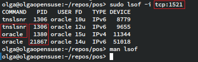

# Oracle

В гипотетической компании `Kalevala` портируют ПО со старого `Slackware` на
новый `OpenSUSE`. На старой системе кодировка базы данных была `CP1251`. На
новой она должа быть, разумеется, `UTF-8`. Перед вами проект посвящённый 
`Oracle`-у, переходу на новую кодировку и платформу, а так же набор полезных
скриптов `PLSQL`.

# Содержание

- [Oracle](#oracle)
- [Содержание](#содержание)
- [Версия](#версия)
- [Установка](#установка)
- [TNS](#tns)
  - [Сеть Oracle-а](#сеть-oracle-а)
  - [Утилиты проверки настрок сети Oracle-а](#утилиты-проверки-настрок-сети-oracle-а)
  - [Настройка сети](#настройка-сети)
- [Кодировка базы](#кодировка-базы)
- [Демонизация Oracle-а](#демонизация-oracle-а)
- [Создание схемы БД](#создание-схемы-бд)
- [ACL для сетевых запросов](#acl-для-сетевых-запросов)
- [Sql Developer](#sql-developer)
- [Портирование данных](#портирование-данных)
  - [Экспорт данных](#экспорт-данных)
  - [Импорт данных](#импорт-данных)
- [Решение проблемы с автозапуском](#решение-проблемы-с-автозапуском)
- [Полезные скрипты](#полезные-скрипты)

# Версия

Переход совершается на данную версию:

| `OpenSUSE`                                                                |
| :------------------------------------------------------------------------ |
| Oracle Database 11g Express Edition Release 11.2.0.2.0 - 64bit Production |
| PL/SQL Release 11.2.0.2.0 - Production                                    |
| "CORE	11.2.0.2.0	Production"                                             |
| TNS for Linux: Version 11.2.0.2.0 - Production                            |
| NLSRTL Version 11.2.0.2.0 - Production                                    |

# Установка

Создайте пустой файл заглушку: `/etc/SuSE-release`

```sh
sudo touch /etc/SuSE-release
```

Установите скрипт `SysV` [`rc.status`](oracle/OpenSUSE/rc.status) из данного
репозитория прямо в корень папки `/etc`. Вы можете воспользоваться командой
`scp` через [`CygWin`][30], если работаете на `Windows`-е:

```sh
# На хосте с репозиторием
scp rc.status <USER>@10.11.9.146:~
# На хосте OpenSUSE
sudo mv ~/rc.status /etc/
```

Необходимо установить следующий пакет: `oracle-xe-11.2.0-1.0.x86_64` из файла:
`oracle-xe-11.2.0-1.0.x86_64.rpm.zip`. Данного пакета уже нет в сети.
Предполагается, что читатель располагает этим файлом.

Вы можете напрямую подтянуть архив `Oracle`-а через `smb` клиент, подставив
свои пользовательские данные авторизации. Обратите внимание, что пользователь и
пароль разделенны именно знаком `%`:

```sh
SMB_PATH="Kalevala/Applications/OracleXE/nix"
smbget smb://${SMB_PATH}/oracle-xe-11.2.0-1.0.x86_64.rpm.zip \
  --user KALEVALA/<USER>%<PASSWORD>
```

Нужно убедиться, что `swap` файл активирован. При стандартной установке
`OpenSuse`, `swap` обычно уже примонтирован из `/dev/sda3` и равен 2 `Gb`. В
любом случае, используйте комманды `fdisk`, `free` и `swapon` при
необходимости.

Установите необходимые пакеты:

```sh
sudo zypper in libnsl1 bc
```

Создайте папку необходимую для `SysV` - `/var/lock/subsys`:

> TODO: после перезагрузки, папка почему то исчезает, решить эту проблему

```sh
sudo /var/lock/subsys
```

Следующие команды используются для установки базы данных. На вопросы
установщика следует отвечать значениями по умолчанию (нажимать `Enter`),
кроме пароля от базы. Указанный пароль запишите на листочке и сохраните:

```sh
unzip oracle-xe-11.2.0-1.0.x86_64.rpm.zip
cd Disk1
sudo rpm -ivh oracle-xe-11.2.0-1.0.x86_64.rpm
```

Убедитесь, что `lsnrctl` связан со всеми библиотеками:

```sh
ldd /u01/app/oracle/product/11.2.0/xe/bin/lsnrctl
```

Если всё хорошо, запустите конфигурацию `Oracle`-а:

```sh
sudo /etc/init.d/oracle-xe configure
```

> По непонятной причине фаза *Configuring database...* занимает очень много
> времени, возможно более 10 минут; наберитесь терпения

При каждом логине вам необходима конфигурации среды `Oracle`-а, к примеру
путь к `/u01/app/oracle/product/11.2.0/xe/bin/` в нужно добавить в `PATH`,
так же установить `$ORACLE_HOME`. Для этого, добавляем в `.bashrc` необходимую
строку, а так же выпоолняем команду в рамках сессии:

```sh
. /u01/app/oracle/product/11.2.0/xe/bin/oracle_env.sh
```

> TODO: учитывая, что мы используем `sudo` для `su`, установка пароля для
> пользователя `oracle` не нужна

Попробуйте подключиться к базе:

```sh
sudo su - oracle
# Возможно вам придётся определить переменные среды
#. /u01/app/oracle/product/11.2.0/xe/bin/oracle_env.sh
sqlplus / as sysdba
select * from dual;
```

# TNS

> TODO: создать диаграммы на `Puml` и перенести главу в `SysScripts`

В данном разделе мы поговорим о таком, без приувеличения, интересном,
загадочном и малоизученом феномене, как сеть `Oracle`-а.

## Сеть Oracle-а

Для начала ознакомьтесь с официальной документацией и небольшим полезным
манускриптом на тему настройки данной сети:

* [Официальная документация][1]
* [Настройка сети][2]

В архитектуре `Oracle`-а есть сервис обеспечивающий связь с базой данных. Это
`Oracle Listener`. `Listener` является одним из значимых узлов сети `Oracle`.
Как гласит официальная документация, данный сервис обеспечивает связываение
клианта и интстанции базы. `Listener`-ы и инстанции представляют из себя
сущности с типом связи `N:N`:

> TODO: составить диаграмму `OraNet` на `puml`

Как гласит официальная документация, `Listener` принимает запрос от клиента и
создаёт независимый канал связи между клиентом и инстанцией:

> TODO: составить диаграмму `OraLsnr` на `puml`

Вы можете задасться вопросом:

> Учитывая, что для связи с базой используется только один порт `TCP: 1521` и
> что `Listener` и инстанции являются разными процессами, то каким образом
> создаётся дочерний канал связи соответствующий фазе `3` на рисунке выше?

Я не нашла ответ на этот вопрос, но иллюстрация ниже немного проливает свет и
даёт ключи к разгадке на будущее:



Так же в экосистеме `Oracle`-а присутствует некий стандарт `TNS`, решающий
проблему разрешения имён баз данных в сетевые адреса более низкого уровня.
`TNS` по своей сути крайне похож на сервис `DNS` разрешающий имена интернета.
Первый конечно намного проще второго - там нет ни репликаций базы имён, ни
древовидной структуры. Функция разрешения имён внедрена в сам клиент базы
данных, к примеру `sqlplus`, и настраивается с помощью файла `listener.ora`.

Оба вышеуказанных аспекта `Oracle`-а настраиваются с помощью соответствющих
файлов. Если база данных  и приложение-клиент располагаются на одном хосте,
то оба файла располагаются в одной папке: `$ORACLE_HOME/network/admin/`.
Синтаксисом данных файлов является язык `Lisp` с его древовидным принципом.
Итак, вот имена файлов конфигурации:

|                   |                |
| :---------------- | :------------- |
| `Oracle Listener` | `listener.ora` |
| `TNS client`      | `tnsnames.ora` |

## Утилиты проверки настрок сети Oracle-а

Для проверки настроек воспользуйтесь соответствующими утилитами. Вызовите
консоль `Listener`-а и проверьте доступность сервисов:

```sh
lsnrctl
LSNRCTL> services
Connecting to (DESCRIPTION=(ADDRESS=(PROTOCOL=IPC)(KEY=EXTPROC_FOR_XE)))
Services Summary...
Service "PLSExtProc" has 1 instance(s).
  Instance "PLSExtProc", status UNKNOWN, has 1 handler(s) for this service...
    Handler(s):
      "DEDICATED" established:0 refused:0
         LOCAL SERVER
Service "XE" has 1 instance(s).
  Instance "XE", status READY, has 1 handler(s) for this service...
    Handler(s):
      "DEDICATED" established:5 refused:0 state:ready
         LOCAL SERVER
Service "XEXDB" has 1 instance(s).
  Instance "XE", status READY, has 1 handler(s) for this service...
    Handler(s):
      "D000" established:0 refused:0 current:0 max:1022 state:ready
         DISPATCHER <machine: ilmarinen.kalevala, pid: 1412>
         (ADDRESS=(PROTOCOL=tcp)(HOST=ilmarinen)(PORT=37437))
The command completed successfully
LSNRCTL> quit
```

Для проверки настройки `TNS` используйте команду `tsnping`:

```sh
tnsping kalevaDB
TNS Ping Utility for Linux: Version
  11.2.0.2.0 - Production on 20-MAR-2024 11:41:21
Copyright (c) 1997, 2011, Oracle.  All rights reserved.
Used parameter files:
Used TNSNAMES adapter to resolve the alias
Attempting to contact (DESCRIPTION =
  (ADDRESS = (PROTOCOL = TCP)
    (HOST = 127.0.0.1)(PORT = 1521))
  (CONNECT_DATA = (SERVER = DEDICATED) (SERVICE_NAME = XE)))
OK (0 msec)
```

## Настройка сети

Настраиваем сеть `Oracle`-а. Находим файл `listener.ora` в папке
`$ORACLE_HOME/network/admin/` и приводим узел `LISTENER` к следующему виду
виду, заменяя `<HOSTNAME>` на имя хоста:

```lisp
LISTENER =
  (DESCRIPTION_LIST =
    (DESCRIPTION =
      (ADDRESS = (PROTOCOL = IPC)(KEY = EXTPROC_FOR_XE))
      (ADDRESS = (PROTOCOL = TCP)(HOST = <HOSTNAME>.<DOMAIN>)(PORT = 1521))
    )
  )
```

Так же находим файл `tnsnames.ora` в той же папке`$ORACLE_HOME/network/admin/`
и добавляем следующую запись:

```lisp
kalevaDB =
  (DESCRIPTION =
    (ADDRESS = (PROTOCOL = TCP)(HOST = 127.0.0.1)(PORT = 1521))
    (CONNECT_DATA =
        (SERVER = DEDICATED)
        (SERVICE_NAME = XE)
     )
  )
```

Перегружаем `Oracle XE` через `SysV` и прверяем статус:

```sh
/etc/init.d/oracle-xe restart
/etc/init.d/oracle-xe status
```

Настраиваем `firewall`:

```sh
sudo firewall-cmd --zone=public --add-port=1521/tcp
sudo firewall-cmd --permanent --zone=public --add-port=1521/tcp
sudo firewall-cmd --list-all
```

# Кодировка базы

Если после установки, и перед импортом данных всё же необходимо изменить
кодировку базы данных, то на просторах сети, вы можете встретить способ смены
кодировки коммандaми:

```sql
ALTER DATABASE CHARACTER SET CL8MSWIN1251
ALTER DATABASE NATIONAL CHARACTER SET CL8MSWIN1251
```

Но к сожалению этот способ не работает в нашем случае, заместо этого требуется
внести изменения таблицу `sys.props$`:

```sql
sqlplus sys as sysdba
SQL> shutdown immediate
SQL> startup restrict
SQL> update sys.props$ set VALUE$='CL8MSWIN1251'
     where name='NLS_CHARACTERSET';
SQL> update sys.props$ set VALUE$='CL8MSWIN1251'
     where name='NLS_NCHAR_CHARACTERSET';
SQL> commit;
SQL> shutdown immediate
SQL> startup
SQL> select parameter, value from nls_database_parameters
     where parameter in ('NLS_CHARACTERSET', 'NLS_NCHAR_CHARACTERSET');
SQL> exit
```

> TODO: в последней версии `OpenSUSE` базу не получается перевести в состояние
> `shutdown immediate`, разобраться

# Демонизация Oracle-а

Разумеется, нужно сконфигурировать `Oracle` так, что бы он мог грузиться вместе
с `OS`, это делается в рамках `systemd`.

Отредактируйте файл `/etc/oratab`, добавив `Y` заместо `N` вконце единственной
строки содержащейся в этом файле. Должно получится что то вроде:

```
XE:/u01/app/oracle/product/11.2.0/xe:Y
```

Включите запуск инстанции по `SysV`. Далее мы создадим прокси/обёртку `SystemD`
для `SysV`, которая наследует все базовые настройки:

```sh
sudo /etc/init.d/oracle-xe enable
```

Установите генератор `SystemD` конфигурации для `LSB` скриптов:

```sh
sudo zypper in systemd-sysvcompat
```

Создайте необходимые папки в файловой системе `/etc/init.d`:

```sh
sudo mkdir \
  /etc/init.d/rc2.d \
  /etc/init.d/rc3.d \
  /etc/init.d/rc4.d \
  /etc/init.d/rc5.d
```

Отредактируйте файл `/etc/init.d/oracle-xe`, убрав все сиволы после завершающей
строки `LSB` - `### END INIT INFO`:

```
### BEGIN INIT INFO
# Provides:       oracle-xe
# Required-Start: $local_fs $remote_fs $network ypbind
# Required-Stop:  $local_fs $remote_fs $network
# Default-Start:  2 3 5
# Default-Stop:   0 1 6
# Short-Description: Oracle Database 11g Express Edition
# Description:    Oracle Database 11g Express Edition
### END INIT INFO
```

Создайте прокси `SystemD` для `SysV`:

```sh
sudo systemctl enable oracle-xe
```

Перегрузите `systemd` с удалением всего лишнего (вторая команда). Старайтесь
всегда так перегружать:

```sh
sudo systemctl daemon-reload
sudo systemctl reset-failed
```

Убедитесь, что `systemd` увидел сервис:

```sh
systemctl show oracle-xe
```

Найдите сервис в выводе списка `unit` файлов:

```sh
systemctl list-unit-files
```

Должно быть:

```
oracle-xe.service generated -
```

Далее создайте точку синхронизации для `SystemD`:

```sh
sudo vim /usr/lib/systemd/system/oracle-xe.target
```

Добавьте содержимое в созданный файл:

```ini
[Unit]
Description=Oracle
Requires=oracle-xe.service

[Install]
WantedBy=graphical.target
```

Снова перезапустите `SystemD`, затем разрешите `oracle-xe.target`:

```sh
sudo systemctl enable oracle-xe.target
```

---
> TODO: выяснить, почему сервис не отображается  в обычном выводе команды
> `systemctl`

Найдите сервис в обычном выводе команды `systemctl`. Если сервис запущен,
должно быть:

```
oracle-xe.service loaded active exited
SYSV: This is a program that is responsible for taking care of
```

---
Убедитесь, что вы можете манипулировать сервисом `Oracle`:

```sh
sudo systemctl status oradb.service
sudo systemctl start oradb.service
sudo systemctl stop oradb.service
```

---
Проверьте новое дерево зависимостей:

```sh
systemctl list-dependencies graphical.target
```

Внизу мы должны увидеть наш `oracle-xe.service` через `oracle-xe.target`.

```sh
systemctl list-dependencies graphical.target
graphical.target
. +-ca-certificates.path
...
. L-oracle-xe.target
.   L-oracle-xe.service
```

Если сервис запущен, точка у `oracle-xe.service` будет зелёной.

---
Перегрузите компьютер или виртуальную машину, и после перезагрузки, проверьте
загрузился ли наш сервис автоматом:

```sh
systemctl status oracle-xe
```

Так же, попробуйте подключится к `sqlplus` используя имя хоста и пользователя
`sys`, запустив команду тестовой выборки:

```sql
sqlplus sys/<PASSWORD>@<HOST> as sysdba
> select * from dual;
```

Если всё работает, выйдите из `sqlplus` и вздохните спокойно.

# Создание схемы БД

Подключитесь к СУБД `Oracle` в режиме `DBA` и задайте пользователю `ILMARINEN`
необходимые права:

```sh
sudo su - oracle
# Возможно вам придётся определить переменные среды
#. /u01/app/oracle/product/11.2.0/xe/bin/oracle_env.sh
sqlplus / as sysdba
```

```sql
SQL> create user ilmarinen identified by ilmarinen;
SQL> grant connect, resource, dba to ilmarinen;
SQL> grant execute on sys.utl_http to ilmarinen;
SQL> grant select on sys.v_$session to ilmarinen;
SQL> grant select on sys.v_$process to ilmarinen;
SQL> grant select on sys.dba_lobs to ilmarinen;
SQL> exit
```

Вам будет необходимо дать роль `DBA` новому пользователю, особенно остро эта
потребность ощутится во время экспорта данных.

Так же необходимо дать права запуска на `SYS.UTL_HTTP`, иначе при импорте, все
объекты ссылающиеся на данный пакет будут невалидными.

# ACL для сетевых запросов

Дайте права пользователю `ilmarinen` на доступ к сети из базы.

```sql
BEGIN
    DBMS_NETWORK_ACL_ADMIN.create_acl (
        acl         => 'service.xml',
        description => 'Запрос на RKULoader',
        principal   => 'ILMARINEN',
        is_grant    => TRUE,
        privilege   => 'connect');

    -- TODO: предположительно лишнее
    /*DBMS_NETWORK_ACL_ADMIN.add_privilege (
        acl         => 'service.xml',
        principal   => 'ILMARINEN',
        is_grant    => TRUE,
        privilege   => 'resolve');*/

    DBMS_NETWORK_ACL_ADMIN.assign_acl(
        acl         => 'service.xml',
        host        => '192.168.1.7',
        lower_port  => 8080,
        upper_port  => 8080);

    DBMS_NETWORK_ACL_ADMIN.create_acl (
        acl         => 'resolveIp.xml',
        description => 'Выборка адреса через UTL_INADDR',
        principal   => 'ILMARINEN',
        is_grant    => TRUE,
        privilege   => 'resolve');

    DBMS_NETWORK_ACL_ADMIN.assign_acl (
        acl         => 'resolveIp.xml',
        host        => '*');
    COMMIT;
END;
```

# Sql Developer

В работе вам понадобится `Sql Developer`. В компании `Kalevala` есть стандартная
сборка этой утилиты. Так же имеется её спутник `Data Modeler`. Обе требуют `jdk`,
который находится в папке второй. Обе утилиты лежат в стандартном расположении
`Kalevala` на рабочих компьютерах: `C:\Tools`. Если на вашем компьютере нет этих
папок, скопируйте обе с иного компьютера разработчика `Kalevala` сохранив пути
Запустите `Sql Developer` и укажите `jdk` из `Data Modeler`.

Включая виртуальные машины поочерёдно, настроив на них сеть и `firewall`,
запустив `Oracle`, вы сможете подключаться к `RDBMS` в рамках разработки и
наладки ПО *АПК*.

# Портирование данных

В идеале импорт и экспорт можно было бы делать с помощью `Sql Developer`-а
подключившись поочерёдно к обоим `instance`-ам и используя функции
экспорта/импорта схемы. Но нам необходимо копировать не только структуры
данных, но и сами данные, при этом файл получается слишком большим. В следствии
чего, возникает необходимость в инструментах командной строки, как это описано
ниже.

## Экспорт данных

```sh
exp ilmarinen/ilmarinen file=ilmarinen.dmp log=log.log
```

При экспорте данных вы можете добавить опцию `full=y`, или ответив положительно
на соответствующий вопрос в интерактивном режиме. В таком случае произойдёт
глобальный импорт всей БД, выходящий за рамки конкретной схемы. При импорте
передав параметры аутентификации конкретного пользователя, вы получите только
его данные.

> Следует перепроверить этот момент

## Импорт данных

Импорт не происходит инкрементально. Система старается пересоздать каждый
объект. Как известно это не вызывает проблем при пересоздании структур кода,
но вызывает проблемы с таблицами. При повторном экспорте таблица будет
существовать, следовательно вам будет необходимо подключиться к `sqlplus` и
удалить её командой `DROP TABLE ...`.

Первая прогонка импортирования:

```sh
# Перед импортом следует установить кирилическую кодировку
export NLS_LANG="AMERICAN_AMERICA.CL8MSWIN1251"
imp \
  ilmarinen/ilmarinen \
  file=/full/path/ilmarinen.dmp \
  log=log.log \
  fromuser=ilmarinen \
  touser=ilmarinen
```

Во время испорта вы увидете вывод на подобии следующего. Возможно так же у вас
будут ошибки связанные с ограничением размера полей куда не поместяться строки
в `UTF-8` представлении:

```
Export file created by EXPORT:V10.02.01 via conventional path
import done in CL8MSWIN1251 character set and AL16UTF16 NCHAR character set
import server uses AL32UTF8 character set (possible charset conversion)
export client uses UTF8 character set (possible charset conversion)
export server uses CL8MSWIN1251 NCHAR ... (possible ncharset conversion)
. . importing table         "..."                   250 rows imported
. . importing table         "..."                   219 rows imported
. . importing table         "..."                   0 rows imported
. . importing table         "..."                   0 rows imported
. . importing table         "..."                   11892 rows imported
. . importing table         "..."                   50145 rows imported
. . importing table         "..."
IMP-00019: row rejected due to ORACLE error 12899
IMP-00003: ORACLE error 12899 encountered
ORA-12899: value too large for column "ILMARINEN"."..."."NAME"
(actual: 114, maximum: 100)
Column 1 114998
Column 2 Y
Column 3 545825789 ... ... ...
Column 4 36598323
```

Вы можете так же импотрировать и экспортировать в интерактивном режиме, для
этого введите просто саму команду без параметров, или указывая лишь данные
аутентификации.

Отвечайте на все вопросы ~~честно~~ положительно, разве что указывая нужное имя
файла, если при экспорте это не было имя по умолчанию - `expdat.dmp`.

Вопрос:

> List contents of import file only (yes/no)

Аналогичен опции `indexfile` описанной ниже.

На вопрос:

> Enter table names. Null list means all tables for user\
> Enter table name or . if done:

Ответье простым `Enter`-ом, или задайте имена необходимых таблиц через `Enter`.

> Важно использовать именно `imp` и `exp` а не `impdb` и `expdb`, так как пока,
> что в `Kalevala`-е используется всё самое древнее и не поддерживаемое,
> "замороженное", как любят говорить некоторые

На `Slackware` пользователь `ilmarinen` обладает ролью `DBA`. Без этой роли
аналогичного пользователя на `OpenSUSE` у вас не получится импортировать данные.

При импорте вы увидете нечитаемые команды на экране и много оповещений
(`warning`-ов). Это связанно с процессом перекодировки данных и констант
в коде `PL/SQL`. После перекодировки, вам следует открыть файл `log.log`
созданный в папке запуска, и решить все появившиеся проблемы. В идеале это
увеличение колонок `NAME VARCHAR2(100)` до `VARCHAR2(100)` - так как `UTF-8`
в случае кириллицы занимает в два раза больше места чем `ANSI`.

Пройдитесь по всем таблицам и выполните команды вроде:

```sql
ALTER TABLE ILMARINEN.TABLE_STONES MODIFY ("NAME" VARCHAR2(200));
```

Используйте папку `GG/EQUIPMENT/TABLES` репозитория `db_scripts` если для
составленеия команды вам необходимы все параметры столбца.

Файл лога будет чрезвыйчайно большим. Вам нужно будет использовать `grep`,
`uniq`, `sed`, `awk` и иные для анализа данных:

```sh
cat log.log | grep "value too large" | awk -F"(" '{print $1}' | uniq | less
```

Получится что то вроде:

```sql
ALTER TABLE ILMARINEN.TABLE_STONES MODIFY ("NAME" VARCHAR2(200));
ALTER TABLE ILMARINEN.TABLE_WOODS  MODIFY ("NAME" VARCHAR2(200));
ALTER TABLE ILMARINEN.TABLE_CARS   MODIFY ("MESSAGE" VARCHAR2(500));
ALTER TABLE ILMARINEN.TABLE_TYPES  MODIFY ("NAME" VARCHAR2(200));
```

Буферы вы реплицируете автоматически, а вот таблицы типа `TABLE_TYPES` будет
необходимо синхронизировать вручную.

Проверьте остальные ошибки. Найдите сами ошибки:

```sh
cat log.log | grep "ORA-" | grep -v "ORA-12899"
```

Затем найдите область полученных строк в оригинальном файле `log.log`.

Учитывая, что вы выполнили команды приведённые ранее:

```sql
SQL> grant select on sys.v_$session to ilmarinen;
SQL> grant select on sys.v_$process to ilmarinen;
```

вам будет необходимо пересоздать отображение `ILMARINEN.PRINT_SESSION`:

```sql
CREATE OR REPLACE VIEW "ILMARINEN"."PRINT_SESSION" ("SPID") AS
  SELECT  p.spid
  FROM    sys.v_$session s, sys.v_$process p
  WHERE   s.paddr = p.addr
  AND     (SYSDATE - logon_time) * 24 * 60 > 20
  AND ACTION IN ('EXPORT','IMPORT');
```

Так же вам будет необходимо перенести объекты `Scheduler`-а. Откройте схему
`ILMARINEN` в `SqlDeveloper` и пересобирите невалидные объекты. Перенесите
недостающие данные и неспособные перейти в валидное состояние объекты из
рабочей базы.

# Решение проблемы с автозапуском

В этой главе рассмотрим решение проблемы с автозапуском `Oracle`-а которое с
течением времени возникло на нашем *АПК* старой версии на `Slackware`.

Заранее приведу пути к различным файлам, и значения некоторых переменных
которые будут упомянуты ниже:

| Переменная         | Значение                                              |
| ------------------ | ----------------------------------------------------- |
| `$ORACLE_HOME`     | `/usr/lib/oracle/xe/app/oracle/product/10.2.0/server` |
| `$ORACLE_SID`      | `XE`                                                  |
| `$ORACLE_OWNER`    | `oracle`                                              |
| `$ORACLE_LOG`      | `/var/log/oracle.log`                                 |
| `$LD_LIBRARY_PATH` | `$ORACLE_HOME/lib:/lib:/usr/lib`                      |

| Файл           | Папка                                           |
| -------------- | ----------------------------------------------- |
| `alert_XE.log` | `/usr/lib/oracle/xe/app/oracle/admin/XE/bdump/` |
| `init.ora`     | `$ORACLE_HOME/dbs/`                             |
| `startdb.sql`  | `$ORACLE_HOME/config/scripts/`                  |
| `stopdb.sql`   | `$ORACLE_HOME/config/scripts/`                  |
| `tnsnames.ora` | `$ORACLE_HOME/network/admin/`                   |
| `listener.ora` | `$ORACLE_HOME/network/admin/`                   |
| `oratab`       | `/etc/`                                         |
| `limits.conf`  | `/etc/security/`                                |
| `startup`      | `/home/louhi/.icewm/`                           |

С какого то момента, после комманды `reboot` у нас перестала загружается
база данных автоматически. В `alert_XE.log` мы можем увидеть, что последний
уровень до которого полнялся `instance` это `MOUNT`, один этап до необходимого
`OPEN`.

Важно добавить, что данная проблема описана в посте на
[`dba.stackexchange.com`][3], так же стоит ознакомится с [этой][4]
замечательной статьёй по инициализации БД.

Ещё одно важное добавление. Проблему можно решить *костылём*, загружая
`Oracle` через `startup` `IceWM`-а, но это для слабаков:

```
[root@test ~]# cat /home/louhi/.icewm/startup
#!/bin/sh
service oracle-xe start
...
```

При этом важно отключить запуск `Oracle`-а через `init`:
`chkconfig oracle-xe off`

Возращаемся к основному, правильному и сложному пути. Я приложила `init`
скрипт [`oracle-xe`](misc/oracle-xe) который по видимому нам придётся
поддерживать и дорабатыватьв будущем. На данном этапе этот скрипт
содержит мои последнии добавления связанные с этой задачей.

> Скрипт `oracle-xe` из папки `misc` следует положить по пути
> `/etc/init.d` вместо старого `oracle-xe`.

Так же я создала логирование процесса запуска `Oracle`. Логи будут писаться
в файл `/var/log/oracle.log`.

Если залогировать выполнение скрипта `$ORACLE_HOME/config/scripts/startdb.sql`
в процессе запуска `Oracle`-а с помощью `init`, то мы увидим следующий
вывод с ошибкой:

```
ORACLE instance started.

Total System Global Area  532676608 bytes
Fixed Size                  1259880 bytes
Variable Size             150996632 bytes
Database Buffers          377487360 bytes
Redo Buffers                2932736 bytes
Database mounted.
ORA-01034: ORACLE not available
ORA-27101: shared memory realm does not exist
Linux Error: 2: No such file or directory
```

Далее следуют ряд действий, которые необходимо совершить на каждом
хосте с нашей базой.

Нам необходимо разделить процесс загрузки на отдельные этапы для того,
чтобы дать системе прийти в себя после каждого этапа, а так же для отладки
процесса загрузки. Приведём скрипт `startdb.sql` к следующему виду:

```sql
connect / as sysdba
host sleep 5
startup nomount
host sleep 5
alter database mount;
host sleep 5
alter database open;
exit
```

---

Для подключения к БД с полными правами и доступом к управлению процессом
инициализации на наших стендах, тредуется использовать подключение с
аутентификацией ОС по `BEQ` протоколу. При этой аутентификации `sqlplus`
проверяет ключение данного пользователя в группу `oracle`. Учитывая, что
`root` не находится в данной группе, нам необходимо на первом этапе
подключится к пользователю `oracle`, а затем уже запросить консоль:

```sh
[root@test ~]# sudo su - oracle
# Возможно вам придётся определить переменные среды
#. /u01/app/oracle/product/11.2.0/xe/bin/oracle_env.sh
-bash-4.1$ sqlplus / as sysdba
```

Очевидно, что вы сможете наблюдать следующие ошибки в `alert_XE.log`:

```
LD_LIBRARY_PATH is not set!
The default library directories are /lib and /usr/lib
Unable to find dynamic library libocrb10.so in search paths
Unable to find dynamic library libocrutl10.so in search paths
Unable to find dynamic library libocrutl10.so in search paths
```

Следующие строки добавленные в актуальную версию `oracle-xe`:

```sh
LD_LIBRARY_PATH=$ORACLE_HOME/lib:/lib:/usr/lib
export LD_LIBRARY_PATH
```

Так же вам часто может встречаться ошибка в `alert_XE.log`:

> ORA-00443: background process "QMNC" did not start

Речь идёт о сбое при загрузке `AQ Monitors`. Это `background` процесс
`AQ`, поднимается он как раз при перехде базы в состояние `OPEN`.
Наш проект не использует `AQ` и целесообразно было бы в принципе отключить
этот компонент следующей командой:

```sql
ALTER SYSTEM SET AQ_TM_PROCESSES=0;
```

Если всё прошло успешно, вы увидите в `alert.log`-е:

> WARNING: AQ_TM_PROCESSES is set to 0. System operation might be
> adversely affected.

При этом возможно у вас будут нижеследующие ошибки с процессом `CJQ0`:

> kkjcre1p: unable to spawn jobq slave process
> Process J000 is dead

В этом случае вам возможно понадобится удалить установленный параметр
и придать ему значение по умолчанию. Для этого воспользуйтесь:

```sql
alter system reset aq_tm_processes scope=spfile sid='*';
```

Ещё один очень важный момент по поводу вышеприведённой ошибки:

> ORA-00443: background process "QMNC" did not start

Она всегда возникает, если вы пытаетесь подключится к хосту по `VNC`
на ранних этапах загрузки ОС. В таком случае происходит сбой запуска
`QMNC`. Тот же эффект будет наблюдаться, если клиент `VNC` будет пытаться
переподключится во время перезагрузки хоста.

Сам `alert.log` обычно занимает пару мегабайт, и тоже требует как видно
лишних ресурсов. Его можно безопасно удалить:

```sh
rm -f /usr/lib/oracle/xe/app/oracle/admin/XE/bdump/alert_XE.log
```

Далее нам необходимо увеличить рамки ограничения по ресурсам в
`limits.conf`:

```
*          hard    nproc     32768
*          hard    nofile    32768
```

В общем то можно ограничить это только для пользователя `oracle`, но
это требует тестирвания. В любом случае посмотреть актуальные значения
`ulimit` пользователя `oracle` с которым происходит запуск `instance`-а
вы сможете в логе `oracle.log`:

```
-------------------------------------------------
Wed Oct 26 17:20:58 MSK 2022
open files                      (-n) 32768
max user processes              (-u) 32768
START
ORACLE instance started.
```

Общие заметки.

Целесообразно установить значение `Y` в файле `/etc/oratab`.

---

Для поиска последних `trace`-ов, советую использовать команду:

```sh
find . -type f -mmin -10 -exec stat  -c "%n %y" {} \;
```

выполенную из папок:

* `/usr/lib/oracle/xe/app/oracle/admin/XE/bdump/`
* `/usr/lib/oracle/xe/app/oracle/admin/XE/udump/`
* `/usr/lib/oracle/xe/app/oracle/admin/XE/adump/`

Можно так же выполнить `grep` по файлам:

```sh
find . -type f -mmin -10 | xargs grep 'APP'
```

---

Для активации режима трассировки, вы можете установить соответсвующий
параметр:

```sql
ALTER SYSTEM SET sql_trace=true;
```

Проверить данный параметр можно команой

```sql
SHOW PARAMETER sql_trace;
```

После работы с базой не забудьте отключить трассировку: `sql_trace=false`
так как она берёт очень много ресурсов.

---

Меняя файлы в папке `$ORACLE_HOME` вам придётся изменить их права, так как
по умолчанию они `read only` для всех пользователей включая `root`-а.
Их права по умолчанию: `r--r-----`. Выполните `chmod ug+w <file_name>`
для необходимого файла.

---

Наша ОС не вызывает `service oracle-xe stop` ни при комманде `reboot` ни
при `shutdown -r now`, то есть закрытие базы происходит *грязным* способом,
что необходимо учитывать прирешении системных проблем с Базой.

---

При аннализе трйсов, вы можете наткнуться на разные имена хостов в
логах `bdump`-а и `udump`-а, вы можете заметить к примеру:

```
Node name:      test1.domain.central
Node name:      test2.domain.central
Node name:      test3.domain.central
```

У вас может возникнуть ошибочное впечатление, что один и тот же сервис
загружался с разными именами хоста. На самомо деле это не верно, дело в том,
что имя файла содержит `PID` сервиса. А в каждый раз, что сервис получает
один и тот же `PID` лог не перезаписывается, а дополняется. Так что записи
с иными именами хоста просто являются старыми.

# Полезные скрипты

* [`DBMS_METADATA`](DBMS_METADATA.pls)

[1]: https://docs.oracle.com/en/database/oracle/oracle-database/19/netag/understanding-oracle-net-architecture.html
[2]: https://oracle-dba.ru/database/network/listener/
[3]: https://dba.stackexchange.com/questions/318523/database-alters-mount-mode-after-reboot
[4]: http://oracledb.ru/administrirovanie-subd/upravlenie-bd/opisanie-etapov-zapuska-i-ostanovki-bd.html
