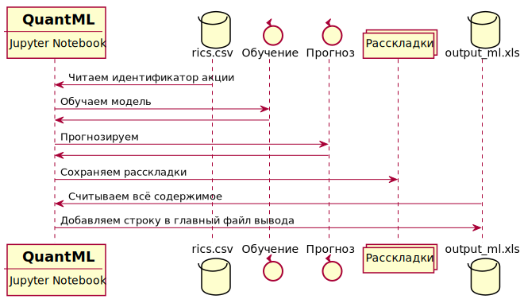

# QuantML

Эксперементы с квантовыми ИНС в сфере финансов.
Основано на описанном [тут][9] принципе.
Используется [этот][10] слой каркаса `Tensorflow`.

# Оглавление

- [QuantML](#quantml)
- [Оглавление](#оглавление)
- [Установка](#установка)
- [Запуск](#запуск)
- [Структура проекта](#структура-проекта)
- [Рабочий процесс](#рабочий-процесс)
- [Полезные термины](#полезные-термины)
- [Полезные ссылки](#полезные-ссылки)

# Установка

Данная инструкция предполагает ручную установку `Python`-а на `Windows 7`. Запустить экосистему на портабельном `Python`-е не вышло. По этому для обеспечения работоспособности экосистемы проекта `QuantML` при работе на `Windows`-е требуется установленный
с помощью пакета `MSI` или `EXE` - `Python 3`.

**Точная версия: `python-3.9.9-amd64`**

Далее установите `notebook` и остальные зависимости из файла `install.bat`.

Если у вас буду ошибки рода `DLL load failed while importing ...`, то [вот][7] решение.

# Запуск

Для старта запустите из корня проекта:

```
$ jupyter notebook
```

На `Windows`-е кликнте два раза по `notebook.cmd`.

# Структура проекта

Основной код находится в папке `QuantML`.

Основные файлы ноутбуков в этой папке имеют формат: `QuantML_\d+[\S]*\.ipynb`, где число в имени нуотбука является номером задачи в `GitLab`-е, решением которой данный ноутбук является.

В папках `docs/reports/\d+/` аналогичным образом содержится материал для презентаций в формате `Markdown` связанный с определёнными задачами в `GitLab`-е. Из данных файлов с помощью соответствующего `plugin`-а `Visual Code`-а можно получить `PDF` файлы.

# Рабочий процесс

Рабочее пространство находится в папке `QuantML`.

*Важное замечание - архитектура пересмотрена, не будет одного внешнего файлы вывода и файла ввода, все файлы вывода будут создаваться под задачу, вся информация о вводе будет в каждом notebook-е*

*Нынешний формат имён файлов вывода*: `<gitlab_task_num>_<ric>_<start_year>`

**Нижеследующее является устаревшей информацией**

Для гитизации ноутбуков, ввод в алгоритм производится через внешний файл, не находящийся под конролем `Git`-а, вывод результата так же складывается в файлы.

* Файл ввода: `rics.csv`
* Основной файл вывода: `output_ml.xlsx`
* Дополнительные файлы вывода: `<NAME>.csv`

Файл ввода должен содержать одну строку и одну колонку данных. Заголовок колонки: `Instrument`.
Таким образов на вход в алгоритм поступает ровно одна акция.

Вот пример файла:

```
Instrument
AMAT
```

> Ноутбуки `Jupyter`-а не расчитаны на циклическую обработку данных. Напротив, они ориентированы на абсолютно последовательный поток `IPO`. Поэтому, для обработки нескольких акций будет необходимо запустить процесс несколько раз.

Каждый раз ноутбук считает содержимое результирующего файла и добавит в него строку.

Вот общая схема процесса:



# Полезные термины

* EMA - Exponential Moving Average
* RIC - Regulated Investment Company

# Полезные ссылки

* [Проект Jupiter][0]
* [Проект Qiskit][1]
* [Принципы работы Биржи 1][3]
* [Принципы работы Биржи 2][4]
* [Принципы работы Биржи 3][5]
* [Принцип работы КК в сравнении с транзисторным][6]
* [Финансовый инструмент][8]

[0]: https://docs.jupyter.org
[1]: https://qiskit.org/
[2]: https://www.python.org/downloads/windows/
[3]: https://habr.com/ru/company/iticapital/blog/200162/
[4]: https://habr.com/ru/company/iticapital/blog/201344/
[5]: https://habr.com/ru/company/iticapital/blog/210570/
[6]: https://habr.com/ru/post/480480/
[7]: https://stackoverflow.com/questions/70924577/dll-load-failed-while-importing-tweedledum
[8]: https://ru.wikipedia.org/wiki/Финансовый_инструмент
[9]: https://developers.refinitiv.com/en/article-catalog/article/tensorflow-variational-quantum-neural-networks-in-finance
[10]: https://github.com/MSKX/tensorflow-quantum_dense
