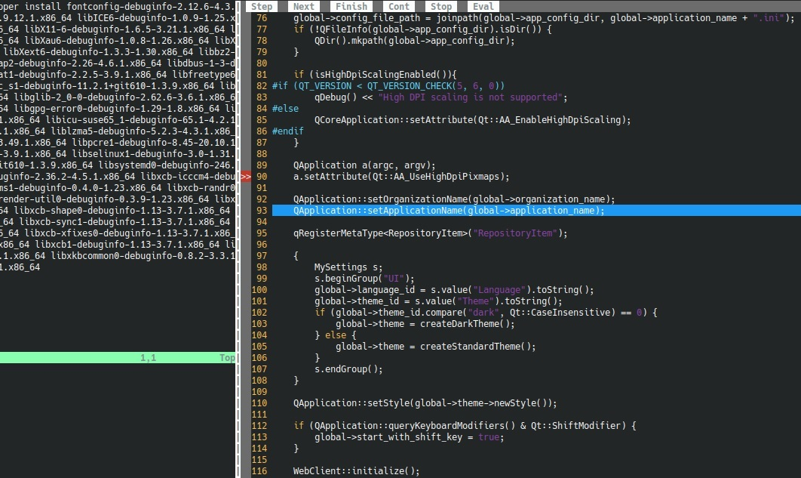

> Carthago delenda est!

# VimIDE

Тут я расскажу о работе в интерактивной консольной среде. О том как превратить
`vim` в `IDE` для `C++`-ных, а так же об утилитах как `Lynx` и `Mutt`.

> В этом мануале используется `zypper` в качестве системы управления пакетами,
> однако команда в конечном счёте зависит от вашего дистрибутива

> `CtrlK` Пока ещё полностью не запустился, но `Termdebug` работает штатно

# Оглавление

- [VimIDE](#vimide)
- [Оглавление](#оглавление)
- [Lynx](#lynx)
- [Mutt](#mutt)
- [Git](#git)
- [Vim](#vim)
  - [Философия Vim](#философия-vim)
  - [Знакомство с Vim](#знакомство-с-vim)
  - [Настройка Vim](#настройка-vim)
  - [Работа с Vim](#работа-с-vim)
  - [Табы Vim](#табы-vim)
  - [Окна Vim](#окна-vim)
  - [Режим замены строки](#режим-замены-строки)
  - [Внешние команды](#внешние-команды)
  - [Заметки Vim](#заметки-vim)
- [Vundle](#vundle)
- [Gdb](#gdb)
- [Termdebug](#termdebug)
  - [Подготовка к отладке](#подготовка-к-отладке)
  - [Команды Termdebug](#команды-termdebug)
  - [Оболочка Termdebug](#оболочка-termdebug)
  - [Отладка программы](#отладка-программы)
  - [Заметки Termdebug](#заметки-termdebug)
- [CtrlK](#ctrlk)

# Lynx

Для проверки доступа к сайтам и проверки `ssl` вам стоит установить `lynx`.

> В общем доступность `ssl` и вообще доступность сайта можно проверить и с
> помощью: `curl [-k] -vvI https://domain.org`, а затем скачать и установить
> сертификат с помощью `openssl s_client`, как описано в проекте
> [`Нибелунги`](../nibelungen/README.md), но `Lynx` по истене великая вещь,
> которая сыграет ещё свою роль в вашем таинственном труде
> `sys`прога/`dep`опса, в вашей борьбе невидимого фронта, особенно при создании
> образов `Docker`-а

Для перехода на адресс, нажмите `g` и введите или вставьте `url`, затем
`Enter`.

Вы можете производить навигацию по странице с помщью клавишь
`[вниз, вверх, влево, вправо]`, а так же `Tab`. При заполнении полей форм,
`Lynx` сам распознаёт тип поля: `checkbox`, `text` и тд.

`Lynx` спросит вас разрешение на скачивание `cookie` и прочей информации.

Для выхода `q`.

В общем всё очень похоже на `Vim`.

# Mutt

В терминале присутствуют несколько сред для работы с почтой. Очень удобная
среди них: `mutt`. Но при вызове собственно говоря команды `mail` вы окажетесь
в ещё более простой интерактивной среде.

При вызове, следует передать параметр `-N`б что бы не печатать заголовки
метаданных писем:

```sh
# опустить заголовок писем
mail -N
```

* Вы окажетесь в режиме спика писем. Используйте `z` для движения впрёд по
  списку
* Если в ыначали редактировать письмо, используйте `Ctrl + d` для завершения
  ввода текста
* Для удаления всех писем, используйте `d *`
* Для помощи используйте `help`
* Для выхода `quit`

# Git

> TODO: привести раздел к стандартной форме, предположительно создать отдельный
> подпроект и консолидировать туда все тексты по `Git`-у

Если вы хотите установить локальную конфигурацию пользователя, добавьте раздел
`[user]` в `.git/config`. Если вы хотите изменить имя коммитера в уже
существующем коммите: `git commit --amend --reset-author  -m "<messsage>"`.

Стоит отменить `less` подобный вывод `git branch`:

```sh
# Отменяем less подобное поведение git branch
git config --global pager.branch false
```

Для того, что бы добавить несколько `url`-ов для в качестве `upstream`:

```sh
git remote set-url origin --push --add url-one
git remote set-url origin --push --add url-two
```

# Vim

Редактор в котором можно найти покой души от всепожирающих графических `IDE`.
А что вы думаете о том, чтобы создать команду разработки, пишушей весь код на
`Vim` а графику использующей лишь для решения графических задачь?

## Философия Vim

`Vim` потоковый консольный тектовый редактор. Консольный и текстовый так как
работает с текстовыми файлами в режиме терминала. Потоковый, так как работает с
потоковыми файлами, в отличии от того же редактора `ISPF`. При этом эра
редакторов *Запись-ориентированных* фаловых систем явно ощущается в `Vim` в
командах работающих в режиме интервалов строк.

`Vim` имеет два режима:

* Режим команд
* Режим ввода текста

Режим команд имеет так же два дочерних режима:

* Режим команд относительно курсора
* Режим команд абсолютного позиционирования

В первом случае мы вводим команды прямо в оболочку без отклика символов команды.
Команда отрабатывает относительно местоположения курсора. Во втором случае мы
начинаем команду со символа двоеточия и наблюдаем отклик внизу экрана, команда
в этом случае работает по строкам файла.

Для перехода из *режима ввода текста* в режим команд, используется клавиша
`<ESC>`. Для обратного перехода команды ввода текста. Вообще всю архитектуру
взаимодействия с `Vim` можно было бы наглядно описать с помощью диаграммы
состояний.

В режиме команд есть так же два типа:

* Обычные команды навигации, изменений и тд., назовём их *субъектные*
* Команды работы с оболочкой - назовём их *объектные*

*Объектные* команды, это к примеру: команда сохранения файла, выхода из
системы, вывода нумерации строк, запуска внешней утилиты и тд. Эти команды
начинаются с символа двоеточия - `:`.

*Субъектные* команды же представлены следующими шаблонами в зависимости от типа
дочернего режима:

* В относительном режиме: `сказуемое обстоятельство подлежащее`
* В абсолютном режиме: `обстоятельство сказуемое`

*Сказуемое* это собственно сама команда, к примеру `d` - удаление.
*Обстоятельство*, это количество раз, необходимое применить к *подлежащему*.
*Подлежащеее*, это **объект** воздействия, к примеру `w` - слово.

У `Vim` есть буфер `undo`. Команда `u` отменяет последние изменение, команда
`U` отменяет последние изменения для данной строки. `Ctrl + r` возвращает
отменённое изменение.

**Подлежащие**

---
В случае, если в относительном режиме в качестве *подлежащего* используется сама
команда, то *подлежащим* полагается вся строка.

Примеры *подлежащего*:

|      |                         | Режим         |
| :--- | :---------------------- | :------------ |
| `^`  | Начало строки           | Относительный |
| `$`  | Конец строки            | Относительный |
| `$`  | Конец файла             | Абсолютный    |
| `w`  | Начало следующего слова | Относительный |
| `e`  | Конец данного слова     | Относительный |

**Обстоятельства**

---
В случае, если в относительном режиме опущено обстоятельство, последнее
полагается равным единице.

Обстоятельство `%` переводиться в `1,$`.

Примеры *обстоятельства*:

|       |                             | Режим         |
| :---- | :-------------------------- | :------------ |
| `2`   | Два, относительно курсора   | Относительный |
| `2`   | Вторая строка               | Абсолютный    |
| `1,3` | От первой до третьей строки | Абсолютный    |
| `%`   | Весь файл                   | Абсолютный    |

**Сказуемые**

---
У *сказуемого* есть условное *наклонение* глагола. Команда поданная с малой
буквой обычно производит небольшие изменения, а с большой - большие.

В осутствии *сказуемого* предполагается действие *навигации* - перемещение.

В абсолютном режиме после символа `!` можно использовать команды терминала.
Если при этом использовано *обстоятельство*, то оно описывает область действия
вызываемой команды, если нет, то `vim` временно перейдёт в режим вывода команды.

Примеры *сказуемого*:

|      |                                                 | Режим         |
| :--- | :---------------------------------------------- | :------------ |
| `d`  | Удалить текст относительно курсора              | Относительный |
| `y`  | Копировать текст относительно курсора           | Относительный |
| `d`  | Удалить строки                                  | Абсолютный    |
| `y`  | Копировать строки                               | Абсолютный    |
| `p`  | Вставить текст из буфера                        | Относительный |
| `o`  | Открыть новую строку под курсором и начать ввод | Относительный |
| `O`  | Открыть новую строку над курсором и начать ввод | Относительный |
| `i`  | Начать ввод текста с данной позиции             | Относительный |
| `I`  | Начать ввод текста с начала строки              | Относительный |
| `a`  | Начать ввод текста со следующей позиции         | Относительный |
| `u`  | Отменить последнее изменние во всём тексте      | Относительный |
| `U`  | Отменить последнее изменние для данной строки   | Относительный |
| `!`  | Запустить команду терминала                     | Абсолютный    |

**Примеры относительного режима**

---
> `d20w` - *удалить 20 слов в положении курсора*

> `y2y` - *копировать две строки от положения курсора включая*

Отсутствие *обстоятельства*:

> `dd` - *удалить одну строку в положении курсора*

Наклонение *сказуемого*:

> `a` - *Начать добавление текста после буквы на которой находится курсор*

> `A` - *Начать добавление текста с конца строки*

Отсутствие *сказуемого*:

> `2e` - *переместиться к концу второго слова исключая пробел*

И в общем перемещения:

> `w` - *от позиции каретки до конца слова, включая последующий пробел*

> `e` - *от позиции каретки до конца слова, исключая последующий пробел*

> `$` - *от позиции каретки до конца строки, включая последний символ*

**Примеры абсолютного режима**

---
> `20d` - *удалить 20-ую строку*

> `w` - сохранить файл

> `%!xxd` - перевести файл в двоичный формат

> `%!xxd -r` - перевести файл обратно из двоичного формата

---
Далее диаграмма состояний


## Знакомство с Vim

Сначала пройдите святой `vimtutor`, который имеет перевод на русский язык:

```sh
vimtutor ru
```

После прохождения `vimtutor` запустите сам `Vim` и ознакомтесь с системой
помощи. Помощь по конкретному разделу вызывается командой `:h[elp] <раздел>`.
Когда открываете помощь, увидите как бы ссылки, это оглавление и `slug`-и глав.
Эти `slug`-и используются так же, как опция при вызове `:h`. Вы можете пройти по
ссылке встав на неё, и нажав на `Ctrl + ]`. Папримеры вызова справок:

```vim
:h vundle
:h vundle-intercative
```

Для вывода главной справки на русском:

```sh
export LANG=ru_RU.UTF8
man vim
# Или
man -L ru vim
```

Ознакомьтесь со следующими документами:

* [Копирование слов][3]
* [Использование помощи Vim][4]
* [Цикл статей на Habr-е][5]
* [Окна Vim][6]

## Настройка Vim

Конфигурация `vim` для пользователя хранится в файле `HOME/.vimrc`,
настоятельно рекомендуем добавить автонумерцию строк. Комметарием в файле
`.vimrc` являются двойные кавычки: `"`. Далее пример небольшой настройки среды
`Vim`:

```vim
" Нумерация строк
set nu
" Четыре пробела заместо таба
set tabstop=4 shiftwidth=4 expandtab
" Заприщает vi вместо vim
set nocompatible " be iMproved, required
" Интеграция мыши
set mouse=a
```

Как вы видете установка опции происходит с помощью команды `set`. Часть опций
являются бинарными: `да/нет`. Они не принимают дополнительных параметров и
имеют команду отмены начинающуюся с `no`. К примеру установка и отмена
нумерации строк:

* `set nu`
* `set nonu`

У части опций есть параметр, который они принимают после знака `=`, к примеру
режим интеграции мыши:

* `set mouse=n` - интеграция мыши в режиме терминала
* `set mouse=a` - интеграция мыши во всех режимах
* `set mouse=""` - отмена интеграции мыши

В `Vim` есть две команды ряд команд касательно обработки `tab`-ов. Вы можете
прочитать о них болшьше, используя помощь `Vim`, набрав `:help имя_команды`:

* `tabstop`
* `shiftwidth`
* `smarttab`
* `expandtab`

Если вы установили в `.vimrc` `expandtab` и работаете с `Makefile`-ом, где вам
необходимо вставить реальный символ `tab`-а, воспользуйтесь отменой режима
расширения `tab`-а:

```vim
:set noexpandtab
```

В `Vim` интегрирована [поддержка][18] `Python`-а, что можно узанть вызвав
`vim --version`, и найдя в выводе: `+python`, `+python3`. Если заместо `+`
стоит `-`, значит какая то поддержка отсутствует.

Мышь лучше не активировать, дабы пользоваться контекстным меню графического
терминала и иметь возможность копировать текст в буфер обмена. Но если вы
хотите всё же использовать интегрированную мышь, то добавьте `:set mouse=a`
в `.vimrc`. Изучите режимы мыши вызвав `:help mouse`.

Большинство настроек консолидированы в файле [.vimrc](.vimrc).

## Работа с Vim

Полезные команды `vim`:

* `:%!xxd` - вывод шестнадцатиричного представления
* `Ctrl` + `G` - показать имя данного файла
* `Ctrl + T`, `Ctrl + O` - навигация вперёд-назад
* `diw` - забор слова в буфер с удалением
* `yiw` - забор слова в буфер без удаления

В `Vim` можно интегрировать мышку. Тогда кнопки `toolbar`-ов и ссылки будут
кликабельны. Для этого задайте `set mouse=a`. Если вы хотите скопировать текст
как раньше, быз интеграции мыши, так что бы текст попал во внешний буффер
обмена, выделяйте текст с нажатой клавишей `Shift`. Не отпускайте `Shift` и
нажмите на правую клавишу мыши, для вызова контекстного меню. При выделении и
копировании очень удобно отключить нумерацию строк: `:set nonum`.

При удалении какого то количества строк, удобно перед этим включить режим
относительной нумерации: `:set relativenumber`.

## Табы Vim

`Vim` имеет систему окон, о которых написано выше, а так же систему табов.

> TODO: это заготовка статьи, расширить

Команды работы с табами:

* `:tabedit <file_name>` - Открыть таб с новым файлом
* `:nextn` - следующий таб
* `:nextp` - предыдущий

> TODO: `:nextn` и `:nextp` почему то не работаю, проверить

Если включена интеграция мыши, вы можете перемещать по табам с мышкой.

## Окна Vim

Как известно, `Vim` поддерживает систему разбиения экрана. Большинство экранных
команд начинаются на `Ctrl + w`, где `w` предположительно - `Window`. Далее
список оконных команд. Разбиение окна:

* `Ctrl + w + s` - Разбиение данного окна по горизонтали
* `Ctrl + w + v` - Разбиение данного окна по вертикали

Навигация совершается с помощью двух груп клавиш: `w` для навигации
*против часовой стрелки*, `j`, `k`, `h`, `l` для навигации в том же направлении
в каком эти клавишим двигают курсор будучи самостоятельными командами.

Вот подсказка, которую я копирую из `vimtutor ru`:

```vim
            ^             Подсказка.
             k                Клавиша h слева и удобна для перемещения влево.
       < h       l >          Клавиша l справа и удобна для перемещения вправо.
             j                Клавиша j похожа на стрелку "вниз".
             v

```

* `Ctrl + w + w` - активация следующего *против часовой стрелки* окна
* `Ctrl + w + [jkhl]` - активация окна в зависимости от направления

Размеры окон вы можете менять двумя способами:

* По размеру единичного символа и строки за раз
* Указывая точные размеры увеличения и уменьшения

Единичные изменения:

* `Ctrl + w + <` - уменьшение ширины на единицу
* `Ctrl + w + >` - увеличение ширины на единицу
* `Ctrl + w + -` - уменьшение высоты на единицу
* `Ctrl + w + +` - увеличение высоты на единицу

> Учтите, что при использовании клавиш `+` и `-` вам нужно сначала отпустить
> `Ctrl + w`, иначе `Konsole` перехватит комбинацию, и изменит шрифт. Для
> возвращения размера фонта в его прежнее состояние, войдите в меню
> *трёх горизонтальных палочек* справа вверху -> `Reset font size`

Количественных изменений можно добиться используя команду `winc[md]`. Вот
примеры достаточно понятные интуиттивно:

* `:30winc >` - увеличение ширины на `30`
* `:30winc <` - уменьшение ширины на `30`
* `:10winc +` - увеличение высоты на `10`
* `:10winc -` - уменьшение высоты на `10`

При разбиении окна ваш файл продублируется, его изменение будет происходить
синхронно. Для открытия нового файла выполните команду `:o <path>`. Вы можете
передать имя папки в виде аргумента, тогда перед вами откроется что то
наподобии левой панели старого доброго `Norton Commander`-а. Вот важные
*объектные* команды:

* `:o[pen]` - открыть файл
* `:clo[se]` - закрыть активное окно
* `:q[uit]` - так же закрывает активное окно

Важны команды навигации по истории открытых файлов *в данном окне*:

* `Ctrl + o` - переход в истории назад
* `Ctrl + i` - возврат в истории вперёд

Для открытия файлов удобно использовать плагин [`FuzzyFinder`](#vundle) о
котором речь пойдёт далее. Настроив расширения `Vim`, как описано ниже,
вызовите: `:FufFile` и набирая начало имени файла найдите его в списке,
перейдите на него, нажмите `<ENTER>`. Это намного удобнее, чем команда `:o`.
Но в режиме `Termdebug`, к примеру `:FufFile` не работает так, как ожидается.
Используя команду `:o` вы можете совершать поиск по списку с помощью `/`.

## Режим замены строки

В `Vim` существует режим замены строки. Он вызывается командой `:c`. Я решила
скопировать блок помощи по этой нетривиальной команде. В работе с `Vim` есть
две фазы:

1. Выйти из `Vim` если случайно запустили его в терминале
2. Выйти из режима замены строки, если случайно вызвали его в `Vim`

```vim
                                                        :c :ch :change
:{range}c[hange][!]     Replace lines of text with some different text.
                        Type a line containing only "." to stop replacing.
                        Without {range}, this command changes only the current
                        line.
                        Adding [!] toggles 'autoindent' for the time this
                        command is executed.
                        This command is not supported in Vim9 script,
                        because it is too easily confused with a variable
                        name.
```

## Внешние команды

Для вызова команды системы из вне `Vim`, наберите эту команду после `:!`. К
примеру:

```vim
:!sh rebuild.loc.sh
```

Обратите внимание, что в оболочке `Vim` у вас не получится эспортировать
переменные командой `source` (или точка `.`). Вам нужно выполнить `source` в
том терминале, где вы запускаете `Vim` до его запуска.

## Заметки Vim

* Русские страницы `man`-а по раполагаются адресу: `/usr/share/man/ru/man1`
* В `Vim` есть команда `python` которая всегда вызывает `python2`
* Отдельно есть команда `python3`
* Файлы плагинов `Vim` имеют расширение `.vim`

# Vundle

У `Vim` есть святой манагер плагинов: [`Vundle`][15]. Установите его с помощью:

```sh
git clone https://github.com/VundleVim/Vundle.vim.git ~/.vim/bundle/Vundle.vim
```

Плагитны `git`-а должны храниться в папке `~/.vim/bundle/`. `Vundle` работает
с плагинами в формате `git` репозитория.

При разработке плагина, изменяйте его прямо в папке `~/.vim/bundle/<plugin>` и
только уже готовую версию грузите в репозиторий. Постоянные `:PluginClean`,
`:PluginInstall` при разработке, это не вариант, так как требуют слишком много
телодвижений.

Вот необходимая конфигурация для `Vundle`. Добавьте следующие строки в
`~/.vimrc`:

```vim
filetype off                  " required
set rtp+=~/.vim/bundle/Vundle.vim
call vundle#begin()
Plugin 'VundleVim/Vundle.vim'
Plugin <Plugin1>
Plugin <PluginN>
"Plugin 'file:///.../CtrlK'
call vundle#end()            " required
filetype plugin indent on    " required
```

Как вы понимаете плагины добавляются в строках начинающихся с `Plugin`. Каждый
идентификатор плагина должен быть обрамлён одинарной кавычкой. В зависимости от
указания имени плагина, плагин ищется в следующих местах:

| Формат имени           | Пример                 | Область поиска       |
| ---------------------- | ---------------------- | -------------------- |
| несколько частей `uri` | `VundleVim/Vundle.vim` | В корне `github` (1) |
| один `slug`            | `FuzzyFinder`          | В `vim-script` (2)   |
| начинается с `file://` | `file:///.../CtrlK`    | Локально             |

(1) `https://github.com/`\
(2) `https://github.com/vim-script`

Рекомендуется установить следующие плагины из `vim-script`:

1. `FuzzyFinder`
2. `L9`

Удаление плагина просиходит только если вы удалите строку из `.vimrc`,
добавление если добавите.

Вот некоторые команды `Vundle`, они основаны на списке плагинов получаемом из
`.vimrc`:

1. `:PluginInstall` - Устанавливает плагины (1)
2. `:PluginUpdate` - Обновляет
3. `:PluginClean` - Удаляет плагины (2)

(1) Плагины которых нет в `~/.vim/bundle/<plugin>`\
(2) Плагины представления которых нет в `.vimrc`

# Gdb

Перед тем, как мы начнём пользоваться плагином `Termdebug` для `Vim`,
стоит освоить чистый `GDB` из командной строки.

Используйте следующие команды:

* `file` для загрузки запускаемого файла или динамической библиотеки
* `break` для точки останова
* `step` для входа в функцию
* `next` для шага без входа
* `finish` для выхода из функции
* `display` для вывода значения выражений
* `kill` для досрочного завершения процесса

Все команды можно сокращать до минимальной уникальной последовательности.

| Команда  | Сокращение |
| -------- | ---------- |
| `break`  | `b`        |
| `step`   | `s`        |
| `next`   | `n`        |
| `finish` | `f`        |

Для `break` передайте в качестве аргумента имя файла и через двоеточие номер
строки. Полный путь можно опустить. При выводе строк с помощью `display` при
нераспознанной кодировке, вы получите удобный вывод в восмиричном формате:

> person->name = "\123\123\123\123 \123\123\123\123\123\123\123\123"

Все библиотеки и запускаемый файлы должны быть собраны с ключём `g++` `-g` для
включения символов отладки.

Пример сессии.

```sh
gdb
> file programm
> file common.so
> break main.cpp:353
> break common.cpp:157
> s
> n
> f
> display person->name
> kill
```

# Termdebug

Вопервых ознакомьтесь с некоторыми мануалами:

* [Debugging in Vim][9]
* [Integrate GDB With Vim][2]

К сожалению я не нашла официальной документации `Termdebug` в интернете, но
есть два иных источника:

1. Официальная документация вызываемая с помощью: `:h terminal-debug`
2. [Клон репозитория Vim][1]

В общем вы можете найти все команды в самом коде плагина в клоне репозитория
`Vim` выше, но справка конечно несомненно удобнее!

```vim
:help terminal-debug
```

## Подготовка к отладке

Отлаживаемая программа должна быть скомпилирована с опцией `-g` переданной в
`gcc`. Если вы собираете с `CMake`, то `CMAKE_BUILD_TYPE` должен быть одним из:

* `Debug`
* `RelWithDebInfo`

В `.vimrc` следует установить следующие опции:

```vim
packadd termdebug
let g:termdebug_wide=1
```

Таким образом мы:

1. Активируем `termdebug`
2. Создаём горизонтальное разделение экранов

Там же установите сопоставление горячих клавишь для отладки. Я использовала
свои настройки, но вы можете их переопределить. Далее по мануалу я буду
ссылаться к своим настройкам:

```vim
map <C-F5> :Run<CR>
map <F5> :Continue<CR>
map <F7> :Over<CR>
map <F8> :Step<CR>
map <F6> :Finish<CR>
map <F9> :Break<CR>
map <S-F9> :Clear<CR>
```

Мы используем `Shift` в `<S-F9>`, так как `<С-F9>` зарезервирован в
`OpenSuse`. Не стоить мапить `:Termdebug`, так как удобнее, используя
автозаполнение вызвать `:Termdebug /path/to/executable` и сэкономить на
написании `file /path/to/executable` в окне `gdb`, с другой стороны можно
замапить прямо с именем экзешника. Так же обратите внимание на `<CR>` вконце
каждого сопоставления. Эта конструкция позволяет сразу запустить команду,
иначе вам придётся вручную нажимать `Enter`.

> После каждого изменения кода, его нужно пересобрать, вызвав
> `:! sh <скрипт_пересборки>`, а затем снова загрузить символы командой `file`

В режиме `Termdebug` очень удобно интегрировать мышь, так как мы сможем с её
помощью перемещаться по экранам а так же менять размер окон. Если нам нужно
будет скопировать текст в буфер обмена, мы можем деактивировать эту настройку.
Так же мы получим замечательные кнопочки вверху экрана для выполнения
отладочных шагов. Если вы включите интеграцию мыши в действующим сеансе
`Termdebug` для всплытия кнопочек, вам придётся перезагрузить сессию.
Следовательно, в идеале установите интеграцию мыши уже на уровне `.vimrc`:

* `set mouse=a` - включить интеграцию мыши
* `set mouse=""` - отключить интеграцию мыши

> TODO: актуализировать тему интеграции мыши по мануалу

## Команды Termdebug

Вот в общем список команд и их значеня:

1. `:Step` - войти в функцию
2. `:Over` - не входить в функцию
3. `:Finish` - выйти из функции
4. `:Continue` - продолжить до следующей точки останова
5. `:Stop` - предположительно послать сигнал `kill` (уточнить)
6. `:Break` - установить точку останова
7. `:Clear` - убрать точку останова
8. `:Run` - начать запуск
9. `:Evaluate {expression}` - расчитать значение
10. `:Up` - на окно стека вверх
11. `:Down` - на окно стека вниз
12. `:Winbar` - мышевое `gui` меню отладчика

Немного о командах, их три категории. При активации определйнного окна,
становятся доступными первые две категории команд, третья категория доступна
всегда, но будет влиять на активное окно:

1. Команды `Vim` набранные при активном окне кода в режиме команд (`Esc`)
2. Команды `Gdb` набранные при активном окне `Gdb` в терминале
3. Команды перехода между окнами и изменения размеров окон

> В режиме команд `Vim` работает автозаполнение табуляцией и сокращения команд

В `Vim` открываем нужный файл командой `:o`. Затем запускаем отладчик командой
`:Termdebug`. Переключаемся между окнами следующим образом. Вызываем
комбинацию `Ctrl + w`, затем отпускаем и нажимаем одну из клавиш:
`[вверх, вниз, впрао, влево]`. Так же можно нажать `Ctrl + w + w` для движения
против часовой стрелки. `Ctrl + w + l` - переход на окно с кодом.

Команды `vim` в общем то можно запускать лишь при фокусировке на правом окне с
кодом. При открытия дополнительных файлов командой `:o` в режиме отладчика
автозаполнение работать не будет, но вы можете написать лишь папку, и `vim`
выведет вам проводник, где вы с помошью навигации сможете выбрать нужный файл.

## Оболочка Termdebug

Перед вами три окна:

1. Верхнее слева: окно `Gdb`
2. Нижнее слева: *окно терминала программы*
3. Справа: окно кода



Возможно будет удобно уменьшить *окно терминала программы* комбинацией или
расширить окно кода, вот комбинации. Для необходимого эффекта следует
выполнить многократно:

* Уменьшить по вертикали: `Ctrl + w` отпускаем и нажимаем `-`
* Увеличить по вертикали: `Ctrl + w` отпускаем и нажимаем `+`
* Увеличить по горизонтали: `Ctrl + w` отпускаем и нажимаем `<` (`Shift + ,`)
* Уменьшить по горизонтали: `Ctrl + w` отпускаем и нажимаем `>` (`Shift + .`)

Так же в режиме команд в окне кода можно использовать:

* `:30winc >` - увеличиваем ширину на 30
* `:30winc <` - уменьшаем ширину на 30
* `:resize 30` - выставляем высоту в 30

> При переходе внутрь функции, если функция в другом файле, `Gdb` автоматом
> откроет этот файл

При активации *окна терминала программы*, ввод будет передан непосредственно в
запущенный и отлаживаемый процесс. Далее:

1. В окне `Gdb` загружаем файл командой `file path/to/bin`
2. Выставляем точки останова дойдя до нужной строки и вызвав `F9`
3. Вызываем `run` в окне `Gdb`

Начинаем дебажить используя `F5`, `F7`, `F8`. Соответствия смотрите выше. Для
вывода панели комманд, необходимо вызвать `:Winbar`.

Расчёт значения выполняется с помощью команды `:Evaluate {expression}`. Без
выражения расчитается значение под курсором. Такой же эфект будет при нажатии
`Shift + k`.

## Отладка программы

Как сказано выше, вы можете вводить различные команды в окне `Gdb`. Справку
по командам вы можете получить с помощью `help` и `help` с именем конкретной
команды. В общем большинство команд `Termdebug` в режиме `Vim` это абстракция
над командами `Gdb`. Далее ряд полезных команд `Gdb`:

* `file` - загрузить бинарный файл с символами отладки
* `backtrace` - вывод `Stacktrace`-а
* `where` - то же самое
* `kill` - прекратить данный сеанс отладки
* `d` - удалить всеточки останова
* `thread find <regex>` - вывод потоков соответствующих шаблону
* `t <number>` - переход на поток с определённым номером

Для того, что бы вывести все потоки, наберите: `thread find .*`. Все действия
плагина `Termdebug` вы можете выполнить из окна `Gdb`. Например установка
точки останова на 25 строке выполняется с помощью `b 25`, а переход на
следующую команду: `n` и `ni` (уточнить по поводу перехода с вхождением и без).

Для выхода из режима отладки, вводим `quit` в окне `Gdb`

> TODO: понять как взаимодействовать с левым нижним окном вывода; если к
> примеру остальные окна закрыты, то система виснет; так же `FufFile` всегда
> открывает файлы в окне `gdb`

Учитывая особенность `FufFile` открывать файл в левой верхней части,
пользуйтесь командой `:o`, при этом вы можете использовать команду поиска: `/`.

## Заметки Termdebug

Если вы случайно открыли файл с помощью `FuzzyFinder`-а, и он открылся
в окне `gdb`, нажмите `Ctrl + o` для возврата.

---
Иногда команды `Termdebug` начнут подвисать и не вызывать ни каких действийю. В
таком случае вызовите аналогичную команду в окне `Gdb`.

# CtrlK

В `Vim` можно настроить навигацию по коду в `C++` по вот этому
[святому мануалу][14].

По указанным ссылкам находятся устаревшие проекты, которые нельзя собрать в
наши дни, в связи с этим я портировала эти проекты на `Python3`:

1. [`py-ctrlk`][16]
2. [`CtrlK`][17]

Склонируйте оба репозитория. Установите пакет разработки `python3`:

```sh
sudo zypper install python311-devel
```

Тем или иным образом установите `libclang-devel`. Если в текущем состоянии
вашего дистрибутива у вас нет необходимых пакетов, собирите `llvm` по
[инструкции](../opensuse/README.md#llvm) в часте посвещённой `OpenSUSE`.

Найдите версию вашей сборки `libclang`, если вы устанавливали через систему
управления пакетами, то воспользуйтесь одной из следующих команд:

```sh
# С помощью locate, если вы создали соответствующую базу
locate libclang
# С помощью zypper
zypper packages --installed-only | grep libclang
```

Если же вы собирали собственную сборку, то версия закодирована в использованном
теге `git`-а.

Перейдите в репозиторий `py-ctrlk`, создайте виртуальную среду, активируйте её:

```sh
python3 -m venv .venv
source .venv/bin/activate
```

Далее установите `python`-овский `clang`. Перед этим найдите соответствующую
версию:

```sh
pip index versions clang
pip install clang==<VER>
```

Если до этого, вы установили ошибочную версию, используйте:

```sh
pip uninstall clang
```

> TODO: актуализировать

`Python`-овский `clang` просит `so`-шник в формате `libclang-<VER>.so`, а мы
имеем формат `libclang.so.<VER>`. Перейдите в папку `/usr/lib64` и выполните:
`sudo ln -s libclang.so.<VER> libclang-<VER>.so`, давлее `sudo ldconfig`.

Собирите и установите `py-ctrlk`, как указанно в мануале:

```sh
python setup.py build
sudo python setup.py install
```

В конфигурации `Vundle` заместо `Plugin 'SkidanovAlex/CtrlK'`
напишите: `Plugin 'file:///home/<user>/repos/CtrlK'` заменяя `<user>` на
своего пользователя, если склонировали репозиторий `CtrlK` в
`/home/<user>/repos/CtrlK`.

Не прописывайте опцию: `let g:ctrlk_clang_library_path="/home/user/llvm/lib"`,
так как `py-ctrlk` собран с актуальным и доступным из системы `libclang`-ом.

> Возможно вам всё таки придётся установить его в
> `let g:ctrlk_clang_library_path="/usr/lib64"`

Задайте клавиши для основных команд `CtrlK`:

```vim
nmap <F3> :call GetCtrlKState()<CR>
nmap <C-k> :call CtrlKNavigateSymbols()<CR>
nmap <F4> :call CtrlKGoToDefinition()<CR>
nmap <F12> :call CtrlKGetReferences()<CR>
```

Запустите тесты в репозитории `py-ctrlk`:

```sh
cd test
./test.py
```

> Так же есть `try.py`, но его необходимо доработать, тк он входит в
> бесконечный цикл

Я добавила два скрипта:
1. `kill.sh` - убивает сервер `ctrlk`
2. `rebuild.sh` - пересобирает и публикует модуль

> Модуль в процессе портирования, и пока не работает.

Для отладки `Python`-а в модуле, используйте следующую конструкцию:

```py
with open('/path/to/log', 'a') as the_file:
	the_file.write('info line\n')
```

Так же добавила функцию `MyRequestHandler.write_error` результат которой
должен оказываться в `vim` в статусной сроке. Но функция пока тоже не работает
как ожидается.

На данный момент удалось пройти следующую строку в файле `client_api.py`

```py
indexer.start(self.leveldb_connection, n_workers)
```

**Как только этот проект поднимиться, это будет нечто фантастическое!**

[1]: https://github.com/vim/vim/blob/master/runtime/pack/dist/opt/termdebug/plugin/termdebug.vim
[2]: https://www.baeldung.com/linux/vim-gdb-integration
[3]: https://vim.fandom.com/wiki/Copy,_cut_and_paste
[4]: https://vim.fandom.com/wiki/Learn_to_use_help
[5]: https://habr.com/ru/articles/706402/
[6]: https://www.tecmint.com/split-vim-screen/
[9]: https://www.dannyadam.com/blog/2019/05/debugging-in-vim/
[16]: https://github.com/olgapshen/py-ctrlk
[17]: https://github.com/olgapshen/CtrlK
[15]: https://github.com/VundleVim/Vundle.vim
[14]: https://habr.com/ru/post/245681/
[18]: https://netdotwork.github.io/vim-python/
